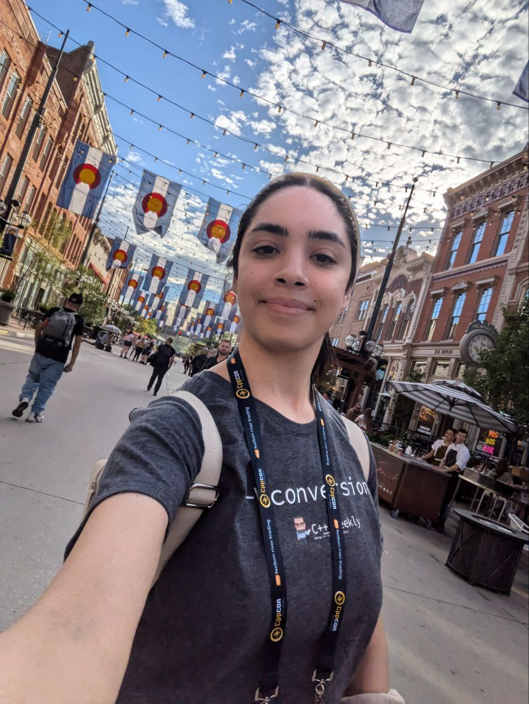
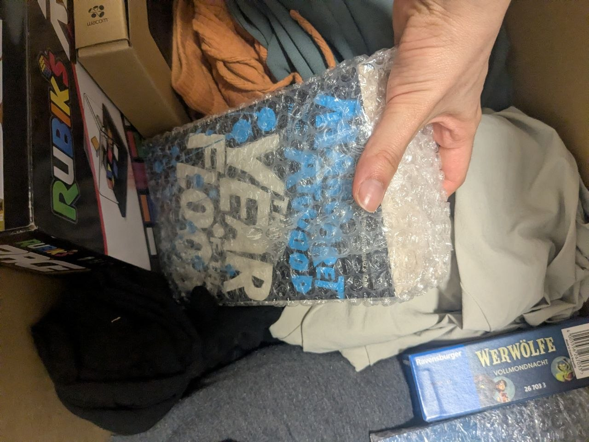
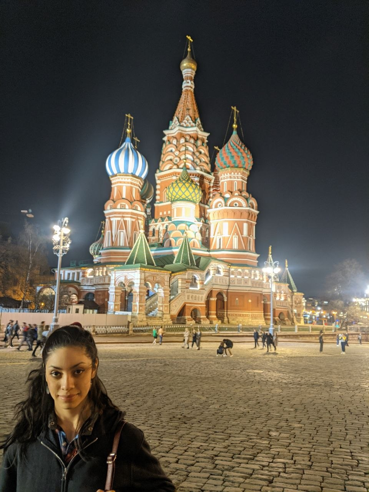
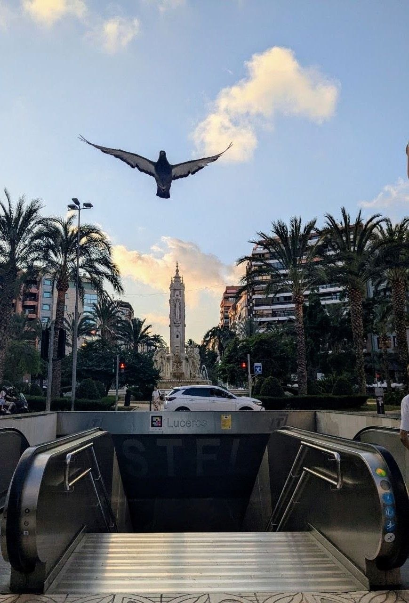
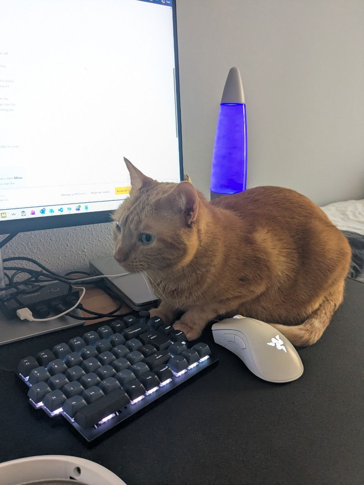
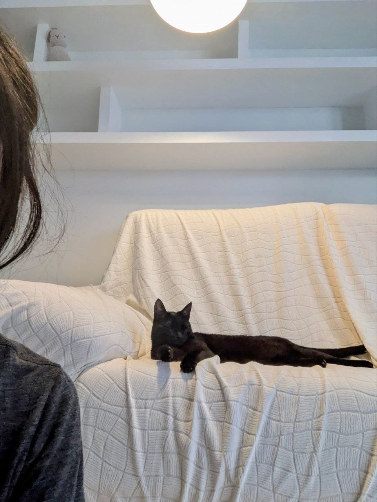
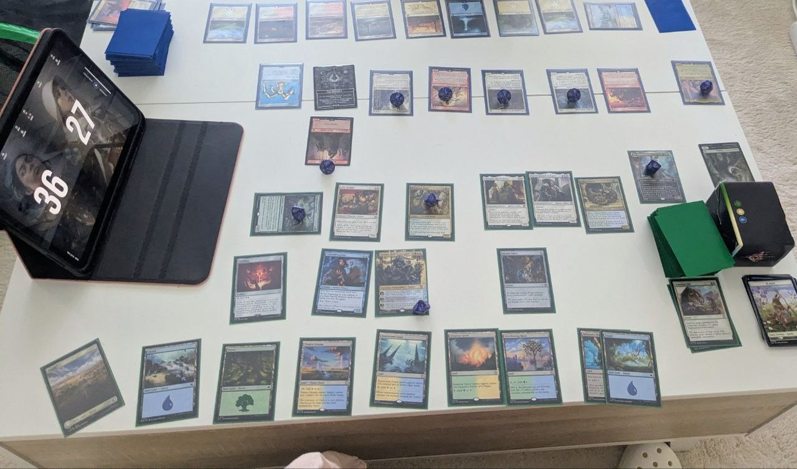

This might be one of the hardest posts to write thus far. My previous one was quite optimistic. I felt I had given good battle and it was time to rest and enjoy. Though as it so often happens, we mortals can't count on the fates to weave the threads of destiny the way we want. But it might also surprise us!

A few months ago, my husband and I decided to move to Spain and start over. The reason is, as almost always is in cases like this, not simple. You can read about it in my previous post if you're interested, but the essence of what we set out to seek is community, being closer to our family, friends and culture. This decision involved trading stability for a chance at a new beginning.

Long story short, we are both now unemployed. In this post I will talk about what has happened since, and how we got to this point. 

> I'm open to work as a C++/Rust systems programmer in Spain or remote within Europe. Reach me on [LinkedIn](https://www.linkedin.com/in/sofiabelenlopezvicens/).

I could try to write a cohesive, nicely packed, narrative with a clear beginning, middle and end. The truth is that life is messy, and I won't try to pretend otherwise. Maybe if I had it all figured out already it'd be easier to write this in such a fashion, but I'm really writing as I process everything that has happened in the last couple of months.

> Disclaimer: literary aside, feel free to skip this paragraph.
>
> I've always leaned on literature to help me make sense of the world and my experiences.
>
> This time, it was Ursula Le Guin's Lavinia that accompanied me. It's a retelling of Virgil's Aeneid through Lavinia, wife to Aeneas. I felt the connection to her, to Lavinia, and to humanity, as I sat outside in the evenings, reading, watching the same stars as Lavinia. As I struggled with the challenges of starting over, of being in between homes, away from my support system, eager to start building our new future. The nights I doubted myself, wondering if my effort was enough, pushing myself.

## Planning the Move

Although it's not our first time moving countries, the process wasn't easy at all. First, the many sleepless nights over maybe a year pondering this decision. Is this the right choice for us? If so, how to execute it? There was a lot to plan.

## Interview Prep for a Role in Spain

<figure>
  
</figure>

Then came the process of interview prep, which started slowly for me at first. I had been using C++ professionally for some years now, but it had been a while since I hadn't review the more theoretical concepts. I started by watching CppCon talks mainly, which rekindled my motivation. Slowly, as I built momentum, I picked up books on operating systems, best practices, concurrency, linux systems programming... It's quite wonderful how you can think you have a grasp on a subject which you actively use for work, only to start studying it more formally to discover how much more there is to learn. As things got more serious, I started putting everything into anki flashcards, strengthening my DSA skills and, to my and everyone's surprise, given how invested I was in C++, taking up Rust.

My motivation for learning Rust was first of all curiosity, and second of all, despite how contradictory it may sound, the more I studied C++, the more I realized just how much I liked the language. With each new concept, my motivation grew to understand it at a deeper level. What does this have to do with Rust? Well, I felt that in order to truly understand a language,  I ought to have something to compare it to. Rust gave me that. By reading about how Rust implements the same concepts I had been studying with C++, the underlying mechanics and solutions to problems faced by those designing the languages became more apparent. Both are wonderful languages that have taught much.

You can imagine how overjoyed I was to receive a job offer for a C++ & Rust position in Spain. Our plan was finally beginning to materialize, and I felt all my effort had paid off.

## Moving Out

<figure>
  
</figure>

Moving out was full of so many emotions. Munich and Germany will forever hold a special place in my heart, part of my story. Every other time I left a place, it felt like it was rushed, and I feel as if I didn't really get the chance to properly say goodbye.

[Moving from Argentina to Russia:](https://sofiabelen.github.io/blog/why-russia/)  we had been planning it for almost a year, but, long story short, when the final confirmation that we could go (invitation letter from the university) arrived, we had only a week to pack, make final arrangements and say goodbye. Until that moment, it wasn't a certainty that we'd go, and didn't, therefore, felt truly real. I have a clear memory of cracking open a suitcase and going through my room and just throwing stuff in. Only a week to mentally prepare for the biggest change in my life so far.

<figure>
  
</figure>

Next time: [leaving Moscow and university as Russia's invasion of Ukraine broke out](https://sofiabelen.github.io/blog/beginnings-hide-behind-ends/). It all happened so fast it's all quite hazy now. Decisions had to be made quickly, no time to process it, we had to focus on undoing and redoing our life.

Why am I reminiscing about all of this? Well, because this time it felt cathartic to actually have time to plan and to properly say goodbye to what had been our home for 4 years. I was working remote in Munich, and I was glad the company let me take one last trip to the Stuttgart office to say goodbye to my colleagues. All of this was very important for me. It gave me closure.

## Arriving in Spain

<figure>
  
</figure>

 I moved to Spain to start my new job at the end of May. Santiago, my husband, had to continue working through his notice period until July. Pampu, our cat, stayed with him. To say it wasn't easy for either of us would be an understatement. It's just one of many challenges life throws at you that really put your relationship and resilience to the test.
 
Regarding my living arrangements, it didn't make sense to be paying two rents simultaneously. This is why I am forever grateful to my parents for providing me with a stable place for me to live as we once again put our life together. As much as I was glad to see them and spend time with them, though, I would be lying if I said I didn't struggled with starting a new remote job without my own space, away from my support system and my routine, in a different country.

## The Struggles of a New Role Without Yet My Own Space

<figure>

  <figcaption>
As the poets wrote, a cat can fix all that's wrong. Featuring my sister's cat, my faithful companion.
  </figcaption>
</figure>

Anyway, I wanted to do well, to make a good first impression. The moving process had left me quite exhausted, as one would expect, but I was full of excitement for the future, both in terms of my career and my personal life. This was everything we had been planning for years. I was hungry to learn, ready to take the leap.

It wasn't easy. I wished I could have had my own space for working, though I knew that'd come in time. It was summer, the house was small, and between me, my sister, my aunt and uncle, who also came to visit, we were suddenly six people in a house meant for two. If you know the Latin-American culture, we're not afraid of throwing more mattresses on the floor to fit extra people. Mind you, I've lived in the student dorms during uni, with shared bathroom and kitchen for the whole floor. But the fact that it was family added another layer of complexity to the situation, if you know what I mean. On top of that, my parents are going through some health problems, which added to the emotional toll. In short, it was still awesome being able to spend time with my family, and I was seeking closeness by moving to Spain, though navigating the day-to-day wasn't as easy at times.

My parents helped me pick up a used desk and chair, which I bought on wallapop for my temporary setup in a room I shared with my sister, which would become my little home for the next month and a half.

I relied on the skills that had never failed me: I optimized my time as much as I could. I protected my routine at all cost, getting up early everyday to run because I knew that was the best way to keep my mind sharp throughout the day. I needed my mind sharp to understand the new codebase and processes. Started reading about windows system programming (as my main experience so far had involved mostly working with linux). Created lots of anki cards to acquire the new concepts as quickly as possible. Breakfast was spent reviewing cards, while I made sure to stick to decaf and enough protein to fuel my morning. 

As time went by, I could feel myself getting more and more comfortable in my new role. My teammates and manager were wonderful and very helpful as they taught me the ropes. I was overjoyed with each day's progress, both by what I was learning, and, even more, by realizing that I could make it and that the role was what I wanted. I saw myself growing, eager to take on more responsibility. Within a few weeks I was contributing to the codebase, taking ownership of the refactoring of a client-side component.

Meanwhile, our apartment-hunting efforts paid off, which meant that I could move into what would become our new place. Santiago still had to finish his contract in Germany, and it fell on him to finalize the hardest parts of the moving out process: emptying out the house, putting all our stuff in boxes, selling the remaining furniture, and completing the paperwork.

<figure>

  <figcaption>
The reunion, after months of not seeing each other. Oh, how much I missed this one.
  </figcaption>
</figure>

Moving is never easy, as I've already mentioned, but planning the logistics, each of us dealing with a separate set of problems, he in Germany, I in Spain, was truly nerve-wracking. Two countries notorious for their bureaucracy, no need to explain more. We are used to handling these things together, so being apart was by far the biggest challenge for us. 

## The Layoff

Things were beginning to settle. A week before Santiago and Pampu were due to arrive here, a company-wide restructuring was announced, and my position was affected.

I took a risk by making this leap, and I have no regrets. Life always has a way of surprising you in the end.

## Cut Back to the Present

<figure>

  <figcaption>
As someone wise once said, the magic is in the gathering.
  </figcaption>
</figure>

Cut to last Saturday, I'm playing magic the gathering with friends. The pieces start falling into place. Everything makes sense right in that moment. Life is simple. This is what I came such a long way for.

Becoming suddenly unemployed puts years of personal work and your confidence to the test. It makes you question yourself, your choices, and whether you can make it again. It's nothing new though. It's at the core of what unites us all, through the centuries, part of the human experience. Isn't a company restructuring the modern-day equivalent of a hailstorm, which our ancestors would pray to the gods to spare them from? Our stories are not so unique after all. This thought brings me solace in that we are never truly alone. There's nothing to do but sow next cycle's crops.

I am grateful for the opportunity, for getting to be where I am now, which is where we had wanted to be all along.

I have never been alone throughout this process. On the battlefront has always been Santi, alongside me, getting through the hardest challenges together, words alone are not enough to describe my appreciation. And my family and friends, whose support I value immensely.

Now it's time for going all in again, for taking another leap. I've taken the time to truly dedicate myself to studying and documenting my findings as a way to give back to the community. I'm keeping up my morning runs, accompanied by my friends now. I had already signed up for EuroRust, which I'm using as a motivational deadline to publish my experiments so I don't go empty-handed. Now that I've had the chance to delve more into writing technical deep dives, I've realized how much I enjoy the sharing of knowledge and sense of community that it brings. My dream is to one day attend as a speaker.
