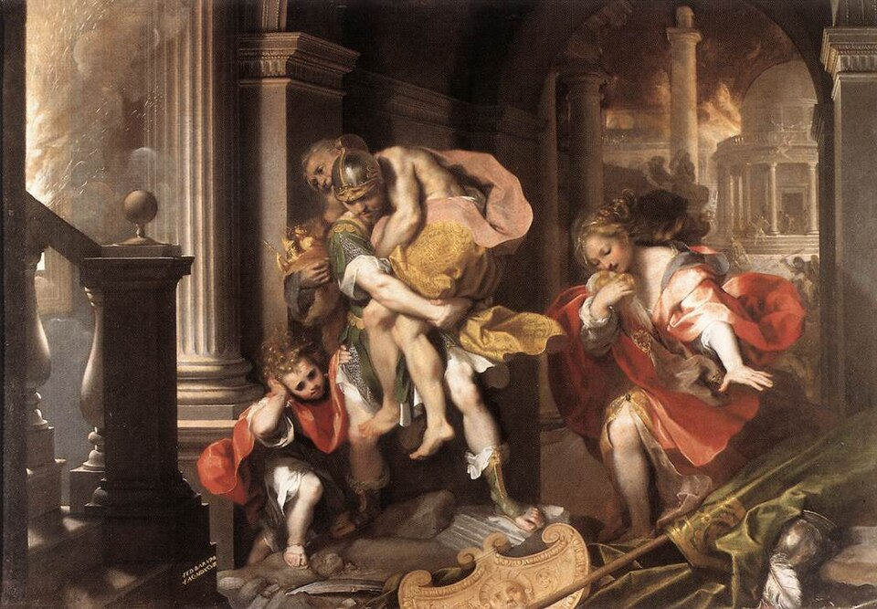
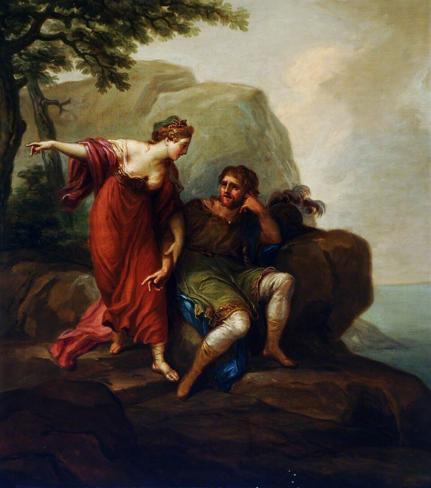
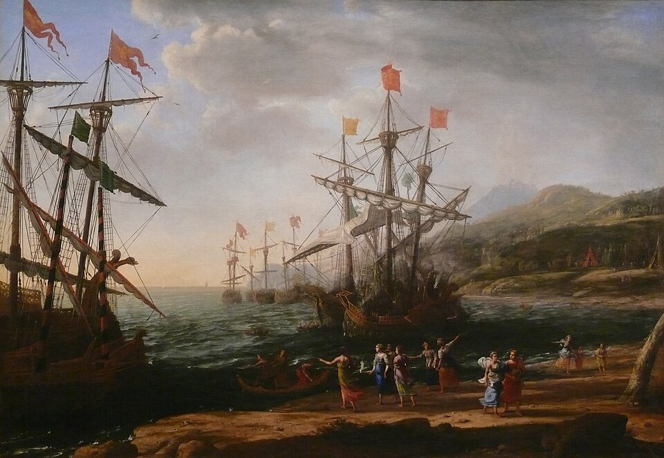
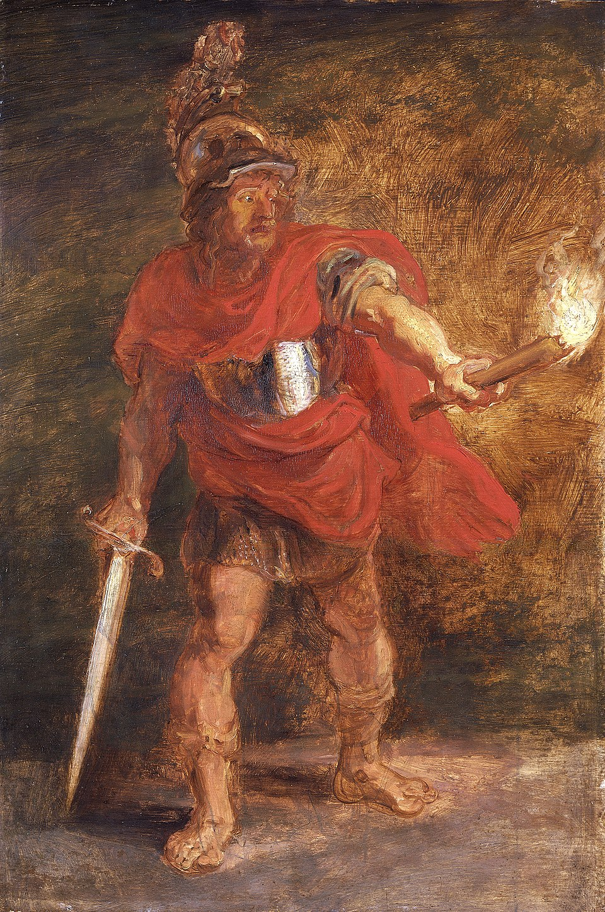
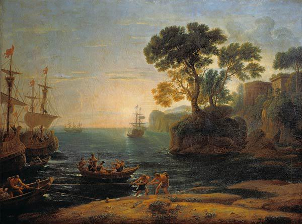

> You shall not go down twice to the same river, nor can you go home again.
>
> You can go home again, so long as you understand that home is a place where you have never been.
>
> --- Ursula Le Guin, The Dispossessed

What I've found in literature is a refuge, an antidote to feeling unique and, in turn, to loneliness. The journey I want to write about is one that started for me more than 10 years ago when I left my home country, Argentina, to study in Russia. It seems nearly poetic that that's how long Odysseus spent at sea on his return home. Am I finally coming home then? The journey I want to talk about clearly involves physical, geographical displacement, but the greatest distance travelled takes place inside of me.

I am in a transitional period in my life, that involves leaving Germany for Spain. Although theses type of stories never end while one keeps living, I feel I have gone full circle, in a sense, and am coming home. Home is for me, however, as only Le Guin can so beautifully express it, a place I have never before been. As I tell my story, I will be unapologetically leaning on literature to help express myself, as it has been my inspiration and guide in this path.

## Leaving Troy

<figure>

  <figcaption>
Federico Barocci, Public domain, via Wikimedia Commons
  </figcaption>
</figure>

> I not Aeneas am, I am not Paul,
>
> Nor I, nor others, think me worthy of it.
>
> --- Dante Alighieri, Inferno

As Dante said, I am not Aeneas, but... I have seen myself reflected in his struggles, as an immigrant sailing through foreign lands, in search of what every living being on Earth most yearns for, a place to call home. He takes off, Troy behind in flames, his father on his back, though where he's going, it's not a place his father or mother will get to see. Isn't that scene alone enough to bring anyone to their knees in tears with just how well it describes the human condition? One who leaves their place of birth, be it a country or their parents' house, to face the world and discover life, and who so wishes they could share everything with those who raised them. Doesn't everyone just wish they could have their parents see life through their eyes, to show them what you've seen, to take them where you've been?

So, I left my parent's house, the country of my birth. What was I looking for? Was I chasing a dream or running away from a city in ruins? It happened that I was evidently running toward something and away from something at the same time, though at the time I could only the dream ahead of me. Leaving was inevitable.

In Russia, it was our, my partner's and mine, first time living on our own, the gods know how many kilometers away from our support network. It wasn't just the academic challenges, we were confronted with a unique set of struggles that any immigrant must face and that end up shaping you as a person. Before departing, I thought the greatest of which must surely be the learning of a new language to study your degree in. If I had to reflect back, though, I would say the heaviest weight to carry, and the one that got heavier instead of lighter as time passed, was navigating a world where you'd always be an outsider. No matter how fluent you became, how good your grades were, how much of an effort you made in trying to "adapt" to the food, the culture, the values. In the end, the most meaningful and beautiful friendships I made were in my native tongue, with those of my own culture, with other immigrants from Latin America.

This weight I carried didn't mean I wanted to go back. It's not so straightforward. What was there for me to come back to? The person who had left those shores no longer existed, and I wasn't sure the shores would recognize her either. Home, I'm afraid, was not something I could find where I last saw it.

<figure>

  <figcaption>
Dido and Aeneas, Antonio Zucchi, Public domain, via Wikimedia Commons
  </figcaption>
</figure>

However, I found much of what I had initially set out to attain.  My alma mater, the Moscow Institute of Physics and Technology, was my Dido. She is the one who gave me refuge, through her I found exactly what I had been missing from my life. That's how it felt like at the moment. Through her I felt I proved myself and what I was capable of. I discovered much of myself in Nizhny Novgorod, in Moscow, in the university halls and through the sleepless nights of exam season. It wasn't just about passing exams, it was about self discovery. I had found a place where I could see myself thriving. I had the opportunity to just about dip my toes into the academia life, and though so much of it was calling to me, I realized it was not quite right for me. The best way I can put it is that in order to truly excel in any one area, you must give it your all, to the detriment of all else. It's not a tradeoff I was willing to make.

## My Little Troy

<figure>

  <figcaption>
The Trojan Women setting Fire to their Fleet, Claude Lorrain.

<a href="https://commons.wikimedia.org/wiki/File:Metropolitan_Lorrain_Tempest.jpg">Foto Ad Meskens</a>, <a href="https://creativecommons.org/licenses/by-sa/3.0">CC BY-SA 3.0</a>, via Wikimedia Commons
  </figcaption>
</figure>

> Proceeding on, another Troy I see,
>
> Or, in less compass, Troy’s epitome.
>
> --- Virgil, The Aeneid, Book III

As fate wills it, the journey must go on. With half my heart still in Moscow, having uprooted my life there due to the war, my next stop was Germany. Just as when Aeneas landed on Sicily, where they were welcomed by King Acestes, of Trojan blood, so did I feel embraced by such a beautiful country and culture. This was my little Troy. I had my first job here and had my first experience of truly feeling like an adult. I found pieces of myself here and truly embraced it as my home. 

Just like the Trojan women did while the men were feasting, part of me set fire to the galleys. I was exhausted of the wandering, every bone of my body begging to settle down. I was ready to begin rebuilding here.

With time, however, that same weight I mentioned earlier so innately tied to the immigrant experience grew heavier and heavier. It was my husband who first grew weary of this burden, and identified its source. After many late night talks, we decided it was time to reconstruct those galleys.

It wasn't easy, these types of enterprise never really are. So much is at stake, a stable present and future, and so much effort is needed. But we knew it was the right choice.

## Visiting the Underworld

<figure>

  <figcaption>
Peter Paul Rubens - Aeneas in the Underworld
  </figcaption>
</figure>

> MIDWAY upon the journey of our life
>
> I found myself within a forest dark,
>
> For the straightforward pathway had been lost.
>
> --- Dante Alighieri, Inferno

I am not Dante, but I have, like every human being, gone to bed and wondered what the hell I'm doing with my life. Am I doing this right? There most likely is no one answer, but for me, it's in the simplest of moments that I've come to find true meaning. These are the moments that give everything else meaning, and they usually involve friends and family. Why then wouldn't I prioritize these relationships, these moments?

I've done much introspective work throughout these last couple of years, which has helped me redefine priorities and, perhaps most importantly, free myself from old narratives and fears that had been holding me back from experiences that truly matter. All of this was vital in realizing what the next step should be.

## Arriving in Latium

<figure>

  <figcaption>
Landscape with the Arrival of Aeneas in Latium, by Claude Lorrain, 1650, oil on canvas, Pushkin Museum, Moscow.
  </figcaption>
</figure>

> Son, when you’re carried to an unknown shore, food is lacking,
>
> and you’re forced to eat the tables, then look for a home
>
> in your weariness: and remember first thing to set your hand
>
> on a site there, and build your houses behind a rampart.
>
> --- Virgil, The Aeneid, Book VII

Why do I say then that I am returning home, when I'm going to a place I've never been? The best way to try to answer this question for myself is by first realizing that where my journey started is a place I can no longer call home. Neither the place nor I are the same as when I left. I've taken with me little pieces of everywhere I've been, until little by little, they've morphed into part of me. Like a puzzle piece that's been away too long, bent and reshaped to fit elsewhere, so that it can no longer fit in its original spot, I can't fully identify with one place. Not that the piece ever did fit, hence the origin of my quest.

However, after being abroad for +10 years, I've come to love my own native language, my own native culture. I've learned to recognize its beauty by being away and noticing what is missing from my life. Each place holds its own wonder and its own weight. Through knowing myself better, I've come to understand which weight I can carry and which wonder I am not willing to live without.

It might sound contradictory, but that's how I've made sense of it. If home is where your roots can take hold and where your family and friends are, then I am heading back to just that, bringing my own family along with me. It's a weird feeling actually, arriving somewhere that will become home, not because it already feels like one, but because that is where your people are and where roots are meant to grow. I hope we find the tables tasty, then we'll know we've truly found it.
