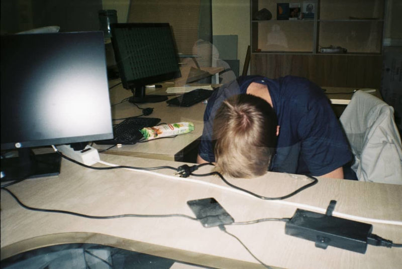
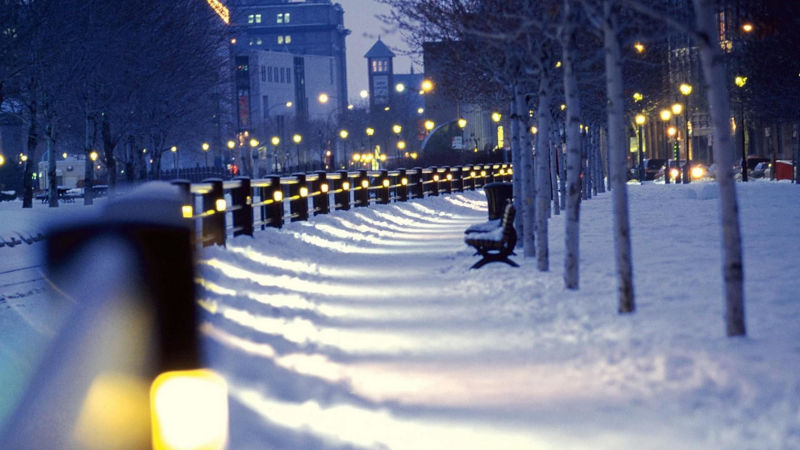
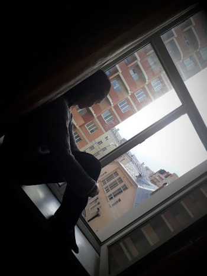
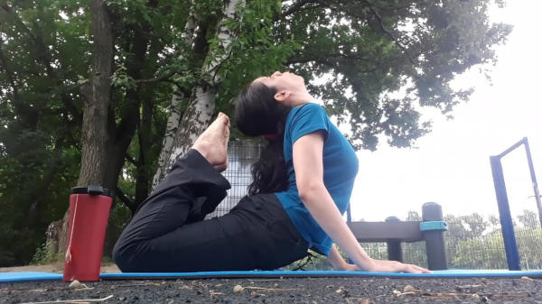

My first semester at MIPT felt like military training for me.
Every hour of my day revolved around studying, worrying and
stressing about failing and getting sent back home.
I developed dermatitis and acid reflux because of stress.
Everyone was on the same boat. In the end, the dropout rate after
the first year was at about fifty percent.

<figure style="text-align: center;">

  <figcaption>
    Photo by Александр Голодков (Alexander Golodkov). Follow him
<a href="https://www.instagram.com/agolodkov/?hl=en">@agolodkov</a>.
  </figcaption>
</figure>

Words can't describe the relief I felt after passing my first exam,
walking through the campus back to my dorm, now suddenly 
everything seemed brighter and prettier. I now had an official
confirmation that I wasn't a complete failure and maybe I did
actually deserve to be here. Memories are a bit blurry
after that, but the beginning of second semester was bliss.
The best way to describe my feeling is the way you see in movies
that people experience their first days of university.
Walking through the halls, meeting new people, curious to discover
what this
new life away from home has in store for you. Discovering new
experiences,
being genuinely curious about your subjects, not just studying them
like a machine because you have to. I didn't get to
experience that the first semester because I was too worried about
not being kicked out.

This didn't last long, though. Half way through, the quarantine
kicked in, we suddenly had to figure out how to study the material
almost on our own, while managing at the same time
the uncertainty of a global pandemic and trying not to go crazy from
being locked in the same room all day. Oh, and don't get me started
on the homemade diy labs that our dear general physics department
treated us with... Nevertheless, not all was gloomy thanks to what
happened during my first winter at phystech.

## Winter of Contemplation and Choosing my Department (Кафедра)

The most important decision for a bachelor student at MIPT is the
choice of your кафедра, or department. You can attend
the classes provided by multiple departments during the
first and second year, to get to know the professors and 
get a feel for what you'll be studying there.
Then, you make a decision by the end of the 3rd semester.

I spent the winter holidays researching all my options, and
giving it a lot of thought. This is where I have to thank my
boyfriend, Santiago, because all I wanted to do at the time
was lay in bed and watch Netflix after a draining semester.
However, he insisted that if I didn't devote the time for
choosing now, I would spend the rest of my time here doing
something I didn't like. So I went through all the options and
the one seemed like a best fit was the 
["Department of Condensed Matter and Living Systems Computational Physics."](https://mipt.ru/education/chairs/phys_cond/)
You can watch a cool information [video](https://www.youtube.com/watch?v=Kuj4dJpfvwg)
about the program made for newcomers.

The first day I walked in the classroom and saw everyone
with their laptops coding in Linux :)
and discussing physics.
During the first 5 seconds, I had already decided this is
where I wanted to be. 
It was the atmosphere that I fell in love with.

Everyone was working on the admission project:
writing your own molecular dynamics simulation, under the supervision
of the department head, Norman Henry Edgarovich. An exemplary
professor, he pushed us hard and motivated us to get work done :)
It's interesting that the head of department was the one
giving the course for
us, newbies, instead of spending that time on
more advanced master's or PhD students. 
This reflects on the value he places on his new students and the
importance of guidance and mentoring at the beginning of our
paths.

I have not once regretted my choice.

## Summer of Recalculating Direction

Fast forwarding a bit, the summer after the second semester,
Santiago and I
didn't get a chance to go home visit our families
because of covid. This gave us plenty of time to reflect about
where we were headed, something that had been impossible
during our chaotic existence as first year PhysTech students.
In summary, this is what came out of it:

1. Okay, we got this far, but university won't give us a path
for our future careers. It gives you the foundation, but it is
on you to build that path.
This drastically changed our view on university,
which takes me to my second point.

2. Grades don't define you nor your future. 
What's more, living under high levels of
stress in order to keep up good grades was no
sustainable way to live.
It also didn't leave any mental space or free time for personal
projects, which, in my opinion, say way more about who you are
and what you are capable of than a number on a piece of paper.

The 3rd semester was the time to test our new mindset.
The most valuable thing I took from this experiment was
learning not to tie my self-esteem to my grades.
It was somewhat obvious, but nontrivial, revelation
that if got called to the board and didn't know
how to solve the problem, or if I didn't score high on a test,
I was still the same person.
My worth as a person didn't change because it was never about that.
This took a heavy weight off my shoulders.

Besides, I also built some cool habits and made progress
in other areas of my life:

- Devoted more time to personal projects and figuring out
what I wanted to pursue.

- Went from drinking coffee several times a day to once a week
or even once a month.
I was anxious and stressed enough and coffee wasn't helping.
So, I replaced my coffee dependency with more hours of sleep
and enough tea to ease the craving of sipping on something
hot throughout the day.

- Took up yoga, which helped me manage stress and my posture.

- Started calling my family more often.

## Why the Mindset of Not Caring About Grades Doesn't Work

In the end, that new mentality of not caring much about
grades took me on a path of personal growth,
but at the same time it came with a much
unexpected cost:

The subjects that once sparked curiosity and enjoyment in me had
become a chore.
Since I saw no point in trying too hard,
I entered the vicious cycle of doing mediocre work and receiving
mediocre results.
This left me with no motivation to keep going.
I understood that this strategy wasn't working.

In the end, I came to the conclusion that I
needed to find a balance, where I could devote enough
time to my studies but also leave energy to actually
enjoy life.

I recently read the book [Flow: The Psychology of Optimal Experience](https://www.goodreads.com/book/show/66354.Flow) by Psychologist
[by Mihaly Csikszentmihalyi](https://www.goodreads.com/author/show/27446.Mihaly_Csikszentmihalyi) which I simply fell in love with.
This phrase quote from his book sums how I would describe my new
philosophy:

> The key to flow is to pursue an activity for its
> own sake, not for the rewards it brings.
>
> --- <cite>Mihaly Csikszentmihalyi</cite>

Whether it was catching up with homework, doing some
really cool coding project, or typing up a lab report
(ugh, I've never liked labs...), it turns out that the
activity becomes more enjoyable if I
approach it with curiosity and for its own sake,
devoting enough time to actually appreciate it, instead
of trying to just get it done as fast as possible.
This approach might take up more time, but instead of draining
my energy, it refills it, so I am more motivated to take on
other tasks.
Another lesson I learned is that
our most precious resource in the pursuit of our goals
is usually not time, but energy, both mental and physical.

## On Why I love MIPT

Second year comes around, and that's when I started working on
my CFD (computational fluid dynamics)
 filtration research project under the supervision of 
Vasily Vyacheslavovich Pisarev.
We would meet every week for a few hours. Sometimes we discussed
the physics, other time the peculiarities of the Julia programming
language, and on some days there was no other option but to
debug and rewrite nasty parts of code from scratch.
This has been one of the most enjoyable learning experiences
in MIPT, which is why I love this university.
PhysTech doesn't just give you a strong preparation in the core
subjects, but it also provides you with opportunities to
dive deeper on topics that strike passion in you.



The highlight of the fourth semester was a post in Reddit
where I asked about job perspectives in Germany in the field
of CFD, being contacted by the team lead of a firm and almost
getting a summer internship. I went through the whole process,
interview and all. I got so excited, that 
I was reading papers on their
methods and trying to remember my German, instead of studying for
classes. In the end it didn't work out since the two months
of summer break
weren't enough time for me to give back to the company after
the training period.

This fifth semester I had the opportunity to take part in my first
scientific conference and present my work on filtration!
Since I am not yet finished with the project, the conference
was more like a checkpoint.
It was cool seeing what others were working on and
getting feedback on my own progress.

## Some Closing Thoughts and Next Steps



In conclusion, during my time at PhysTech I
have experienced burn out and
anxiety, especially, but not only, during exams.
I have also had moments of
great gratification and breakthroughs, both personal and
academic.

My goal this semester was
to avoid falling in the 'pit of despair' both during the semester
and during exams.
I am writing this a week before exams, and so far
I can say that these new strategies have helped me stay clear
of that dreaded state of burn out. Though the real test is
about to start, so we'll see what happens :) I am optimistic.

It's hard to get caught up in the flow of everyday life, but
sometimes it's necessary to take the time to reflect
before moving forward. After thinking hard
about where I see myself in a few years, I've decided that
my goal for the incoming semester is to aim for a summer internship.
This will be a big challenge, since they usually take people
doing their master's, but I am hopeful my hard work pays off.

I hope that by writing about my journey I could help
someone who is in a similar situation and
maybe share a new perspective to those walking down
completely different paths.
This was a very personal post for me, so 
I am very curious to hear what were your thoughts while reading!

