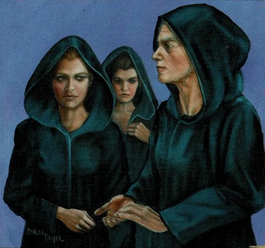
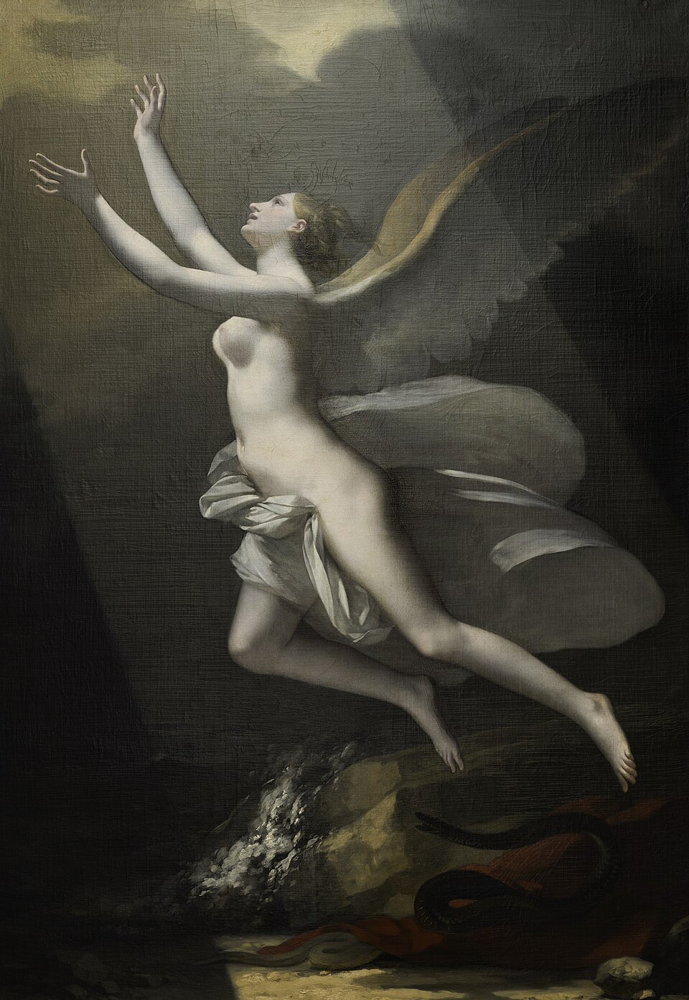
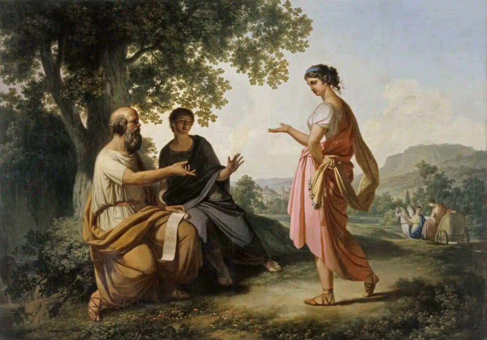
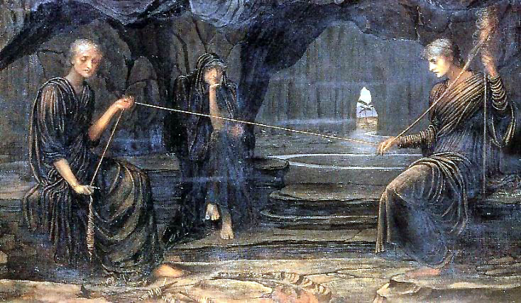

Now that I've finished Chapterhouse, I can confidently say that Heretics is my favorite book of the series. I am at awe by Herbert's portrayal of an "ideal" society. Part of my fascination comes from having read the last three books simultaneously with Plato's Republic. I'm not sure if it was Herbert's intention, but they brought to life many of Plato's concepts for me, which had seemed too far fetched at first. I absolutely adored the series. That's why I want to continue the conversation I started with my previous post on God Emperor of Dune regarding the parallels between Frank Herbert's and Plato's ideas. I am neither a philosophy nor a literature expert, just an avid sci-fi reader with a pull towards philosophy.

I would like to first illustrate the parallels I found in a general way, and then go into details. We can think of the Bene Gesserit regime as Plato's aristocracy in his ideal city. The Mother Superior at the top would be akin to the philosopher king. Then, there's the guardian class, which could be the rest of the Sisterhood, including men like Miles Teg and Duncan Idaho. At last, Plato's working class could be paralleled with the rest of the human race in Dune's universe. This comparison makes sense given that the Sisterhood's goal is to guide the human race into maturity.

## Mother Superior as Philosopher King

<figure>

  <figcaption>
The Bene Gesserit Sisterhood, as depicted in Dune — image source: Dune Wiki (Fandom)
  </figcaption>
</figure>

One important point Plato makes regarding the philosopher king is that he shouldn't desire to rule, instead it's his duty to his people. The city provides him with an elite education, the price for which he must later repay by serving as their ruler. We see this same concept in Dune, where it's made clear that someone like Bell, who craves power a little too much, couldn't become Mother Superior. The role of Mother Superior is a role of selfless sacrifice for the greater good. The Bene Gesserit also have this concept that each sister 'owes' the Sisterhood. We see this throughout the whole series, but it's made explicit to us when Odrade tells Sheeana how she now owes the Sisterhood for saving her and letting her join them. It's the same motivation the philosopher king has to rule the city: he owes his people, since it's only thanks to their support that he has access to the education that allowed him to escape the cave and see the truth.

The rest of the Reverend Mothers could be considered philosophers and part of the ruling class as well. They provide council to the Mother Superior. Also, let's not forget the proctors who keep the Mother Superior in check by having the power to vote her out.

One question that lingered while reading Plato's Republic is: how stable is such a configuration over time, considering human nature? One generation? A few generations? Plato himself discusses how such a society is bound to degrade over time, ending in tyranny. Herbert answers my question with a caveat: the Bene Gessirt persist through time, but they seem to be no longer human.

I found this idea fascinating, particularly in how the series develops a subtle but stark shift in what it means to be "human." Early in Dune, the Bene Gesserit claim the authority to "sift through people to find the humans" by using the Gom Jabbar to identifiy individuals with mental control over their primal instincts. Humanity, in this framework, is defined by self-mastery and awareness.

In Heretics of Dune, however, that standard is turned inward. The narrative raises the possibility that the Bene Gesserit’s own institutional discipline have distanced them from the very qualities they once used to define humanity. Odrade’s character arc, in particular, centers on navigating the fragile boundary between calculated, systemic control and emotional, relational engagement, suggesting that being “human” may require vulnerability as much as mastery. I explore this topic a bit more when discussing the concept of "love."

## The Sisterhood as the Guardian Class

The rest of the Sisterhood could be considered the guardian class. The acolytes are guardians/philosophers in training. They receive highly specialized education, just as guardians do, to be able to protect themselves and the Sisterhood. They would rather die than do the Sisterhood harm, just as the guardians. Education is the basis for everything. It shapes the mind and the body to support complex skills later on while also providing a moral foundation.

> Education is no substitute for intelligence. That elusive quality is defined only in p art by puzzle-solving ability. It is in the creation of new puzzles reflecting what you senses report that you round out the definition.
>
> --- MENTAT TEXT ONE (DECTO), *Chapterhouse: Dune*

Both Bene Gesserit and the guardian's education have the ultimate purpose of allowing the soul control over the spirit, so they can both rule over the body. Herbert doesn't talk it about it in those terms exactly, but he describes at length how the sisters are taught to be masters of their emotions and in turn control the body even by manipulating their metabolisms.

Plato describes a breeding program for the guardian class with the aim of producing the best soldiers and ideal rulers. The Sisterhood engage in a similar endeavor. In both societies, the concept of the nuclear family is replaced by a sort of 'communal family.' Children aren't necessarily raised by their parents. In fact, most of the time, they don't even know who their parents are. They advocate for a tribal sense of family.

They have two purposes. First of all comes survival of the Sisterhood. Second of all, they consider themselves educators, guiding humanity toward maturity.

## The Agony as Escaping the Cave

<figure>

  <figcaption>
The Soul Breaking the Links Holding it to the Earth (1821-1823) by Pierre-Paul Prud'hon
  </figcaption>
</figure>

Surviving the agony is escaping the cave. Along with Sharing, it's the glue that binds them together. If you have seen the truth with your own eyes, felt it with your own senses, there's no need for anyone to try to convince you of it. It's simply genius. It's the ultimate cult, only it's actually the antithesis of religion. It's based on seeing the universe and human nature for what it is in its most raw form.

I was so worried when they wanted to turn Murbella into a Reverend Mother, wondering how can they trust her? What if she betrays them? However, they knew (or at least Odrade did) it was inevitable for her to convert completely to their side once she went through the agony and truly saw things for what they are. The trust they build among their sisters is based on a mutual understanding of the world, through the Agony, and of themselves, through the Sharing. Even the sisters who rebelled, like Jessica or Schwangyu, eventually came back.

> What you really want is to conjoin our experiences, make them sufficiently like you that we can create trust between us. That's what education does.
>
> --- Murbella, *Chapterhouse: Dune*

This is the basis of their whole plan to convert the Honored Matres. They would have no choice but to give in and join their sisters. I was blown away by this realization.

> There would be a honeymoon. Honored Matres would be children in a candy store. Only gradually would the inevitable grow plain to them. Then they would be trapped.
>
> --- Murbella, *Chapterhouse: Dune*. 

## Love and the Limits of Humanity

<figure>

  <figcaption>
Painting of Socrates and student discussing love with Diotima by Franz Caucig. Credit: National Gallery of Slovenia.
  </figcaption>
</figure>

From my limited understanding of Plato's views, he considers love as a double edged force. On one hand, it motivates a philosopher to seek the truth and ultimate Good; on the other, when not governed by reason, it can become destructive. Plato portrays the tyrant as a figure ruled by lawless desires, especially erotic ones. In Dune, this idea is reflected in the Honored Matres's enslavement of entire populations through their use of sexuality as an addictive drug.

The underlying tension runs throughout series. It appears as early as Jessica's betrayal of her sisters by falling in love with her Duke and giving him a son instead of a daughter, as she was commanded. It is the Tyrant's greatest loss and the root of his suffering, something he loses along with his humanity. The rejection of human love is also at the root of why Bene Gesserit doubt if they're even human anymore.

It makes me wonder what Herbert wanted to convey through his work regarding love. The overall theme I get is: it might be a weakness, but it's what in the end makes life worth living. It's a such beautiful way to see it, in my opinion, because it truly puts things into perspective. Odrade talks about how some sisters are overcome with hate in their efforts to reject human love and affection, which might be just as harmful as love itself. This speaks about the inevitable aspect of it. You might as well embrace it, like Odrade did, which is the path that ultimately led her to saving the sisterhood. She realized that instead of continuing the endless cycle of war and violence, love could be the answer.

> “And there’s our flaw. We don’t give ourselves easily. Fear of love and affection! To be self-possessed has its own greed. ‘See what I have? You can’t have it unless you follow my ways!’ Never take that attitude with Honored Matres.”
>
> “Are you telling me we have to love them?” 
> 
> “How else can we make them admire us? That was Jessica’s victory. When she gave, she gave it all. So much bottled up by our ways and then that overwhelming wash: everything given. It’s irresistible.” [...]
> 
> “It’ll be a bloody union, this joining of Bene Gesserit and Honored Matre.” [...]
> 
> “A marriage made on the battlefield.”
>
> --- conversation between Bell and Murbella, *Chapterhouse: Dune*. 

## Greek Fate and Herbert's Prescience

<figure>

  <figcaption>
A Golden Thread by John Melhuish Strudwick 1885
  </figcaption>
</figure>

I want to conclude my essay with a thought that I recognize might be a bit of a stretch, but it's nevertheless worth exploring.

Greek tradition emphasized fate, controlling destiny. Plato shows us a way out of the chains of fate: by breaking free from the sensory illusion of the cave, we discover a higher reality and freedom to choose a better life for our soul.

The way I see it, Herbert's concept of prescience has much in common with the Greek concept of fate. Wasn't it those that were about to die who gained the gift the of prophecy in ancient Greek mythology? They could see beyond because they were already doomed. The same could be said the other way around, those endowed with prescience are doomed. Paul, for example, by daring to peek into the future, bound himself and all of humanity. As he describes it, knowing the future turns every moment into something already remembered rather than truly experienced.

The Bene Gesserit learned from this mistake.

> And I dare not use even my small prescience to guide us. I could lock our future into unchanging form. Muad'Dib and his Tyrant son did that and the Tyrant spent thirty-five hundred years extricating us.
>
> --- Odrade, *Chapterhouse: Dune*. 

Could it be that their way of breaking free from fate is similar to how Plato describes escaping the cave as taking agency in our own destiny?

> Don't ask the oracle what you can gain. That's the trap. Beware the real fortune teller! Would you like thirty-five hundred years of boredom?
>
> --- Murbella, *Chapterhouse: Dune*

Herbert's books have left me with much to ponder on, even sparking ideas I haven’t fully formed yet. I've greatly enjoyed the journey and I take a part of Dune with me. I am looking forward to untangling more of his ideas and wonderful universe on future re-reads. I would love to hear your comments and critiques!
