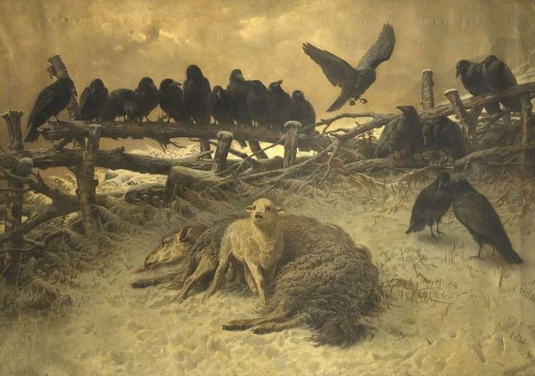
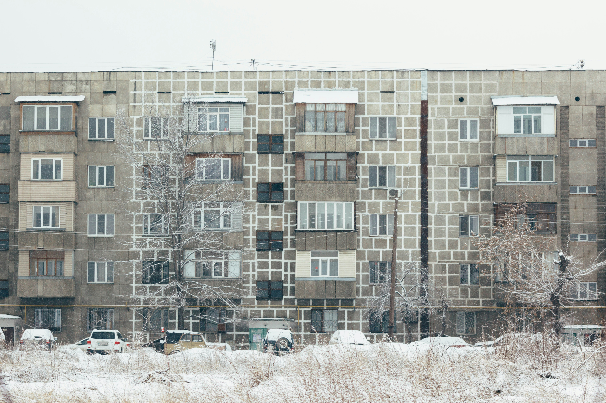
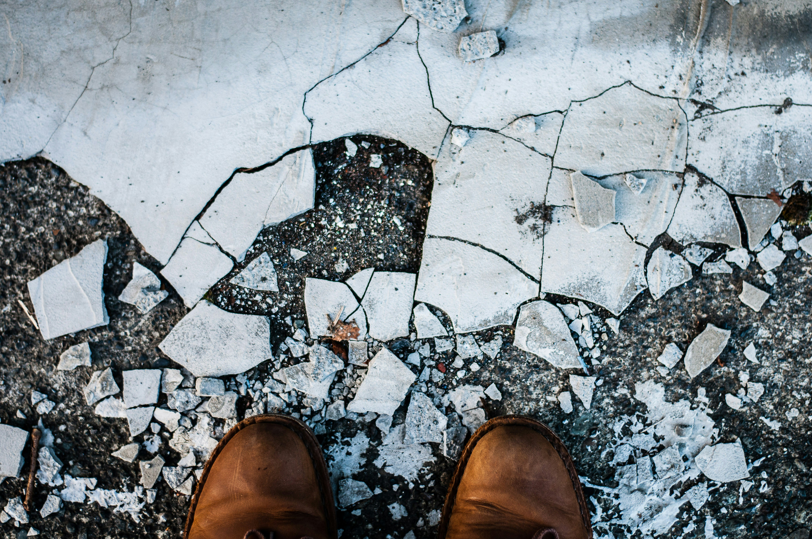
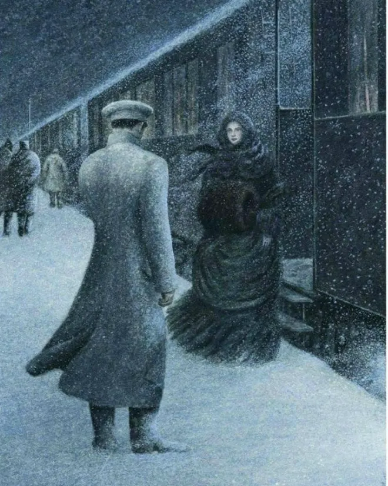
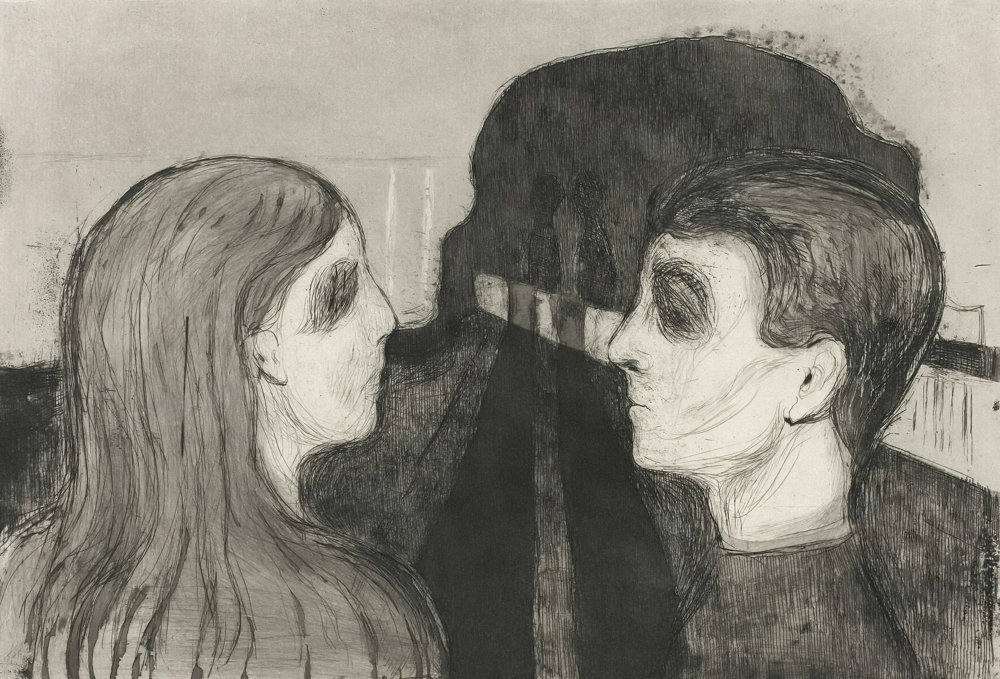
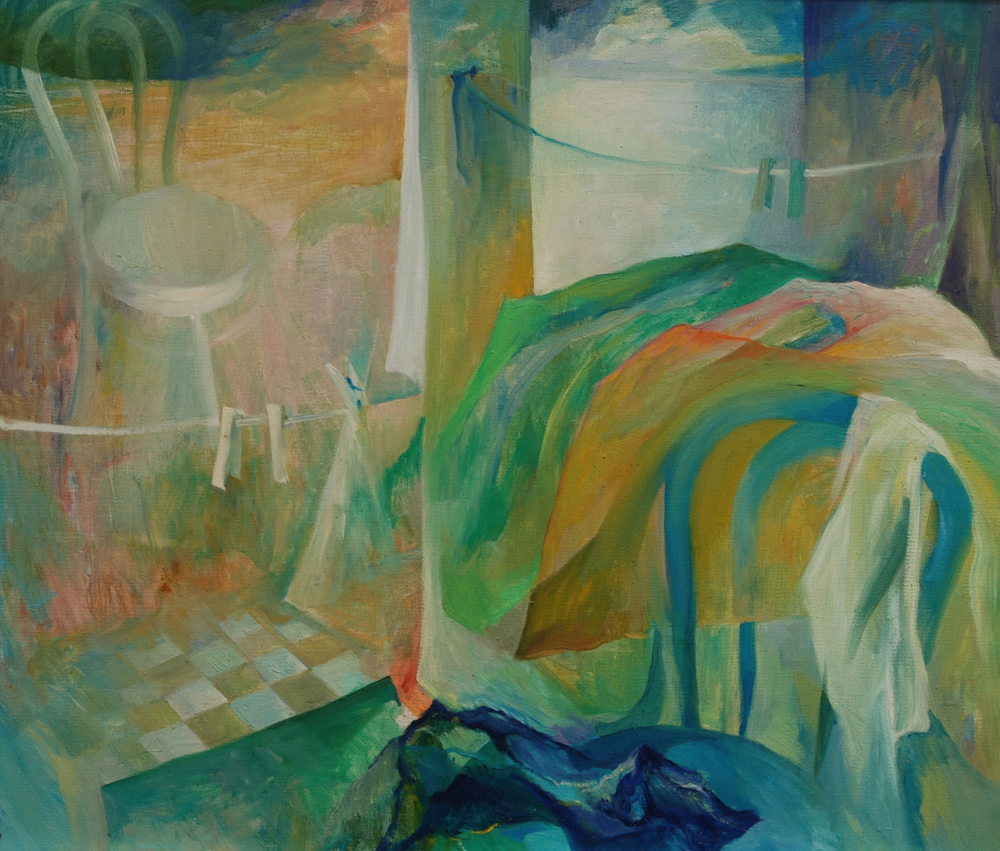

> The unexamined life is not worth living.
>
> --- Socrates

I've been lately on a search for something, though I'm not quite sure what. First, i tried looking inside, through mindfulness and Buddhist practices. That seemed like the way, until it didn't. I wasn't willing to commit and sacrifice so much for something that seemed elusive. I am also not quite sure I agree with the core premise, at least it didn't align for what I want for my own life. I am not necessarily looking to avoid suffering. Though many techniques and principles did stick and I'm glad I ventured. Then, I also looked into psychology, books like "The body keeps the score" and "Complex PTSD: From surviving to thriving." I hyperfixated on that for a while, and I believe I gained valuable knowledge. Now, however, I've adverted my gaze in a different direction. I'm now looking into literature to try to find that which I cannot name. 

Disclaimer: I'm not going to try and make a literary analysis of this work. That has been done by experts who are much more capable. I just want to share the effect this work had on me, as a reader.

## Why Does It Matter If We're Ready For Death
<figure>

  <figcaption>
    August Friedrich Schenck, Anguish, 1878, oil on canvas
  </figcaption>
</figure>

Ultimately, though, even if we have loved ones by our side, we must face death alone. Must we be "ready for when it comes"? Does it really matter? One could say, it's only some moments of extreme suffering and then it's all over, why does it matter or why should we worry so much about how death will find us?

I think it has to do not with avoiding suffering in those last moments, but more so with what those last moments reveal for us. It grants us is perspective. The big picture. It brings up our most raw emotions and truest desires. I would guess. At least the thought experiment does seem to bring something valuable to the surface.

Though I would also like to question the value of what this different perspective gives us. Since it comes along with so many emotions, it could be tainted or biased by fear and doubt. Let's take a snapshot of our view on life on two different scenarios:

- on our deathbed (or imagining we are there),
- on the happiest day of our lives (or imagining/remembering it).

Which one holds more truth? On the first scenario, we might have x, y and z regrets. While on the second one, we might say, just this one moment makes everything else worth it. Which one holds more truth?

## A Core Fear: To Not Realize Life Is Slipping Away and Wake Up Only When You Are About to Die

> Then he grew quiet and not only ceased weeping, but even held his breath and became all attention. It was as though he were listening not to an audible voice but to the voice of his soul, to the current of thoughts arising within him.

For the first time in maybe his whole adult life, he listened to himself. He took a step back and observed what was inside. Maybe what the thought of death does for us is to force us to be still and truly listen. To pay attention. We could otherwise go our whole lives living automatically.

This prospect is truly scary and why there's much value in examining our lives, our own selves, and what it means to be human.

## The Cost of an Ordinary Life

<figure>

  <figcaption>
    Photo by Darya Jum via Unsplash.
  </figcaption>
</figure>

> Ival Ilyich's life had been most simple and most ordinary and therefore most terrible.
>
> --- Tolstoy, The Death of Ivan Ilyich

This quote contradicted an unconscious belief I seemed to hold: those who live simple lives are the happiest. Something along the lines of, ignorance is bliss. I now find myself questioning which is true.

Let's examine Tolstoy's archetype of someone who lives an 'ordinary' life. They are, by definition, doing what everyone else is doing, if we take the definition of ordinary to be 'what is commonplace or standard.' They follow the path that the system has set in place for them. Here we arrive at our first contradiction: how can someone have their most fulfilled life in a system that is purposefully designed to take profit from us, not benefit us? However, they do stress less (maybe), since they're not constantly questioning their life choices. It must be painful, though, to experience life only at a superficial level, never daring to venture deeper. This includes the relationships they form, which are mostly based on spatial proximity, not on intention. They are agreeable and get along with everyone because they avoid conflict, which leaves them only with superficial interactions. No one can really get to know them because not even they have taken the time to get to know themselves. They follow the path that has been set out for them, never questioning if that's what they truly desire. 

Okay, seems like a pretty depressing existence, similar to what our protagonist describes. It makes sense, then, why his pleasure decreases as $\frac{1}{t^2}$ in relation to time. The older he gets, the less authentic he seems to get.

That seems to be the picture that Tolstoy tries to paint for us with his characters 'living ordinary lives.' Word choice can hint at the author's intent. 'Usual' is a synonym for ordinary. However similar both words appear, they have very different connotations. 'Ordinary' can leave a sour aftertaste in the reader's mouth, while 'usual' could indeed remind us of something familiar, home-like.

For most of us, a big chunk of our lives, by definition, will be ordinary. If we take Tolstoy at face value, we're looking at a quite gloomy prospect. Though I believe, like with everything, it's a spectrum. If we take the other end of the spectrum to be the over cynical philosopher, who is constantly analysing their life and min-maxing fulfillment, it doesn't seem like a very joyful existence either. They could go their entire lives paralyzed by fear or lead a life that looks great on paper, but is ultimately not aligned with who they are. There it is the theme of authenticity again. In both scenarios, not being authentic is what robs us of fulfillment. 

My takeaway is that we could all benefit from a bit from both viewpoints:

- analysing our lives and daring to venture deeper in relationships, passions, hobbies, even our career,
- while also learning to enjoy the quiet moments and mundane parts.

## Confronting the Self

<figure>

  <figcaption>
    Photo by Jachan DeVol via Unsplash.
  </figcaption>
</figure>

A glimpse into my inner dialogue as I was reading (from some of my notes):

For him it was following social expectations that led him on a path to an unfulfilled life. I would like to believe, "oh I'm good, I'm not going on a conventional path." Though, wait a minute, why so much defensiveness? What am I trying to prove? That I'm not like Ilyich and therefore won't suffer the same fate?

> It's as if death was something inherent to Ivan Ilyich.
>
> --- Tolstoy, The Death of Ivan Ilyich

What it is that I'm trying to escape from? I don't want to fall into the trap of believing that I'm doing everything perfect, as that leaves no room for growth. It's imporant to notice where defensiveness comes up because it could be pointing to an unconscious truth we are trying to avoid. 

> Until you make the unconscious conscious, it will direct your life and you will call it fate.
>
> --- C.G. Jung 

## Doing Things for Their Own Sake

Throughout the book, one consistent sybmolism is bridge: the card game that Ilyich likes to play with his colleagues. I've given it much thought to what it could represent.

I found it interesting that he doesn't like getting big rewards from it. I remember reading a study about how children will enjoy an activity less and less if receive external praise. Even we, as adults stop enjoying something we once loved if we receive outside reward for it (money). I guess that it speaks of a more general truth: whatever we do, to do it for its own sake. That's what bridge symbolises in the novel. The moments when Ilyich is playing are the only times he was able to find enjoyment or peace in adulthood, as he did in childhood.

## Echoes from Anna Karenina: Unmasking Pretense in Family Life

<figure>

  <figcaption>
    Photo by Vincent NICOLAS via Unsplash.
  </figcaption>
</figure>

I noticed some similarities with Anna Karenina (which I'm still reading). The theme of family life is strong in both books.

Karenin's marriage resembles Ilyich's. They got married because it's the decent thing to do in society's eyes. They have their routines, they have children together. Wife and husband fulfill their roles. They live in the same house, sleep in the same bed, but they don't really know each other. Both men use work as an escape from their family when things at home get a bit rough. They are then caught off guard when they reach a critical point in their lives, when they are in desperate need of a partner and they realize their wives don't know them, don't care for them, and definitely don't love them. Their kids hold affection for them, but there isn't a bond to speak of. They realize only too late of the consequence of detaching themselves from the emotional labour of holding together a family and raising their kids.

They believe themselves to be rational beings above the need for emotional connection. Ilyich time and time again dismisses his wife's pleas for emotional intimacy and partnership. He isn't there for her as she navigates the hardships of pregnancy and the transformation of becoming a mother. Instead he buries himself with work, letting her love grow cold and his children grow up learning not to rely on him.

I'm by no means putting all the blame on the men. I'm merely examining the role they had in their own fates in the stories that Tolstoy imagined.

This ties back to the topic of authenticity: what does it mean to be authentic in our relationships? One thing is clear, creating authenticity takes work and is cultivated over time. It takes being inconvenienced, for the other's sake, which is what Ilyich worked the hardest at avoiding throughout his life. It takes daring to be vulnerable and show up as a human being, trusting that the other will accept you for you. This is where Karenin, hiding behind his armour of detached rationality, fails to create a meaningful bond with his wife. 

On a related note, Tolstoy's writing is brilliant in creating a juxtaposition of his treatment of others and the treatment he gets when he falls ill. "and this conclusion struck him painfully, ..." The irony: what did he expect? I wrote in my notes: "Would this make him reflect on how he treated other in his job? I don't think so." Even at that moment, he remained blind to the irony that was so clear to us as readers.

## Echoes from Kafka's Metamorphosis

<figure>

  <figcaption>
    Photo by <a href="https://unsplash.com/@artchicago?utm_content=creditCopyText&utm_medium=referral&utm_source=unsplash">Art Institute of Chicago</a> on <a href="https://unsplash.com/photos/a-drawing-of-a-man-and-a-woman-facing-each-other-I9GvNd4ACeY?utm_content=creditCopyText&utm_medium=referral&utm_source=unsplash">Unsplash</a>
  </figcaption>
</figure>

> [..] in the third month of Ivan Iliych's illness, his wife, his daughter, his son, his acquaintances, the doctor, the servants, and above all he himself, were aware that the whole interest he had for other people was whether he would soon vacate his place
>
> --- Tolstoy, The Death of Ivan Ilyich

This book taps into a core fear of mine in a similar way that Kafka's Metamorphosis does. To be misunderstood and trapped inside your body, eventually to be discarded by society. Everyone around is just pretending, waiting for you to be gone. You were useful while your body was able to provide labour, but not anymore.

> From the doctor's summing up Ivan Iliych concluded that things were bad, but that for the doctor, and perhaps for everybody else, it was a matter of indifference, though for him it was bad. [...] Is my condition bad? Is it very bad?"

From my notes: This part made feel infinitely lonely. We all participate in a façade that everyone strives to maintain, until someone’s life unravels. No one wants to witness it, and no one wants their carefully constructed illusion disturbed.

For the doctor, it was just a Tuesday, and he wanted Iliych in and out of his practice as soon as possible and without much fuss. It's impossible not to shudder at the detachment of the doctor from the havoc his words wrecked in his patient's psyche. Words, uttered in a way that betrayed the weight of their implication.

## Final Thoughts

<figure>

  <figcaption>
    Tuba by Helle Vahersalu, 1974 
  </figcaption>
</figure>

My mood after finishing the book and also I'm writing this post is gloomy, but also hopeful. As I focus on my body, I notice a tight throat and a longing in my chest. Intellectually, I'm glad to get the chance to examine these ideas. Maybe it helps me be more prepared for when that time comes, maybe it helps me get closer, while I'm still living, to that which I'm searching for but cannot yet name. 

One takeaway for me is that one, if not the most, important thing in life is cultivating human connection. In an effort for which I'm sharing a glimpse into the emotional and existential rollercoaster that this book from more than a 100 years ago has taken me on. May we find solace in knowing we battle the same fundamental questions, which have coincidentally been touched on brilliantly by someone from another place, another era.
