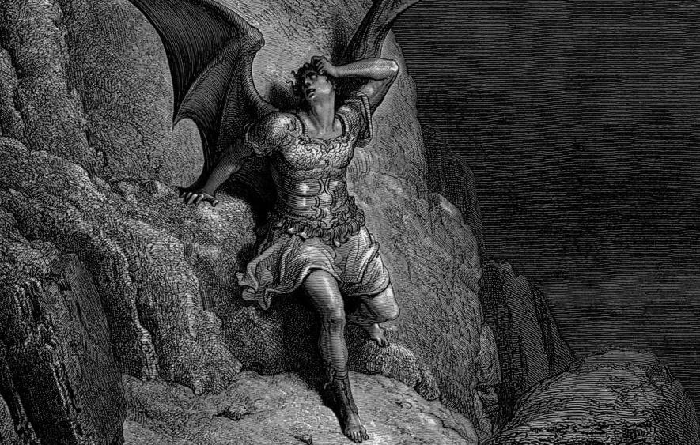
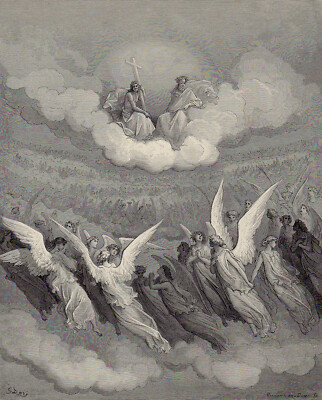
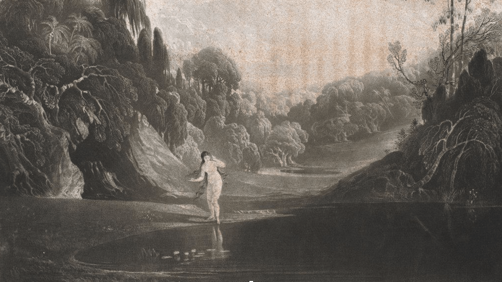
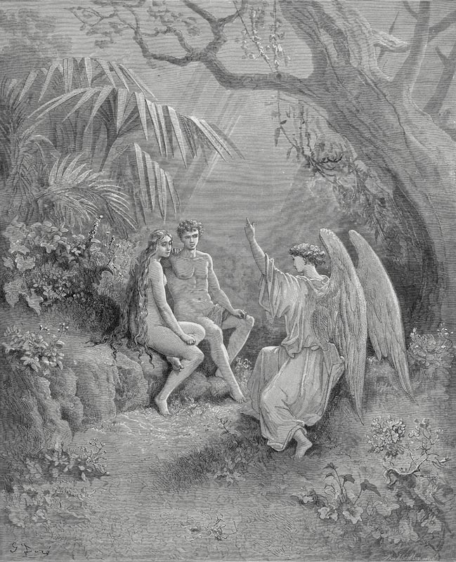
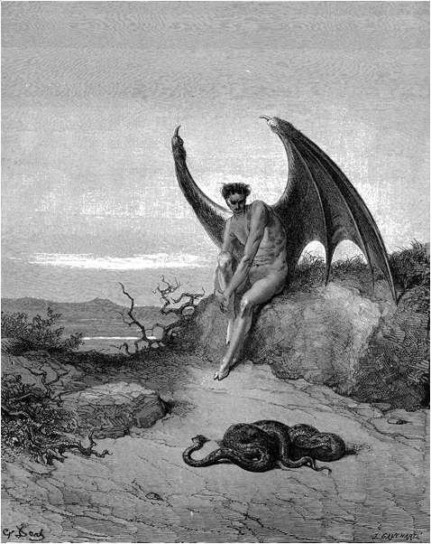
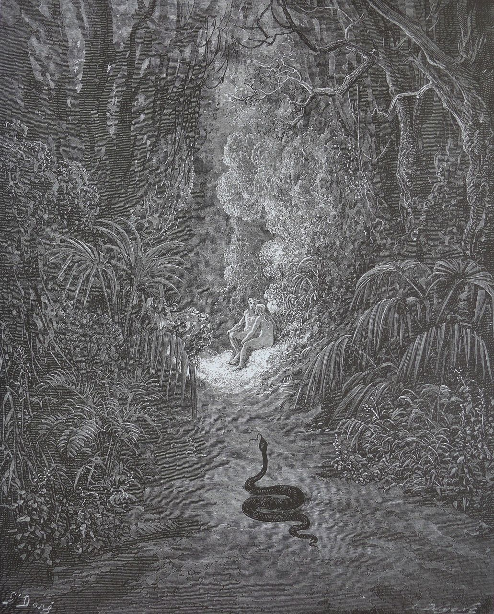

It's been a while since I read Paradise Lost along with the community over at <a href="https://www.reddit.com/r/ClassicBookClub/comments/1j27svc/paradise_lostbook_1_discussion_spoilers_up_to/">Classic Book Club on Reddit</a>. It was my first reading along with a book club and such a rewarding experience! I came across the announcement post as I was finishing reading The Iliad. Paradise Lost is an epic poem as well, and its author claims it surpasses the ancient classics, so I was intrigued. I very much enjoyed the book club reading experience as well as Milton's exquisite writing.

In the book club, it was very interesting to see the contrasting takes of readers who grew up in a Christian upbringing and those who didn't. I feel that whether we abide by those views or not as adults, having grown up hearing certain stories does definitely affect the lens through which we view the world, even to the point of trying to do the exact opposite in an effort to compensate.  Regardless, the shadow of some core fears attained in this way as a child remain. For me, I can say that it has definitely colored my first impression of Paradise Lost. I would even go as far as to describe it as a cathartic read.

I've put off posting about it, since my notes were a bit all over the place, so I thought I'd rather share as it is than not share it at all. So, these are mostly my notes, book-by-book, with minimal editing. I didn't write about all of the books, I only wrote about the ones that I felt I had something to say. The last one especially didn't cause in me such an impact as the rest, which means I probably won't be reading Paradise Regained any time soon.

I am in the process of getting accustomed to my new job, apartment hunting, and trying to find my routine amidst the chaos. So I find refuge in reading and writing. I am halfway through Lavinia, by Ursula Le Guin, and well, I decided to clean up this draft and finally publish it.

## Book 1: Satan in the Depths of Hell

<figure>

<figcaption>
<a href="https://commons.wikimedia.org/wiki/File:Gustave_Dore_Satan%27s_Despair.jpg">Gustave Doré</a>, Public domain, via Wikimedia Commons
</figcaption>
</figure>

My first impression was how refreshing it is to read this in comparison to the bible because the intentions are clear. This is also something I experienced with The Odyssey and The Iliad: the Greek Gods weren't good, but they didn't claim to be. Satan makes sense, in a way. He wants to do evil, which is the opposite of good. Good being what God wants. So, he's just striving to do and be the opposite of God. Even if he fears that in the end, as God is almighty, all will go according to God's plan and his actions will benefit that plan. He knows this, yet he still sets out to defy God.

It reminded me of us, humans, who know we're going to die, yet strive to live. We seek purpose and meaning, even though we know there probably is none.

> Better to reign in Hell, than serve in Heaven.

This part shook me to my bones. It got me thinking about how we're born in a system we didn't choose and that doesn't necessarily benefit us. We have a choice: to comply in hopes of lessening our suffering, or to rebel, at the cost of our happiness. Either way we lose, but at least in the latter we're choosing freedom.

As for God, I haven't always been able to clearly define his intentions. Let's see how Milton fleshes out His personality and motivation.

As for the descriptions and imagery, my first impression is that it's beautiful and terrifying at the same time. I'm listening to the audiobook as I read, and I feel myself getting lost in Milton's world. It's not an 'easy' read, but it's very rewarding. I have been rereading sections as I go, to first get an understanding of what is happening and then to just enjoy the poem.

## Book 3: Meeting Milton's God

<figure>

<figcaption>
Illustration for John Milton’s “Paradise Lost“ by Gustave Doré, 1866.
</figcaption>
</figure>

> Behold me, then: me for him, life for life, I offer; on me let thine anger fall;

This read almost like a family dynamic I recognized. Milton's God, the Father, comes across as someone who needs somwhere to put his wrath. The Son put himself in danger and submitted himself to his father's wrath in order to save man. It's like a kid putting himself in between his abusive father and his pet because he'd rather suffer himself than let his dear pet, whose greatest sin was disobeying a command he had no comprehension of, be hurt. Self control for the father was never an option. The Father needed a punching bag, an outlet to release his emotions.

> Freely they stood who stood, and fell who fell.
>
> Not free, what proof could they have given sincere
>
> Of true allegiance, constant faith, or love,
>
> Where only what they needs must do appeared,
>
> Not what they would? what praise could they receive,
>
> What pleasure I, from such obedience paid,
>
> When Will and Reason (Reason also is choice)
>
> Useless and vain, of freedom both despoild,
>
> Made passive both, had servd necessitie, 
>
> Not mee. [...]

There is something almost self-defeating in what Milton's God asks for. Not only does He seek constant self-sacrificing and obedient love and praise; he wants it to be done out of free will. This means that he wouldn't be satisfied with creating beings who have no choice but to serve him. He wants something which is essentially impossible. He creates beings who are bound to fail his standards due to their very nature, but still expects from them the impossible.

Why does God favor some humans over others? Why 'hard be hardened, blind be blinded more'? Isn't this a reflection of our current justice system where criminals are punished but not rehabilitated? Isn't this what Socrates referred to when he said that harming the unjust person leads more injustice because someone who is hurt is more likely to act more unjustly? Can a just being call themselves just if they are fostering injustice in others?

## Book 4: Paradise and Eve's Birth

<figure>

<figcaption>
Eve, from John Milton’s epic Paradise Lost (1667, 1674), stands before a pool, staring at her own reflection against the vast landscape of Paradise (illustrated by Gustave Doré, 1866).
</figcaption>
</figure>

One of the things that I liked the most about paradise is that we get to find joy in our work, we don't get burned out, and it's meaningful.

I loved the scene about Eve's birth, inspired by the myth of Narcissus. It's such a powerful metaphor that evokes hope for me because we weren't born submissive to the patriarchy and hating our bodies. We were born in love with ourselves. It was under external influence that we were conditioned (literally from birth) to be submissive and to have a troubled relationship with our bodies. I don't think Eve hates her body per se, or at least yet, but God guilting her loving herself is the seed of our self-loathing.

Save for the misogynistic elements, I liked the romance, how everything was pure, shame-free, and natural. How they can just exist and there's no expectation to alter ourselves to fit a standard. How we can just exist with the love of our lives and we'll be in bliss for eternity (at least for now).

There are some questions that popped up for me:

### Would God Have Forgiven Satan Had He Repented?
I think it's impossible for Satan to repent given his nature, and since God knows this, he won't forgive him.

### What Is the Symbolism Behind the Tree of Knowledge Being the One to Lead to Death?
I guess one interpretation is that ignorance is bliss. Another interpretation could be knowledge of death is a prerequisite for dying. A baby is eternal because it has no concept of time, or of life and death, only of the now. Also, it's similar to how rulers strive to keep their societies dumb and illiterate because they are then easier to control. Plato's concept of the noble lie is also fitting. We are happy while we live under the spell of the noble lie, the tree of knowledge is the door out of the world of illusions, but we lose our state of never-ending bliss.

### Why Is the Tree of Knowledge Next to the Tree of Life?
Growing up I always wondered what would've happened if they had eaten from the tree of life right after eating from the tree of knowledge. I still haven't made sense of this.

## Book 5

<figure>

<figcaption>
Illustration for John Milton’s “Paradise Lost“ by Gustave Doré, 1866.
</figcaption>
</figure>

Ugh the patriarchy's claws are visible even in paradise. It's annoying having to filter through all that crap. Why does Eve have to make supper if both have been working all morning?

Eve must listen and ask her husband later, she mustn't ask questions to the angel directly. This resonates with my experience at church growing up. In my child's mind, I didn't understand why it was wrong of me to ask questions or to speak up.

## Book 6

<figure>

<figcaption>
Illustration for John Milton’s “Paradise Lost“ by Gustave Doré, 1866.
</figcaption>
</figure>

> Author of evil, unknown till thy revolt,
>
> Unnam'd in heaven, now plenteous, as thou seest,
>
> These acts of hateful strife, hateful to all,
>
> Though heaviest by just measure on thyself
>
> And thy adherents: how hast thou disturb'd
>
> Heaven's blessed peace, and into nature brought
>
> Misery, uncreated till the crime
>
> Of thy rebellion?

Sometimes even those who are the most evil possess desirable qualities, which causes the self-proclaimed good people to wonder. I believe it can stir up feelings of jealousy, or even a sense of unfairness. We expect those who are evil to be despicable, hateful beings, but it's not usually the case. I feel Milton did a beautiful job in showing the human side of evil.

## Book 8

<figure>

<figcaption>
Illustration for John Milton’s “Paradise Lost“ by Gustave Doré, 1866.
</figcaption>
</figure>

> [...] Heav'n is for thee too high
>
> To know what passes there; be lowlie wise:
>
> Think onely what concernes thee and thy being;
>
> Dream not of other Worlds, what Creatures there
>
> Live, in what state, condition or degree,
>
> Contented that thus farr hath been reveal'd
>
> Not of Earth onely but of highest Heav'n. 

In Book 8, Raphael warns them not to pry too deeply into the workings of the heavens, which got me thinking: where is the line drawn between what knowledge is okay to aspire to and which is wrong? Why is there such a line?

This is something I've actually struggled with growing up. I thought I was doing the right thing by studying the Bible and trying to make sense of it, but my inquiries were mostly looked down upon by other church members or the leadership. I felt that I wasn't meant to be asking so many questions or trying to piece out the logic. We were told to read the Bible and I did, which was, unbeknownst to me at that time, my first bite out of the fruit from the tree of knowledge.

## Conclusion

I've abstained from criticizing the misogyny excessively because it's obviously there, but I didn't want to make it the main focus of my analysis.

As to the question of whether Milton achieved what he set out to do, I believe that for me, at least, he definitely did. It's beautiful for me being able to walk through history in a sense, by reading different authors that are each continuing the narrative, each work a response to the ones that came before. Each author building upon the work of their predecessors.

I was skeptical about mixing Greek myths with Christian themes, but Milton's world building is insane in bringing everything together smoothly. It makes a lot of sense for me. I'd be doing Milton an injustice if I tried to define his writing; all I will say is that it was for me an exquisite read.

This work has given me a fresh perspective on the Christianity backstory and lore, as well as an appreciation for the hours spent studying the Bible as I feel it has given me a good foundation for tackling the western literature canon.
