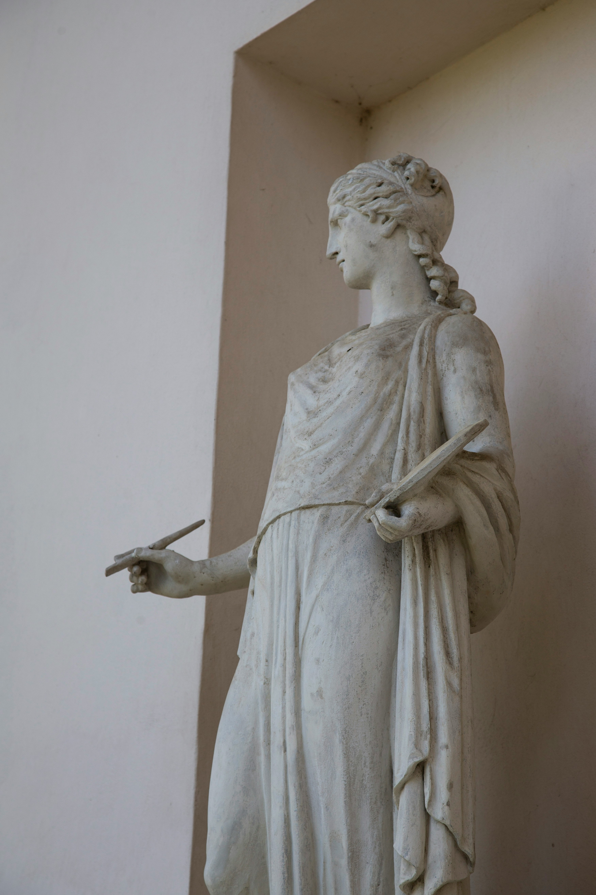
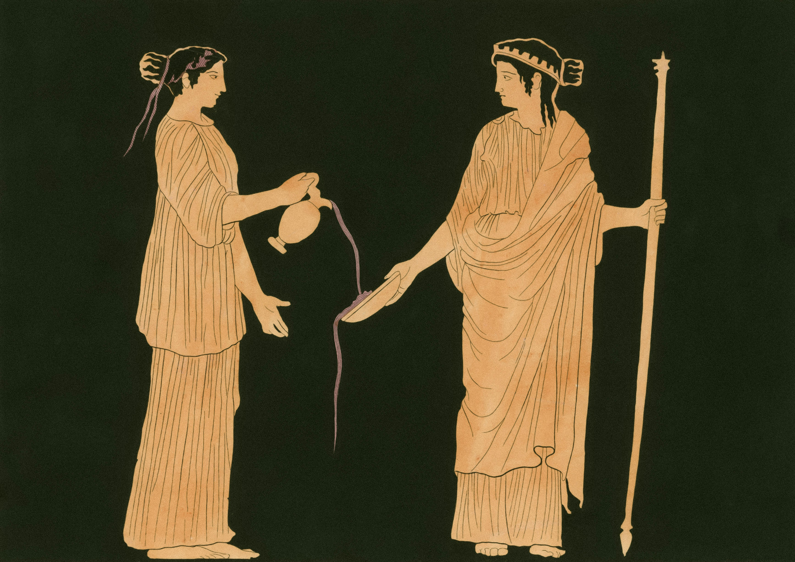

My previous post started with a quote from Socrates and ended with a reflection on our need for human connection. Back then, I wasn't planning on reading The Republic any time soon. That’s why I was stunned to find those same core themes popping up in my pre-reading research on Plato, and then again in the very first book:

- what it means to live a good life and what exactly is a life well lived;
- the value of human connection.

In an effort to pursue both the first and the second, cultivate connection and try to seek answers to the first question, I've set a book club with my parents. We'll start with The Republic and meet weekly to discuss one book each time. The first meetup was a sort of introduction, to set up our expectations and questions. I found it incredibly valuable to have those conversations and to open up about the ways we each see the world. I'm looking forward to also sharing my thoughts in this format as we move through the book!

## Two Visions of the Life Well-Lived: Plato and Tolstoy

From Adam Kirsch's introduction:

> What Plato teaches above all, in this Straussian interpretation, is the permanent tension between the truth, which can only be perceived and tolerated by a few, and consoling falsehoods, which are needed by the many in order to live a peaceful, happy life.

Tolstoy writes that the worst life one can have is an ordinary one. One theme that stuck out for me while reading the Death of Ivan Ilyich is the falsehood. Everyone seemed to be living their lives drowned in falsehood. My question still remains: whether the philosopher or the simple person archetype lives a happier life. Another question would be, do they both seek a happy life? Maybe fulfilment, and in turn, what we define as happiness, comes in completely different forms for both of them. Following from this Straussian interpretation of what Plato teaches, both must exist: the philosopher and the simple person. The simple people need to be guided and told lies by the philosopher. These lies make it possible for them to live a happy life. In this arrangement, does the philosopher live a happy life as well? 

### Who finds Happiness? The Philosopher Or the Simple Person?

<figure>

  <figcaption>
    Photo by <a href="https://unsplash.com/@milada_vigerova?utm_content=creditCopyText&utm_medium=referral&utm_source=unsplash">Milada Vigerova</a> on <a href="https://unsplash.com/photos/white-angel-statue-on-white-wall-CuzXP5eFZb4?utm_content=creditCopyText&utm_medium=referral&utm_source=unsplash">Unsplash</a>
  </figcaption>
</figure>
 

If we look at the allegory of the cave, for some reason, the philosopher decides to go back. She doesn’t *have* to go back to the cave to guide the prisoners. She’d be much happier in the *real world*, from how it's described. However, she choses to go back to the world of illusions in order to help her fellow humans. Maybe what compels her to do his is related to the other big lesson I took from Tolstoy book: the importance of human connection. Can she really be happy with all her knowledge of how things really are if she’s all alone? In this interpretation, she chooses to back to the cave, but the knowledge she has gained has transformed her in such a way that she can no longer live as they do, as she used to. This puts her in an awkward position, where she sacrificed what she didn’t know was essential in the pursuit of what she thought she was lacking but was with her all along. She found the knowledge she was looking for, and in that knowledge was the revelation that what she so desperately needs is something she had all along but can now no longer have. The next best thing she can think to do is to go back to the cave and try her best to find her place among those who are now alien to her. So she takes up the role of the philosopher king, as Plato puts it.

Another interpretation is that upon exiting the cave and experiencing the truth, she learns about something that compels her to go back. We don’t know what that something is. Maybe it’s what I mentioned earlier. Could be something else. Could be she is compelled to do ‘justice’ to her fellow humans. By this I mean to do the most ‘good.' Why is she seeking to do the most good? Either to protect her soul or for her own happiness, since Socrates tries to convince us that living a moral life leads to happiness. Or is that one of the lies the philosopher king needs to tell the people so that we’ll do what is ‘just’?

As I'm writing this down, I haven’t yet started reading The Republic. These are just some thoughts as I’m reading the introduction by Adam Kirsch. However, I’m still not convinced and I’m very skeptical of the premise that we need to live a just life in order to be happy. Or that living a just life leads to happiness. I’m not sure yet what point Plato or Socrates is trying to make. Do they mean that that’s the only way to happiness or one of the ways?
One of the biggest topics on which I hope to find insight by reading this book is the question of whether the philosopher is happy/fulfilled or the ordinary person is, or both of them are, maybe in different ways. 

## The Propagation of Trauma From Generation to Generation

<figure>

  <figcaption>
    Photo by <a href="https://unsplash.com/@nypl?utm_content=creditCopyText&utm_medium=referral&utm_source=unsplash">The New York Public Library</a> on <a href="https://unsplash.com/photos/-vxGGeFgS2Q?utm_content=creditCopyText&utm_medium=referral&utm_source=unsplash">Unsplash</a>
  </figcaption>
</figure>

> Then, my friend, human beings who have been harmed necessarily become more unjust.
> 
> --- Socrates

As they are discussing what it means to be just, from the premise that a just man hurts his enemies, it follows that a just man perpetuates injustice by the means of hurting another. It's mind blowing how Socrates had already at that time come up with the concept of generational trauma and how long it took us as a society to collectively realize this. Also, doesn't then the justice system of today perpetuates injustice in this way, by making the unjust people suffer, the system is making them more unjust?

Before reading Book 1, I had tried to come up with a definition of the just person. My first thought was to try to think of someone or something is just. If we have that, then, maybe we can find out if someone is just by comparing them to that which is just. The first thing I thought of is animals. They are pure, after all, and act on survival instinct, I thought. Then, I remembered that cats play with their prey and that dolphins rape. Maybe, animals are not so pure after all. Plants then. They certainly do no harm. However, they are mostly immobile and are the recipients of harm because they are mostly defenceless. Is someone who allows harm to be done to their own body someone we should consider just? I don't think so. I kept thinking and couldn't come up with a single just being. This made excited to start reading because I was beginning to realize the magnitude of the task. 

## Reading Book 1: My Thoughts on Justice and The Prisoners' Dilemma

As I was reading book 1, one thing that popped into my mind is game theory and the prisoners' dilemma. This prisoners' dilemma leads to the conclusion that two rational individuals acting in their own self-interest will choose a strategy that has a worse outcome for both than if they had chosen to cooperate.
One of the questions proposed in book 1 was whether it's more beneficial for the individual to be just or unjust. Thrasymachus, with whom Socrates is arguing/talking, says that the perfectly unjust will get the most benefit because he's able to conquer cities and have power and so on. However, Socrates interjects that even for a band of criminals, they need to treat each other justly in order to achieve their goals. So, even unjust people have a need for justice in order to benefit.

### Justice as the Pillar for Community

<figure>

  <figcaption>
Photo by <a href="https://unsplash.com/@nypl?utm_content=creditCopyText&utm_medium=referral&utm_source=unsplash">The New York Public Library</a> on <a href="https://unsplash.com/photos/8mjzgIEFPaM?utm_content=creditCopyText&utm_medium=referral&utm_source=unsplash">Unsplash</a>
  </figcaption>
</figure>
      

My conclusion is that justice is beneficial for the individual because it's a necessary pillar for cooperation and community. This way, the individual benefits not only from the material advantage of living in a society, but also from the emotional support and sense of belonging that living in a group provides.
One could then argue that if that group is already established, it's more beneficial for that individual to be unjust because they can just take advantage of the others. This could work, until enough people do this, then the integrity of the community is at risk. Or, do the unjust take over the community and are then able to reap the benefits of the labor of other without giving anything back themselves? We could then talk about how stable such a society would be, how long until those with the power get overtaken? Or... we could go back to our initial cooperative community and examine it's stability. Was is doomed from the start because of the fact that unjust people are always going to exist and try to take over? Is it then not more beneficial for the individuals of the community to each be a little unjust, as to prevent a much more unjust person taking over? 

Another point I wanted to make (I don't know if Plato talks about this later on) is that another benefit we get for being just is the emotional response our bodies generate when we act justly. This might not apply universally and it depends on many factors, but many times, one could experience such bodily states as peace, belonging, even love. This might or not be enough motivation for someone to choose to act justly. On the other hand, acting unjustly could bring emotions such as worry that whoever we wronged could get back at as us, mistrust in others. One could argue, however, that the cost of acting unjustly is less than the cost of being 'naïve' and in turn being the recipient of someone's injustice. 

In the end, though, if I dig deeper, why am I trying to make a case for justice? Why is it that my gut reaction is to try to defend it? At the heart of it, I think it comes down to what Socrates says:

> We don't fear doing injustice, we fear the injustice others can inflict upon us. 
> 
> --- Socrates

I’ll leave you with that quote to reflect on as I wrap up my first post on Book I of The Republic. I’ll be continuing through the rest, and I hope you’ll come along as I explore what Plato can teach us about the human condition! I’d love to hear your thoughts — drop a comment below to keep the Socratic dialogue going (and to help me celebrate finally getting the comment section working after quite a struggle!).
