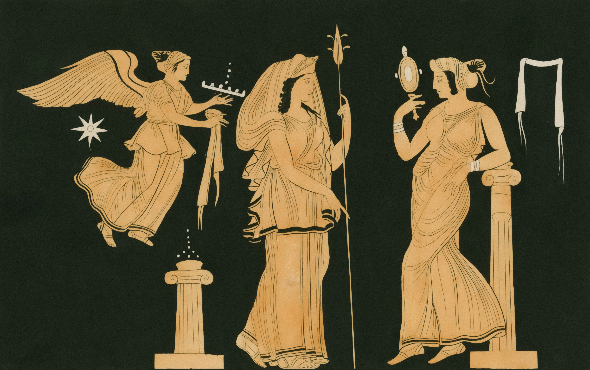
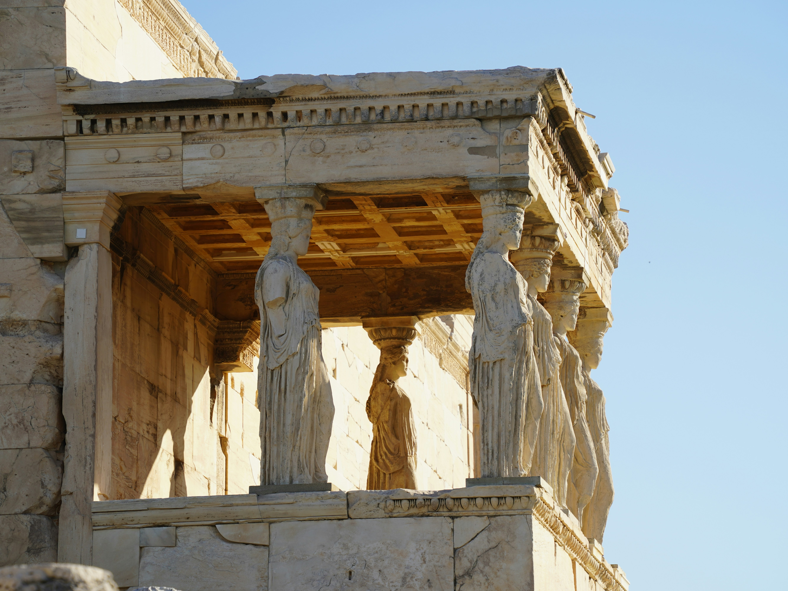

> And this, then, is the genesis and being of justice; it is a mean between what is best—doing injustice without paying the penalty—and what is worst—suffering injustice without being able to avenge oneself.
>
> --- Glaucon

As I start reading book 2, I feel myself get more and more infatuated by Glaucon's argument. I know that he himself is making this argument hoping for Socrates to refute it. This is what he's heard throughout his life and it all seems to make so much sense. In fact, it seems to perfectly describe our relationship with justice. That's why it was mildly terrifying. Just like Glaucon, I've come face to face with the darkest parts of human nature, afraid to look further in fear of seeing my own reflection there. Glaucon, then, and I now, 2400 years later, expose these fears and put our hopes in Socrates to refute this wretched declaration.

I wonder if by the end of this second book, I'll still find all of what was said as appealing. Either way, it's scary to see how easy it is to fall prey to pretty argumentation, that I know deep down doesn't resonate with me. I wonder how often it happens, to trip and fall in exactly this same way into an ultra-extremist political pipeline. I wonder if this is how  political propaganda works, by slowly presenting you with seemingly logical arguments that lead to an absurd (or not so absurd) conclusion. We can't be so prideful as to assume that if we are not able to tear down the argument by logic, then it must infallible. We are choosing to ignore the very real possibility that it's just out of our mind's current capacity to refute it.

However, our intuition can act as an anchor to reality. That isn't infallible either, but it can point us in the right direction. If in physics you are crunching some numbers, and the calculations point to something absurd, you either discovered something groundbreaking (unlikely) or you made a mistake somewhere. It should at least prompt you to double check your logic. Or to do as Glaucon did, and come to someone wiser.

The biggest lesson Glaucon teaches us is to set aside our pride, acknowledge the stories we've heard throughout our lives and have come to believe, and put them to the test. 

> Until you make the unconscious conscious, it will direct your life and you will call it fate.

I've been quoting Jung on that, but it turns out he never said that. He did say, however:

> The psychological rule says that when an inner situation is not made conscious, it happens outside, as fate. That is to say, when the individual remains undivided and does not become conscious of his inner opposite, the world must perforce act out the conflict and be torn into opposing halves.
> 
> --- Carl Jung, Aion, Christ: A Symbol of the Self, Pages 70-71, Para 126.

I'll provide a wrap up of book 1 and finish reading book 2 before coming back to write a conclusion. Or maybe I'll delete this whole introduction because I've realized something I wasn't seeing and now nothing makes sense anymore. That's the danger of writing these posts as I read. I find it valuable, however, to capture my thought process and emotional journey as I go as opposed to providing a curated 'conclusion' that doesn't do justice (pun intended) to the philosophical process of having your world view crushed and trying to reconstruct it again.

## Book 1 Wrap-Up: The Function of the Human Soul


Are we wired for justice or are we wired for survival?


Book 1 ends with Socrates establishing that the just live happily, while the unjust live unhappily. He's not satisfied, however, because he still doesn't know what it means to be just.

As for me, I'm not yet convinced with his argument. The part that doesn't click for me is when they establish that justice is the virtue of the soul. Thrasymachus is quick to agree with that, which leads me to believe there's an unspoken societal bias of the time at play. I, for my part, don't think it's so evident or obvious. First of all, let's assume for argument's sake that the soul exists as an entity, synonymous to the 'human mind.' From what I understand, that's what the ancient Greeks referred to as soul (plus an immortal element). Does the soul necessarily have to have a virtue (or only one virtue) and does that virtue have to be justice? Couldn't its virtue be to keep the body alive? Are we wired for justice or are we wired for survival?

Another way to see it is, if you take justice to be the virtue of the soul a priori, then you are essentially defining justice: it is that which only the soul can do or which only the soul can do best. The next question is, what can only the soul do (or do best)? I believe this could lead us down a path where justice takes on a completely different meaning than what we collectively understand from that word. If justice is by definition that which the human psyche does best, we are left with the question, what does the human soul do best?

## Exploring Justice in the City as a Path to Understanding the Justice of the Soul

<figure>

  <figcaption>
Photo by <a href="https://unsplash.com/@nypl?utm_content=creditCopyText&utm_medium=referral&utm_source=unsplash">The New York Public Library</a> on <a href="https://unsplash.com/photos/7loBusXoxTE?utm_content=creditCopyText&utm_medium=referral&utm_source=unsplash">Unsplash</a>
  </figcaption>
</figure>

Socrates suggests to first examine what justice means for a city, since it'll be easier to "read big letters than small letters." What ones reads in the big letters, one can then apply to the small letters, as they are the same, he says. An interesting idea, for sure. I'll try to keep this goal in mind as I continue reading the book, always trying to fit the narrative of what's being said about the city to what it would mean for the human soul.

One thing that comes to mind when trying to map the parts of a soul to the parts of a city is the therapeutic model: internal family systems (IFS). This modality views the human psyche as composed of multiple parts, each with its own unique thoughts, feelings, needs and roles. The goal is to understand and integrate these parts, rather than eliminate them, to resolve internal conflicts. In this way, the individual can operate from a central, healthy "self."

## The True City
<figure>

  <figcaption>
A Square with Imaginary Buildings by Hendrick van Steenwijck de Jonge Hendrick van Steenwijck
  </figcaption>
</figure>

Socrates starts off by describing what he refers to as the "true city." The people living there have their basic needs covered, but no luxuries. There's no need for war because they don't need extra resources. They live peaceful and simple lives. 

Could we compare this 'true city' with an individual who lives the most simplest of lives? What would Tolstoy say about the happiness of this individual?


I wonder: Is this city doomed to be conquered by other cities because they don't invest in self-defense? Does the same happen to the 'truthful' individual?


Is there also no need for science and philosophy in this type of life/city? Can we achieve happy and peaceful lives without philosophy?

## The Guardians as Protectors of the Soul
<figure>

  <figcaption>
Photo by <a href="https://unsplash.com/@shpetimujkani?utm_content=creditCopyText&utm_medium=referral&utm_source=unsplash">Shpëtim Ujkani</a> on <a href="https://unsplash.com/photos/a-close-up-of-some-statues-on-a-building--YhYlhcMi-A?utm_content=creditCopyText&utm_medium=referral&utm_source=unsplash">Unsplash</a>
  </figcaption>
</figure>
The guardians are first mentioned in this book when we start introducing the need for luxuries in our city, and in turn the need for war. They are ones tasked with defending the city from enemies and going to war to acquire more resources. 

> Yet, they must be gentle to their own and cruel to enemies. If not, they'll not wait for others to destroy them, but they'll do it themselves beforehand.

We've got a lot to reflect on from this quote. From the lens of internal family systems, what happens when one of our protector parts turns against us and becomes a prosecutor? This part plays the role of an inner critic and is able to do more damage than an outsider ever could. Our job is to understand its purpose: what is its role in keeping the individual safe? Maybe it's trying to make sure we don't make mistakes because mistakes were punished harshly in the past, so it thinks the best thing we can do is avoid making mistakes. This could've developed early in childhood, when we were mostly helpless and needed to appease our caretakers for survival, but as adults, this pattern is not helpful anymore. If we can understand the inner critic's needs and transform our relationship with it, we can redirect it to the role of a protector, as Socrates' guardians.

## The Theme of Transformation in Relation to Ovid's Metamorphoses

<figure>

  <figcaption>
According to the myth, described in Ovid´s Metamorphoses, Apollo, fated by Cupid's arrow, sees Daphne and is filled with wonder at her beauty. But Daphne has been fated by Cupid's love-repelling arrow and denies the love of men. She ran away and prayed, asking her father, Peneus, to destroy her beauty. Then, she became a tree.
  </figcaption>
</figure>

> "Hence everything that's in fine condition, whether by nature or art or both, admits least transformation by anything else."
> 
> --- Socrates

This part got me thinking about Ovid Metamorphoses, and how almost all of the transformations there happen due to trauma. In Ovid's stories, it's usually the case that the victim of a violent trauma is transformed either as a result or as a way to escape that fate. Mostly women, but not only. I have much to say about that book but haven't been able to get through it yet as it. I actually had to put it down because it was starting to give me nightmares. However, in my opinion, those victims' transformations are a sign of their internal strength and will. They find a way to take control of their fates. So, I strongly disagree with Socrates that everything that is in fine condition admits least transformation. On the contrary, it's a sign of resilience if one can transform and adapt and grow according to the circumstances.

## All Beings Hate the True Lie

> "Don't you know," I said, "that all gods and human beings hate the true lie, if that expression can be used?"
> "What do you mean?" he said.
> "That surely no one," I said, "voluntarily wishes to lie about the most sovereign things to what is most sovereign in himself. Rather, he fears holding a lie there more than anything."

I'll close with this quote. They make a distinction between a true lie and a "lie in speeches," that one makes in the telling of ancient stories. The idea that the deepest danger lies in deceiving ourselves, rather than in the tales we tell, is a challenging thought. I’m curious to see how this notion of the ‘true lie’ will stand alongside the later concept of the ‘noble lie.'

As for Glaucon's initial argument regarding the nature of justice, it still stands for me. I’m eager to see how it develops over the course of The Republic as a whole.
