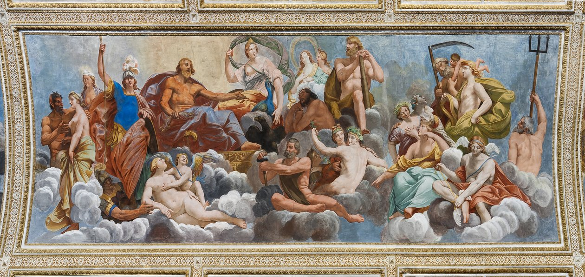
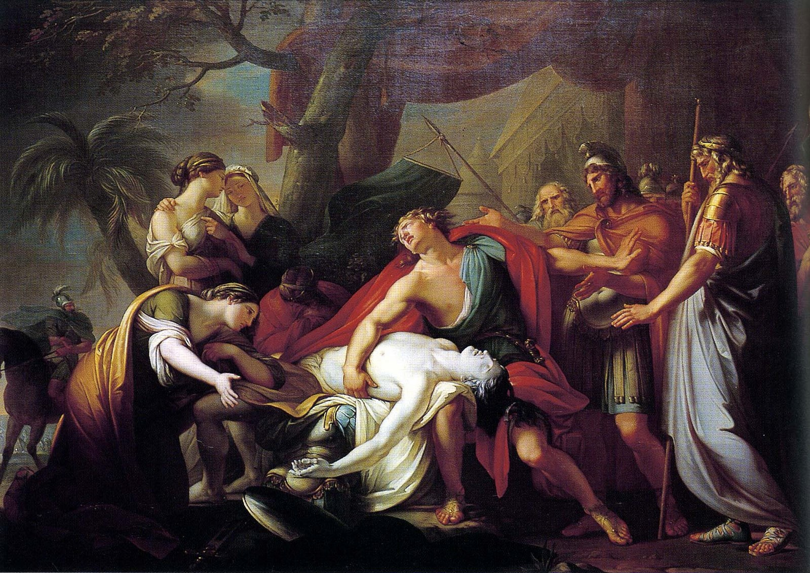

> "And what if they are to be courageous? Mustn't they also be told things that will make them fear death least? Or do you believe that anyone who has this terror in him would ever become courageous?"

It was never about building the perfect city, was it? The goal was to define what justice means for the human soul. If we accept this interpretation of The Republic, then all the talk about censorship regarding ancient tells and stories could be interpreted as Plato warning us to mind what we consume, especially at a young age.

Isn't it logical to say that if we grow up with stories that instill in us fear of spending eternity in Hades after we die, we risk becoming adults whose lives are ruled by fear as opposed to authenticity? Or what effects does one expect for those stories, especially if portrayed as the ultimate truth, to have on the psyches of developing humans?

Plato and Socrates didn't have the knowledge we have today on the effect that religion can have on our mental health, especially if those beliefs prey on emotions such as guilt, shame and fear. It can lead to depression, anxiety and even complex post-traumatic stress disorder (CPTSD). Though they do seem to have the right idea about the effect that it can have on children.

I am not sure yet, however, whether Socrates wants to outright ban these type of material or he just wants the young guardians to not grow up with them as a source for moral and ethical guidance. There is a big difference here. From my understanding, and correct me if I'm wrong, tales such as The Iliad and The Odyssey were used as a sort of moral compass in society in the times of Socrates. They outlined what a hero ought to be like and what the gods were like and whom they favored. For a modern reader of such epic poems, it's evident why one wouldn't want them to be moral foundation of one's society. At least, we can say that it doesn't align with our current value system. One can only imagine, however, how insane it must have been in Socrates time to try to speak against essentially the moral foundation of his community. It's important to try to put this into perspective as his bold takes ultimately caused him to be sentenced to death for not recognizing the gods and corrupting the youth.

### Did Socrates Try to Introduce a New Religion?
<figure>

  <figcaption>
Gathering of the Gods of Olympus by Carlo Santner
  </figcaption>
</figure>

In The Republic, there's a bit of back and forth about the nature of the gods. Do they punish the unjust and praise the just? Or do they act according to their whims and moods, praising those whom they fancy the most and from whom they receive the better offerings? Socrates would prefer it were as first described, so in a sense he rejects the current depiction of the gods and wishes to mold it to better fit his ideal.

My question is, whether after such a fundamental transformation, is he still talking about the same gods or a completely new set? Is it any better from the original one?

From this analysis stems a much more fundamental question: what is better for society, a religion that portrays the gods as just, even when their actions speak otherwise, or one that forgoes moral claims and honestly unapologetically displays their true nature?

### Censorship of Human Emotions
<figure>

  <figcaption>
Gavin Hamilton, Achilles Mourning Patroclus
  </figcaption>
</figure>

There's also talk abut censorship of human emotions in ancient tells, such as the scene of Achilles grieving the death of Patroclus and the inevitable wrath that consumes him after. While reading the Iliad, this scene struck me as one of the purest expressions of human emotion. I believe there is much value in it and wouldn't want it censured. I don't argue, however, that it could serve to reach his goal of bring up the best soldiers possible. Are those guardians happy, though? Their purpose is to protect the city, but who protects them and their souls? Or must they sacrifice their humanity so that others might thrive?

With our knowledge of modern psychology, we know that stuffing down "undesirable" emotions, such as sadness in men or anger in women, doesn't lead to happiness down the road. One could say that by suppressing the expression of the soul, one drifts farther away from one's authentic self, which can only lead to internal conflict and misery.

### My Objection To Socrates' Censorship
Although I agree in part about the need to protect young minds from stories that instill in them fear, there's something I find troubling. The original motive of these tales is to control a society by means of shaping their belief system. Socrates objects, not because he's against the controlling of population in this way, but because he wishes to change the agenda, only to manipulate them in a different way. He doesn't want his warriors to fear death, not so they'll live a happy life, but so that they won't be afraid of battle. It's all a bit ironic, to replace one tyrant with another. 

### Deeper Analysis: Censorship at the Level of the Soul
Alternatively, if we take the city to mean an individual, then censoring takes on a completely different meaning. Who are the guardians of the soul? If we take them to be the parts of our mind responsible for protecting us against outside threats, then what does this censoring mean for them?

Could we say that we ought to protect our guardians from consuming content that will be detrimental to their job? If their job is to protect, then for that they need to keep our self-esteem high. How can we guard ourselves against the outside world if we don't value ourselves? Then, it can be said that we ought to avoid consuming content that damages our self-esteem. Fear and anxiety are also obstacles in standing up for ourselves. Then, we must carefully not to feed our minds material that fosters our insecurities, our fears and instills in us anxiety. 

Knowledge is a weapon we use to look out for ourselves as we move through the our lives. Ignorance keeps us under the control of others. If that is true, then we could say that the content we consume is favorable if it gives us knowledge. The same can be said about the skill of critical thought.

In conclusion, whatever we consume should foster critical thought, acquire knowledge and build our self-esteem. I choose to take home this interpretation of Socrates' ideas, leaving out some of what I find troubling.
