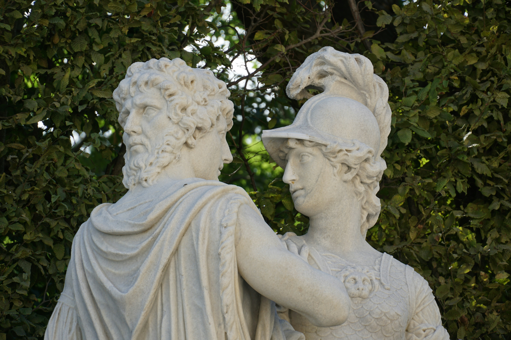
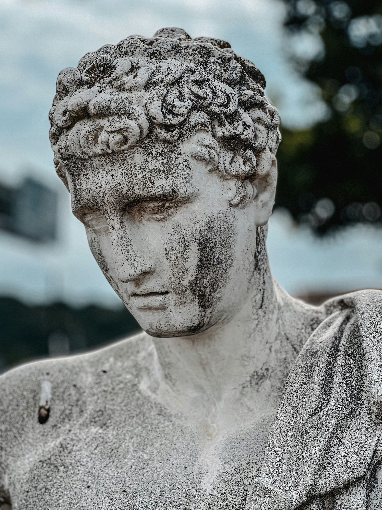

Quick recap: In my previous posts, I’ve been breaking down Plato’s allegory of the city and the soul — the idea that the structure of an ideal city mirrors the structure of the human psyche. According to his allegory:

- The city stands in for the psyche

- The rulers or philosopher-kings represent the rational part of the soul

- The guardians correspond to the soul’s spirited part — its will, courage, and inner defenses

Now, to the topic that left me pondering.

## The Illusions of Self and Free Will as Noble Lies
Could it be that in order to survive and thrive in our day-to-day life, we need the illusion of a self? We need to believe that what we experience as "I" or as self exists and is an entity separate from the rest of the experiences in our consciousness. We need to believe that the thoughts we think are our own and we have a say in our destinies. In other words, we need to believe that we have free will.

I like this experiment: close your eyes and observe your thoughts as they appear in consciousness, try to see where those thoughts come from. Did you choose to think them? Look for a self that is the producing them. Who is observing those thoughts as they pop up? Is it the same entity as the one that came up with them? How are those thoughts different from other experiences in consciousness, those that come from the "outside": sounds, colors, changes in light... Do they all not share the same nature? Experiences that arise and then fade away, out of our control.

I’m not sure I can confidently say if free will exists or not. I don't have proof either way and I'm looking for an answer myself. What I'm trying to say, however, is that *if we live in a deterministic universe*, then the illusion of free will could be considered a noble lie that the brain puts together so that we can function, couldn't it? What other noble lies did Plato have in mind?

As for the illusion of self, *if it is an illusion after all*, there's a name in psychology for when the spell is broken: Depersonalization, either by itself or as a symptom of a dissociative disorders.

This brings into perspective why some warn to be careful with meditation practices, as it could break such illusions at a time when we are not yet ready for it.

## When Is It a True Lie and Not a Noble One?
<figure>

  <figcaption>
Photo by <a href="https://unsplash.com/@qld_traveller?utm_content=creditCopyText&utm_medium=referral&utm_source=unsplash">Sheila C</a> on <a href="https://unsplash.com/photos/a-statue-of-a-woman-holding-a-mans-arm-PwZ0mztPiO8?utm_content=creditCopyText&utm_medium=referral&utm_source=unsplash">Unsplash</a>
  </figcaption>
</figure>

Plato talks about the true lie as the worst kind of lie, one that deep inside our soul we believe to be true. It sounds a bit contradictory saying "true lie," but as I understand it, it's actually a clever way to describe it and differentiate it from other types of lies. There are also the lies in speeches, which are allegories: they are meant to lead us to the truth, but are not in themselves true. They prove useful, as Plato puts it, so they are not necessarily characterized as bad. Then, there's the noble lie, which our leaders, in the case of a city, or our reason, in the case of our psyche, tells us to ensure our peace.

### Spoiler Warning: Discussion Relating to *God Emperor of Dune* (Book 4 by Frank Herbert)

> I know a profound pattern which humans deny with their words even while their actions affirm it. They say they seek security and quiet, the condition they call peace. Even as they speak, they create the seeds of turmoil and violence. If they find their quiet security, they squirm in it. How boring they find it.
>
> — Leto II Atreides, in God Emperor of Dune by Frank Herbert

In God Emperor of Dune, Leto II can be seen as a kind of philosopher-king.
He's not content, he's doing it for selfless reasons (up to debate) and doesn't get recognition for it. He gives the people in his empire the gift of peace, but they reject it. They are not content. Could it be their lives are peaceful and happy but they don't know it? Their impulse is to break free from the tyranny of peace, but do they understand what's at stake?

If we look at the world this way, both the philosopher king and the people of the city are not content. They are put in impossible positions, where they must go without what they most desire.
Seen from this perspective, neither the philosopher-king nor the people find true contentment. Both are trapped in roles that deny them what they most deeply long for.
Though essentially any state other than their current would prove worse.

## Is Peace Worth The Price?

<figure>

  <figcaption>
Photo by <a href="https://unsplash.com/@sajan009?utm_content=creditCopyText&utm_medium=referral&utm_source=unsplash">Sajan Rajbahak</a> on <a href="https://unsplash.com/photos/a-statue-of-a-man-uDbfsgw5Wqo?utm_content=creditCopyText&utm_medium=referral&utm_source=unsplash">Unsplash</a>
  </figcaption>
</figure>
What do we loose when we surrender to these lies and illusions?

> [...] the greatest of penalties is being ruled by a worse man if one is not willing to rule oneself.
>
> --- Socrates

Do we risk living our whole lives under an illusion and waking up only as we're about to die? Is that a price worth paying a "peaceful" life? Do we trust those in charge enough to allow their the noble lies to rule over our lives? Do we even have a choice?

Alternatively, we have to ask: what do we risk by *breaking the spell*? If we care at all about our happiness, I believe we should seriously consider whether this choice might lead us into a state from which there’s no way back, one that could ultimately be worse than where we started.

## Conclusion

I found very interesting the concept of the illusions of self and free will as a noble lie, supposing that they are illusions after all, which I can't assert. There was much discussed in book 2, that has been talked about and analyzed throughout the centuries. I don't intend to make a comprehensive analysis here. Instead I wish to capture my live reaction to first coming in contact with this work and these concepts, which are for me novel. I'm sure and I hope much will change about my interpretation as I continue reading.
