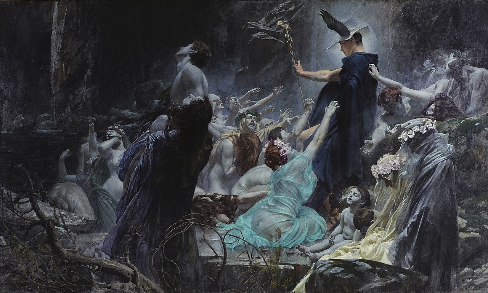
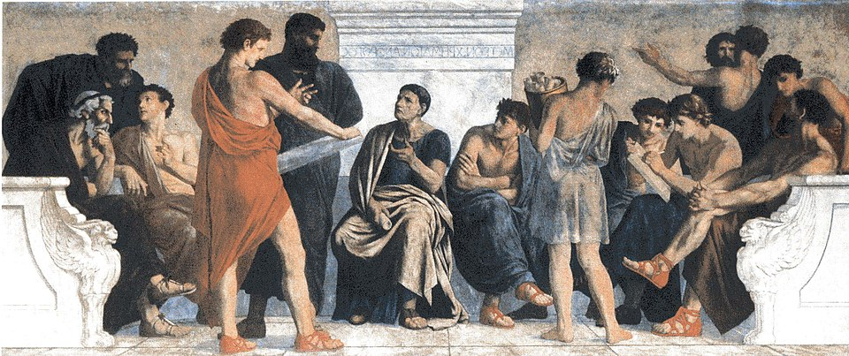

## **Introduction:** Brief overview of Book 4 and its significance.
I love that Socrates reconnects the city metaphor back to the soul, which was the original purpose for building this city. I was beginning to worry Plato might abandon us on the task of connecting the dots.

This book sparked internal discussion on different fronts, that's why this post might a bit over the place.

This post is part of a series of my reflections as I read The Republic, one book at a time.
 As I've said before, my goal here is not make a scholarly analysis. Instead, I wish to capture my initial reaction to first coming in contact with this work and these concepts. I'm curious as to how my thought process will evolve by the end of the book.

## Series


## **Guarding the City and the Soul:** Discussion on Internal and External Threats
<figure>

  <figcaption>
Souls on the Banks of the Acheron by Adolf Hirémy‑Hirschl
  </figcaption>
</figure>

> So, as it seems, we've found other things for the guardians to guard against in every way so that these things never slip into the city without their awareness.

In terms of our, I like this notion of guarding not just for extreme external violence, such as would be considered war for a city, but also minor threats that slip into our soul and harm us. This could be harmful thinking patterns, internalizing someone else's hateful speech toward us, or something as simple as bad habits. Or the threat of blindly adopting the narrative of a system doesn't have our best interests in mind. 

For the city, it's "wealth and poverty" that they must guard against. They do have a point. We can only dream of a world without either.

## **Plato’s Pedagogy:** Philosophy or Indoctrination?

<figure>

  <figcaption>
Fresco by Gustav Adolph Spangenberg, ca 1883-1888
  </figcaption>
</figure>

> "These are not, as one might think, many great commands we are imposing on them, but they are all slight if, as the saying goes, they guard the one great---or, rather than great, sufficient---thing."
>
> "What's that?" he said.
>
> <mark>"Their education and rearing,"</mark> I said. "If by being well educated they become sensible men, they'll easily see to all this and everything else we are now leaving out [...].

I wonder where we draw the line between what is consider education and indoctrination, though I believe that is no trivial task. 

Socrates talks about 'dyeing' the youth first in white, so that they can later take on other colors more effectively. This is a metaphor for shaping young minds early on. But if he's setting such a strong initial conditioning from childhood, when the brain is most malleable, can that truly be called *education*? Then again, is it any different from what any parent tries to do with their kids? To instill in them a moral framework that reflects their own values, which will become their point of reference when navigating the world as adults? The difference is that Socrates envisions this process as more structured program for an entire segment of society.

This shocked me at first. I didn't, and still don't, want to agree with it. Though, I ask myself, what's the alternative? Aren't we doing the same today, in a perhaps less overt fashion? 

I wonder, does such an education promote the kind of thinking and curiosity that ends up leading people to escape the cave? Or is it meant to serve as "ball and chain" for those who are not meant to leave the cave?

> "Such as the appropriate silence of younger men in the presence of older ones, making way for them and rising, care of parents, and hair-dos, clothing, shoes, and, as a whole, the bearing of the body, and everything of the sort. [...]"

He goes on to talk about how it would be best for everyone to dress the same. He doesn't want people performing different roles. Does the danger lie in the creative power of self-expression, which leads to individual-first thinking as well as creativity? Doesn't creativity foster a rebellious spirit, which is quite the opposite to what he arrives for in his city?  Isn't it also one of those few things we as humans pursuit for its own sake, meaning that it holds inherent value for us? What is the hidden price we pay for living in Socrates' just city? Would we be willing to pay it?

## Obedience Or Creative Thought as a Virtue
> "I mean," I said, "that courage is a certain kind of preserving."
>
> "Just what sort of preserving?"
>
> "The preserving of the opinion produced by law through education about what---and what sort of thing---is terrible."

I think the opposite is actually true. Holding on to how you were brought up, no matter how elite an education you received, is not courageous, it's complacency. It takes every bit of courage to go against what seems to form the very fibers of your reality and to replace it with independent thought. We build our identity and sense of reality from the lessons we learn during our childhood, that's why going against it feels so destabilizing. It's why go their whole lives preserving it, and why it's such a powerful way to control a population.

I do think it's brilliant, though, how Plato understood, even then, how our upbringing conditions us for life. He shows us the type of discourse that those in power might employ to keep us all compliant. He's showing us the very techniques used today, all in the name of justice. How they shape and mold a whole society, setting them up for generations.

## **Conclusion:** Personal Reflections and Questions Raised by The Text
Plato identifies four cardinal virtues: wisdom, courage, moderation and justice. 

After a long and winding search, Socrates and his companions finally settle on a definition of justice, both in the city and in the soul: as each part performing its proper function without interfering with the others. I find this definition compelling when applied to the individual, though I'm less convinced it holds for a city, especially in the context of today's society. AT least speaking for myself, I take joy in taking part in many different "roles," and it'd make me miserable to know I'd have to stick to doing only the one thing I'm best at for the rest of my life.

Throughout the dialogue, we move through several ideas about justice:
- Is it the advantage of the strongest?
- Is it that everyone performs their assigned role?
- Is justice more profitable than injustice, or valuable in itself regardless of the outcome?

In the end, the proposed structure of the just soul mirrors that of the just city: the rational (calculating) part rules, the spirited part supports it, and the appetitive part obeys.

As Socrates suggests, there are as many types of souls as there are regimes. This sets the stage for the next inquiry into the various forms of government and the corresponding characters they produce. I am especially curious how the different types of regimes will translate to which types of souls.
