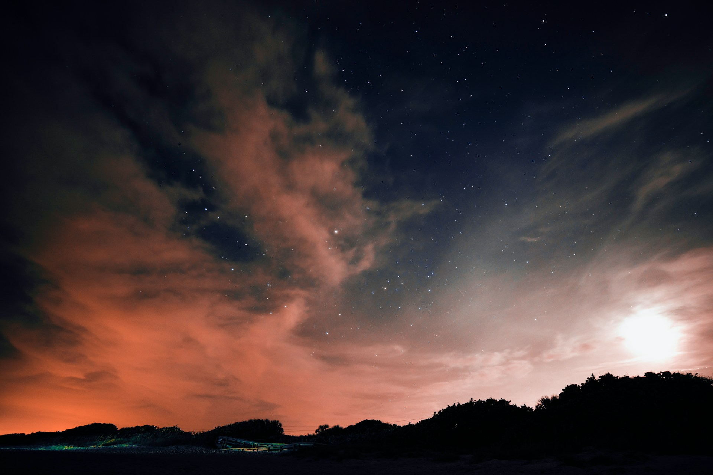
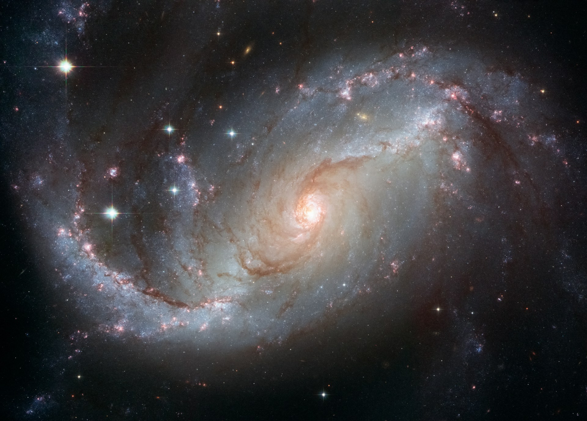
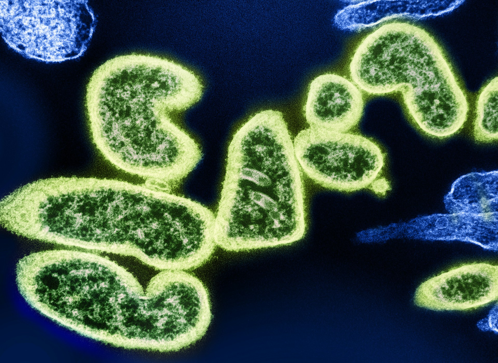
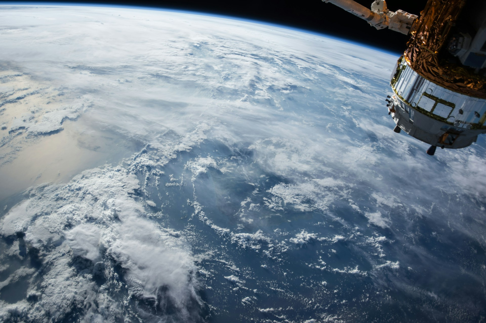

This book has been cathartic to me on a whole different level. I guess it stroke a cord for me (no pun intended). I've always been a sucker for well-written sci-fi, but I connected to Weir's story telling on such a fundamental level. My husband took me to watch the movie. I went in blind, and I'm so glad I did because it was an otherworldly experience. I then listened to the audiobook narrated by Ray Porter, finished it in one week, and had a good crying session each time I opened the app. Something about this story touched me in a way I can't fully explain yet, and I wanted to use this post to try to understand what that something is.

## Back To Basics

<figure>

</figure>

> “You hear light, question?”
>
> “Yes. I hear light.”
>
> “Light gives you information, question? Enough information to
understand room, question?”
>
> “Yes. Light gives information to humans like sound gives
information to Eridians.”
>
> A thought occurs to him. He stops working on his device
entirely. “You hear light from space, question? You hear stars,
planets, asteroids, question?”
>
> “Yes.”
>
> “Amaze.”
 
The first thing that stands out is how it touches on incredibly fundamental themes about our existence and the world around us.
As cheesy as it might sound, I was overwhelmed with appreciation for life and our human experience, our home, Earth. In the end, we are so fortunate to get to experience seeing light and colors and the stars. Also what we experience with the rest of our senses. Just pure appreciation. 

## The Timing

<figure>

<caption>
Hubble's View of Barred Spiral Galaxy NGC 1672.
</caption>
</figure>

But beyond the themes themselves, there's also the matter of timing.
It's not just the content of a book, but the moment in life that it happens to find you, that dictates the impact it will have. For me, it caught me in a transitional period, where I'm sailing through uncertainty and change, so this story has been quite grounding for me. It unironically helped me keep my feet on the Earth and reconnect with what life is really all about.

I've been reading/listening as a sort of meditation practice by getting the room dark, lying down, and getting lost in the narration. It's been a very immersive experience, Ray Porter is a genius, he truly became Grace. Also, hearing Rocky 'speak' for the first time gave me goosebumps. I couldn't get enough of it in general.

## Science as the Universal Language

<figure>

<caption>
Nipah Virus Particles Colorized.
Image captured at the NIAID Integrated Research Facility in Fort Detrick, Maryland. Credit NIAID
<caption>
</figure>

> “Molecules!” I grab the handcuffs and hold them out to Rocky. “These are molecules! You’re trying to tell me something about chemistry!”
> 
> “♫♪♫♫♪.”
>
> But wait. These are some weird molecules. They make no sense. I look at the handcuffs. Nothing forms a molecule like this. Eight atoms on one side, eight on the other, and connected by…what? Nothing? The connector string isn’t even coming off a bead. It’s just teeing off strings from the two circles.
>
> “Atoms!” I say. “The beads are protons. So the circles of beads are atoms. And the little connectors are chemical bonds!”

The last thing is something quite simple but portrayed in such an beautiful way that shook me to my core.
The concept of science as the universal language throughout the book, while not a novel idea, was so brilliantly executed that it puts everything into perspective. I feel we spend so much of our time under the illusion that our struggles are somehow unique, which leads to feelings of isolation. Reading in general helps me to break that illusion and connect my individual struggles to the human experience. What was different for me with Project Hail Mary is that it made feel connected to not just the human experience, but to the experience of being a living being, in this universe. The basic desire to understand the world around us unites us all. I'm simultaneously up my journey through the Trojan War epic cycle with the Aeneid, which might be the reason that I have this vivid picture in my mind of the Greeks observing the stars at night and imagining what could be out there. How much more we understand now, though somehow still not enough. 

It was a reminder of how I had fallen in love with physics. It brought me back to my university days, sitting in a lecture, learning about a new concept for the first time and having the same reaction as Rocky:

> Amaze, amaze, amaze.

I never want to loose that. That curiosity and utter joy that comes from learning. Not productivity rituals, just pure amazement at how things work. One of the thoughts that circled my head as I was deciding whether to study physics was that I didn't want to die without having at least learned about the fundamentals of what we know about this place spawned in. It's overwhelming to think about the vastness of our current knowledge and sad to think about how it's impossible to cover it all in a lifetime. There is, however, a certain melancholy attached to the prospect of missing out. It's a similar feeling for me that I get regarding philosophy. Humanity has come a long way and I want to know what we've figured out thus far. If an alien species came to us with shiny new knowledge about the universe, we'd be dying to learn about it.

The concepts we now know about thanks to brilliant minds that came before: relativity, our understanding of radiation and computers. It's easy to go about life and not give it a second thought, but it's all truly a big deal. Rocky's crew died because they didn't know about radiation. By sharing with Rocky about radiation, Grace gave him the gift of closure. What I'm trying to say is that the understanding of science we have truly is a gift.

## Cherishing our Childlike Curiosity

<figure>

</figure>

I'm also filled with memories of my grandfather. He was a farmer, someone who had to work from an early age and didn't get a chance to finish school, but who had such a deep curiosity and desire to learn. I remember summer nights as a kid, we'd look at the stars and he'd explain about the different stars and galaxies, and how unimaginably large the cosmos truly was. It was from him that I first heard about concepts such as a relativity and how heavy objects bend spacetime. I was too little to grasp at these concepts, but I was eager to understand and to learn more. During university, it was him I thought about whenever the math of a new concept finally clicked for me. In a way, it felt like we both made it. I knew he would've loved to get the chance to formally study physics. In a sense, he represents for me the curiosity of my inner child. It's a voice I never want to loose.
