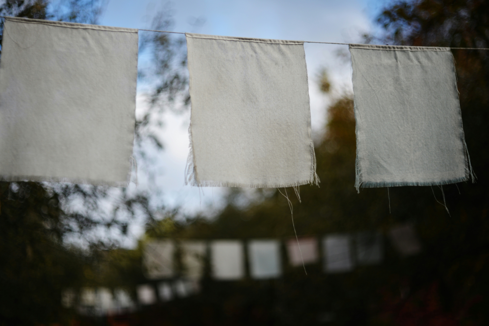

> He had come to love Urras; but what good was his yearning love? He was not part of it. Nor was he part of the world of his birth.

Such a rich work, the reading experience was rollercoaster of ideas and shifts in perspective. This book has met me at a transition time in my life revolving around the theme of coming home. Like Shevek, I have been on a constant journey seeking home. I feel that everywhere I've been, I've found pieces of what I would call home. What I mean by this is that different aspects of 'me' have felt at home in the different 'realms' I've inhabited. Each time, I was overjoyed; each time, I thought, I have finally found it. Each time, though, I learned to realize that other parts of me were left without a home.

Shevek's journey mirrors mine. In a sense, I got drunk on the promise of a foreign world, only after which I understood what I truly yearned for was to come home. The home I am coming back to is not somewhere I have been before.

This is a topic for another post though. For now, The Dispossessed has left me with many ideas and symbolisms I wish to unpack.

## The Rape Scene

I was shocked and very much disturbed after reading this part. To say it was unexpected is an understatement. I had to put the book down to gather my thoughts and feelings. My first interpretation was something along of the lines of how a sick society leads the individuals to commit insane actions. However, I believe this is only part of the picture, mainly because it takes responsibility away from the individual and puts the blame solely on society. While a systematic analysis of this sort is vital, we can't deny the agency of an individual, holding them accountable in this way for their own actions. Is individual freedom not the foundation upon which Anarres is built, and does that freedom not inherently demand personal responsibility? In granting complete autonomy to its people, does Anarres not also leave the weight of moral decision-making on each person's shoulders, even if that means going against their society?

After finishing the book, I realized just how vital this scene is. It shows reality, human nature, something that can be witnessed even among animals. It doesn't take away from the cruelty and utter violence of the act, on the contrary, I admire Le Guin for portraying her main character like this. It is more faithful to reality than the curated news and history books we learn from. Even 'great' scientists or revolutionaries who have made incredible contributions throughout history, have committed atrocities in their private (or public) lives. It's usually excused because we prefer morally unambiguous stories and characters that we can either wholeheartedly condone or admire. But humans are not like that. Societies and systems are not like that. I believe it's the whole point she is trying to make throughout her novel, that no system is perfect and no individual is perfect. We need to be wary of messianic figures. This is ultimately the purpose of that scene, as I see it.

## The Handkerchief

<figure>

<caption>
Photo by <a href="https://unsplash.com/@cherstve_pechivo?utm_source=unsplash&utm_medium=referral&utm_content=creditCopyText">Liana S</a> on <a href="https://unsplash.com/photos/white-fabric-flags-strung-on-a-wire-outdoors-_GJwC3OApMM?utm_source=unsplash&utm_medium=referral&utm_content=creditCopyText">Unsplash</a>
</caption>
</figure>

Accepting the inherent cruelty of human nature and therefore the impossibility of a perfect social organization system leaves me with a lingering feeling of hopelessness. However, I believe it isn't the whole picture that Le Guin is trying to paint either. There's another important message, symbolized by the handkerchief, which is how it's also in human nature to constantly seek to be better despite all around appearing doomed. These two seemingly opposing themes are interwoven throughout the story.

A handkerchief appears as a symbol of solidarity both in Anarres and in Urras. It seems a quite trivial detail, easy to overlook, yet holds much significance. I empathized with Shevek's constant state of dealing with one or another sort of allergy. Being offered a handkerchief is a simple gesture that can make one feel seen and cared for. Even a propertarian Urrasti can't help themselves but share a handkerchief with their fellow human, alleviating in this way their suffering.

## The Rule of The Majority

I found interesting the similarities shared by the Anarrasti society and how the soldier class is described in Plato's Republic: no private ownership, kids are raised collectively, no institution of marriage, everyone is a sister/brother to each other. However, as I dug deeper, I discovered more and more similarities, inherent to the thought experiment of imagining an ideal society. 

Plato condones democracy and the rule of the majority in favor of rule by a philosopher king. Similarly, the crux of Shevek's arc is in breaking free from the invisible rule of the majority, in his case, in favor of individual rule, or what he describes as freedom. I am still wrapping my head around how such a society would function, and one question that comes to mind is: where does our collective wisdom lie? The answer to this question serves as the moral foundation upon which a social system is created, both in fiction and in reality. Plato stipulates that wisdom is only accessible to an elite few, those who are able to break free from the illusions and see beyond, see the truth, the good. Therefore, it makes sense to him that society should be ruled by these few. Capitalism stipulates that wisdom lies in the invisible 'forces' behind market behavior, therefore our society should be ruled by these forces. According to that theory, the rich hold the wisdom and therefore the power. For the Anarresti, it is the individual who holds the wisdom and the responsibility of acting in a moral way, to benefit society as a whole, lies on each of them. This creates a contradiction, though. There is no official government but the approval of one's neighbours end up being the laws by which an individual lives. This is the trap that Shevek is trying to break free from and I believe it hints at a fundamental principle present in any type of society: it is doomed to decay if left to follow the path of least resistance. Plato came up against this same wall when trying to figure out what an ideal society ought to look like. He admitted that even his ideal society would decay after some generations because the effort made by the original 'founders' wasn't maintained by their offspring. This fact is present in an ideal anarchist society as is Anarres: the revolution isn't something that happens once, it's something that must be continuously happening, renewed by each new generation. So, to wrap this up, along with the previous points: no system is perfect and even a good system needs effort to be maintained and improved, which is fueled by the innate will of the individual of striving for something better.

## The Hainish

<figure>

<caption>
Photo by <a href="https://unsplash.com/@mike_kiev?utm_source=unsplash&utm_medium=referral&utm_content=creditCopyText">Photobank Kiev</a> on <a href="https://unsplash.com/photos/3-men-standing-on-rocky-shore-during-daytime-Opzk_hvwO9Q?utm_source=unsplash&utm_medium=referral&utm_content=creditCopyText">Unsplash</a>
</caption>
</figure>

I want to explore what I just now realized is a fundamental part in the novel that hadn't made sense before for me. 

As I read the novel, it pretty much felt like putting together a puzzle. That puzzle ultimately being Le Guin's ideas and philosophies. With each page, I got new pieces to the puzzles, but each time I thought it was beginning to make sense, something new happened which shattered my mental picture. I'm still not sure I have put it together quite right. This is the type of book that deserves a (several) reread(s) to begin to grasp the complexity of the author's philosophy behind it.

The last piece of the puzzle was the hardest for me to put together: the Hainish. With how little we learn about them on the book, one could initially think they are merely a plot device: we get a Terra that is hopelessly doomed but also has a presence on other worlds, and in particularly Urras, in the form of embassies, thanks to the Hainish altruism. Also, there's a loophole in Anarres initial settlement policy of not allowing any Urrasti inside their land, but the Hainish are not Urrasti. However, after building such a complex web of ideas, where every character and action in the book feels intentional and serves a purpose in the big picture, I couldn't imagine the author added the Hainish as a mere plot device. It was just me who hadn't yet figured out what that purpose was. Until just now, as I was writing about the individual's natural drive for change and improvement. The Hainish seem to have it all figured out by now and have explored all forms of organizing societies. Yet they still wish to learn about the Anarresti. Better said, it is an individual Hainish who wants to visit Anarres because he himself hasn't experienced all the forms of society that his people claim to have had. What matters here is the point being made about the individual thirst for knowledge and will for improvement even though theoretically all is figured out already. There is always something to learn, something to improve and even an anarchist in an anarchist society has to be a revolutionary. This is a beautiful idea that can be extrapolated to just about any field.

What point is there for me, a hobbyist, to study literature or philosophy or even physics, when I probably won't get far enough to reach the edge of what humanity as a whole has unblocked already to have the slightest chance of making any meaningful contribution at all? The point for me, as for our Hanish ambassador, is that I want to experience it for myself.

## The Perspective

<figure>

<caption>
Photo by <a href="https://unsplash.com/@gev__avetisyan?utm_source=unsplash&utm_medium=referral&utm_content=creditCopyText">Gevorg Avetisyan</a> on <a href="https://unsplash.com/photos/a-view-of-the-night-sky-with-the-milky-in-the-background-57uRPx9bCKM?utm_source=unsplash&utm_medium=referral&utm_content=creditCopyText">Unsplash</a>
</caption>
</figure>

> "I never thought before," said Tirin unruffled, "of the fact that there are people sitting on a hill, up there, on Urras, looking at Anarres, at us, and saying, 'Look, there's the Moon.' Our earth is their Moon; our Moon is their earth."
>
> "Where then, is the Truth?" declaimed Bedap, and yawned.
>
> "In the hill one happens to be sitting on," said Tirin.

This part stopped me on my tracks. I believe it captures the essence of this work beautifully. Who is really a prisoner, the ones on this or on that side of the wall? Who is free, the one with freedom to own or the one with freedom to never be owned? I enjoyed reading the many such opposing symmetries.

## The Impossibility of Coming Home

<figure>

<caption>
Photo by <a href="https://unsplash.com/@nabozzz?utm_source=unsplash&utm_medium=referral&utm_content=creditCopyText">Daniele Nabissi</a> on <a href="https://unsplash.com/photos/brown-mountain-under-white-clouds-during-daytime-4sskdq-I08c?utm_source=unsplash&utm_medium=referral&utm_content=creditCopyText">Unsplash</a>
</caption>
</figure>

> He would most likely not have embarked on that years-long enterprise had he not had profound assurance that return was possible, even though he himself might not return; that indeed the very nature of the voyage, like a circumnavigation of the globe, implied return. You shall not go down twice to the same river, nor can you go home again.
> 
> You *can* go home again, the General Temporal Theory asserts, so long as you understand that home is a place where you have never been.

Why did Shevek need to go to Urras to realize what he was seeking for all along was home? But he was not home before in the place where he now comes back to and calls home. It might have to do with the part about perspective. Shevek needed to sit on the other side of the wall, on the other hill looking at the Moon, to become someone for whom home was where he started out. He felt a foreigner in his own culture and something in him yearned for acceptance elsewhere, on Urras. Urras confronted him and transformed him. It was only after this transformation that was he able to truly go home.
