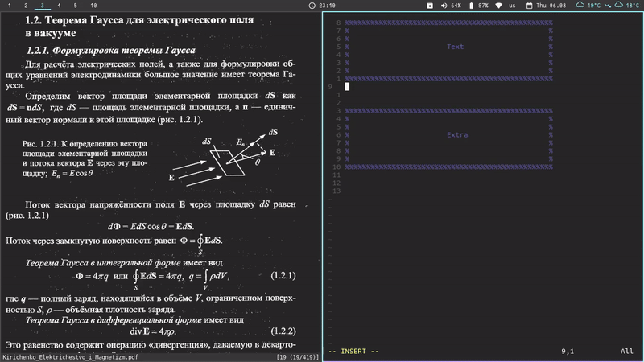

<br/>

Check out this [blog post](https://sofiabelen.github.io/selfstudy/Anki-Vim.html) on how to use this tool and some other tips for adding mathjax (latex) and images to your cards.

## Overview

Use vim to rapidly write textfiles immediately importable into anki.

## My fork

Same as original, just added my own snippets and used a cloze-deletion template instead of question-answer.

## Requirements

* Python >= 2.7 or Python >= 3.4

## Installation

Clone the repo and install using pip:

```bash
    git clone https://github.com/sofiabelen/AnkiVim.git
    cd AnkiVim
    pip install -e .
```


You can verify that this step succeeded and see available options by running:

```bash
    anki-vim -h
```


## Generating Anki Cards

1. Call: 

```bash
    anki-vim DECKNAME
```

2. vim starts with a preformatted card.
   Start typing the front part of the anki card below "Text", then fill out 
   the back below "Extra". 
   (*NOTE*: It is important to leave the Text and Extra headers intact throughout)

3. save the file and exit the editor. (vim: ":wq") => the card contents are saved to: 
   `$HOME/.ankivim/decks/DECKNAME/raw_cards.txt`.
   (alternatively, you can specify a custom location for your decks using 
   the `--deckpath` option of `script/anki-vim.py`.)

4. editor starts right back up to generate a new card for the same deck => Iterate 2.-4. until all cards are generated.

5. to stop the card creation process, simply close your editor ( for vim: ":q" or ":q!", for additional information see
   this [book](https://www.amazon.com/How-Exit-Vim-Chris-Worfolk-ebook/dp/B01N5M1U6W)).

## Importing into Anki

Procedure to import anki cards generated by this tool into anki:

1. Open Anki

2. Generate the deck to import into or click on an existing deck

3. Click import and navigate to
   "/path/to/anki-vim/decks/DECKNAME/raw_cards.txt"

4. check "allow html in fields"

5. Done


## Supports

* Latex/mathjax commands of any kind.
* Html tags of any kind (images can be included this way as well).
* Uses snippets. Checkout: [snippets](https://github.com/sofiabelen/AnkiVim/blob/master/ankivim/UltiSnips/anki_vim.snippets).

## Images

For adding images, you can use this script. It uses scrot to take a screenshot by letting you select a part of the screen. It then saves it to anki media collection, and you'll get the name of the image in your clipboard (using xclip). There is a snippet to add an image:

1. **by itself:** write 'img' in beginning of line to trigger.

2. **inside a cloze:** write 'ci' to trigger.

Paste the image name that was stored in your clipboard inside the "", and you're done!

Disclaimer: Anki doesn't always recognize the image right away, you might have to open the card edditor or click on 'Check media...'. If anyone has a workaround for this, please let me know!


```bash
    #!/bin/bash
    
    dir=".local/share/Anki2/User\ 1/collection.media/"
    name=$(date --iso-8601='seconds' | sed 's/://g').png
    
    scrot -s "$dir$name" && echo $name | tr -d '\n' | xclip -selection clipboard
```

If you're using i3-wm, add this to your config file to bind the script to Shift+Print (or some other key combination). Make sure the anki-screenshot script is in your PATH.

```bash
    bindsym --release Shift+Print exec anki-screenshot
```

