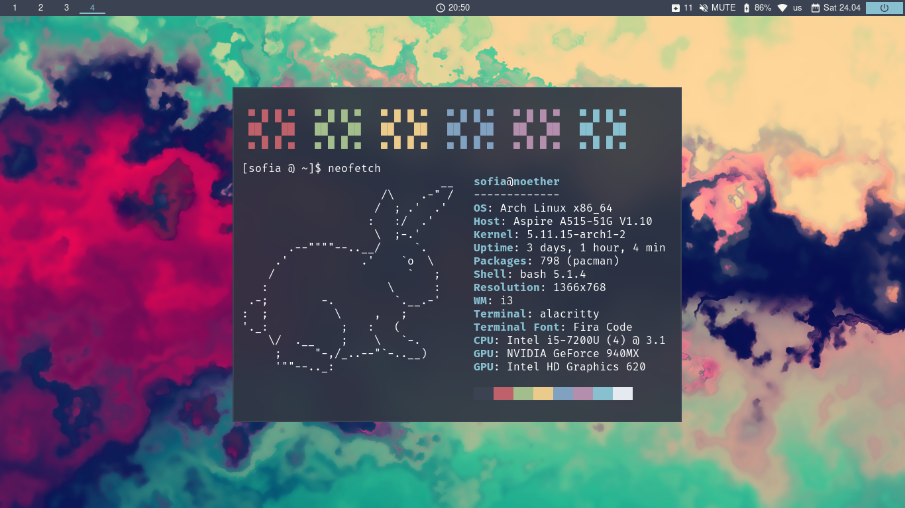
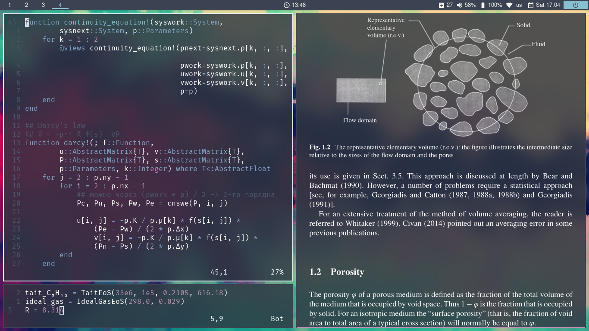
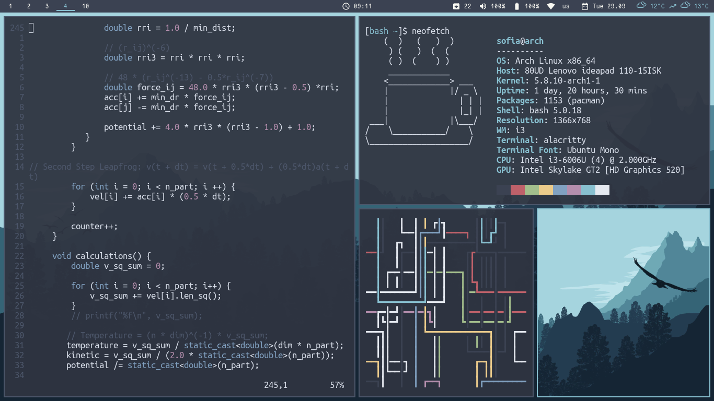
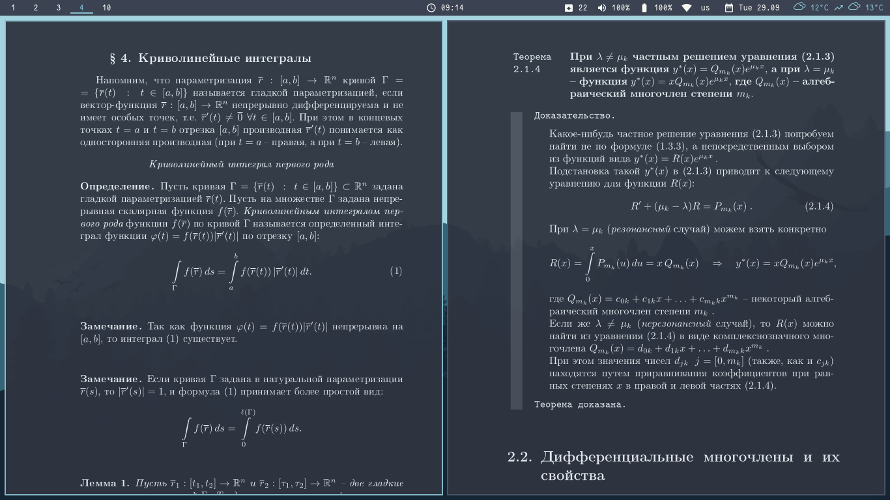
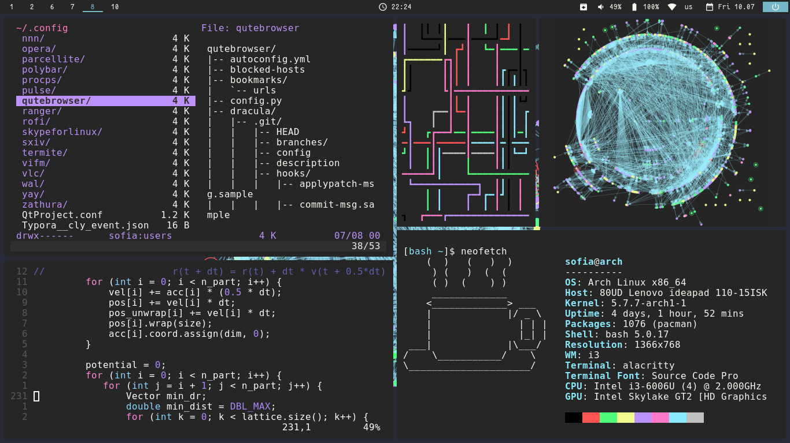
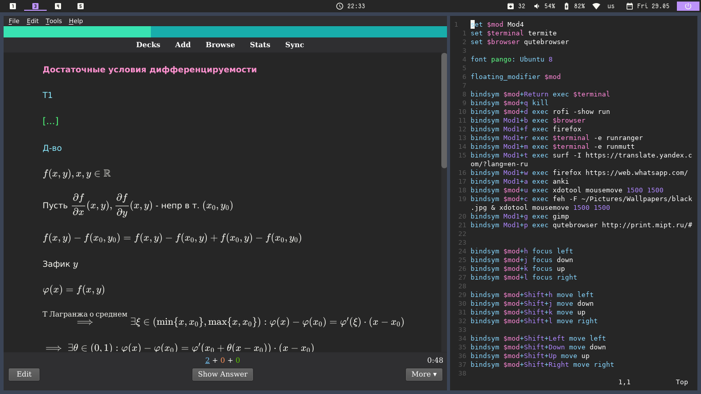
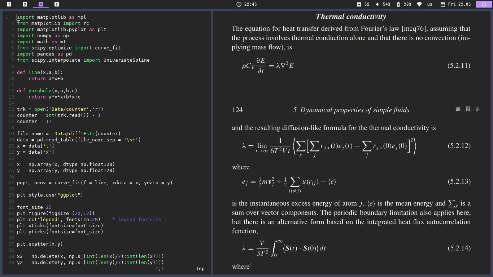

## Workflow

* Distro: Arch Linux
* Window Manager: i3-gaps
* Terminal: Alacritty
* Status bar: Polybar
* Pdf-viewer: Zathura
* File Manager: Vifm
* Anki for studying
* Vim Plugin for Latex: VimTex

Check out my [dotfiles](https://github.com/sofiabelen/dotfiles).

## Blur and Nord Colorscheme

---
## Nord Colorscheme

---
## Dracula Colorscheme

