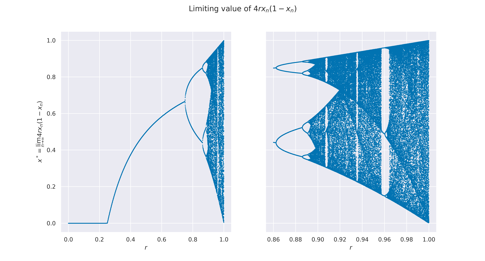
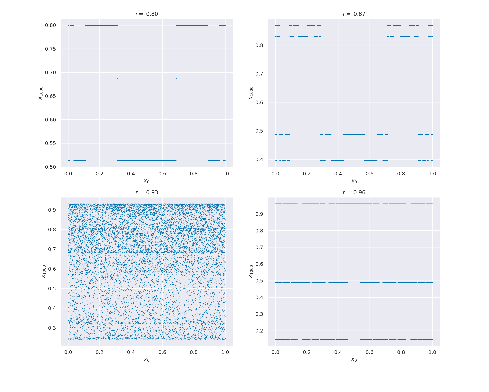

 

## Stability with Respect to Starting Conditions

We analyze how the value the 1000-th member of the sequence changes if we change the starting value of x. We notice that in the first two images, r = 0.80 and r = 0.87, respectively, the results stay 'close enough' to the solution. We could call this a piecewise continuous function. In the third picture, the instability is easy to see. In the last picture, however, it could appear to be stable, always taking on the same three values. This is not the case, since it is not piecewise continuous.

## Feigenbaum Constant

Having found the first few bifurcation points, we use an interpolation to find the Feigenbaum Constant.

