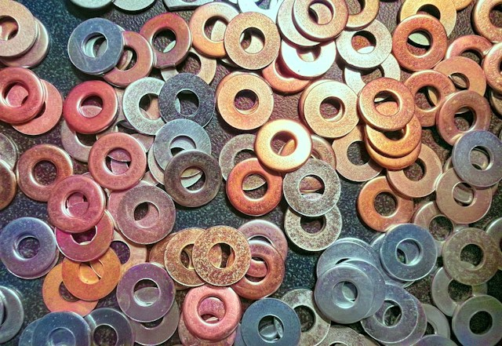

This is a follow-up to [my previous post](https://sofiabelen.github.io/projects/visualizing-the-aba-problem/), where we reproduced the ABA problem in a lock-free stack by manually sleeping the threads to achieve the desired scheduling. This is, however, an undeniably unviable strategy for testing and finding bugs in real life. To quote the docs, [Loom](https://docs.rs/loom/latest/loom/) offers a way to "run tests many times, permuting the possible concurrent executions of each test according to what constitutes valid executions under the C11 memory model."

My goal for this post is to explore the usage of loom and apply it to our broken lock-free stack, to see if it can detect the aba bug. It's my first time working with this tool, so it should be exciting!

The code can be found on my [github](https://github.com/sofiabelen/visualizing-crossbeam-epoch)!

## ABA Scenario Recap

Here's a diagram for a quick recap of the ABA scenario:


---
title: "Initial state"
---
flowchart TB
    head(("head"))

    subgraph nodea["node 'A'"]
        direction TB
        na_value["value: 1"]
        na_memory["memory: A"]
    end

    subgraph nodeb["node 'B'"]
        direction TB
        nb_value["value: 2"]
        nb_memory["memory: B"]
    end

    head --> nodea
    nodea --> nodeb
%%%
---
title: "Thread 1 reads head"
---
flowchart TB
    head(("head"))

    subgraph nodea["node 'A'"]
        direction TB
        na_value["value: 1"]
        na_memory["memory: A"]
    end

    subgraph nodeb["node 'B'"]
        direction TB
        nb_value["value: 2"]
        nb_memory["memory: B"]
    end

    t1["Thread 1<br/>head: A<br/>next: B"]

    head --> nodea
    nodea --> nodeb
    t1 --> nodea
%%%
---
title: "Thread 2 pops node 'A'"
---
flowchart TB
    head(("head"))

    subgraph nodeb["node 'B'"]
        direction TB
        nb_value["value: 2"]
        nb_memory["memory: B"]
    end

    t1["Thread 1<br/>head: A<br/>next: B"]

    subgraph nodea["node 'A' (popped)"]
        direction TB
        na_value["value: 1"]
        na_memory["memory: A"]
    end

    head --> nodeb
    nodeb ~~~ t1
    t1 --> nodea
%%%
---
title: "Thread 2 pops node 'B'"
---
flowchart TB
    head(("head (null)"))

    t1["Thread 1<br/>head: A<br/>next: B"]

    subgraph nodea["node 'A' (freed)"]
        direction TB
        na_value["value: 1"]
        na_memory["memory: A"]
    end

    head ~~~ t1
    t1 --> nodea
%%%
---
title: "Thread 2 pushes node 'C' (address A)"
---
flowchart TB
    head(("head"))

    subgraph nodec["node 'C'"]
        direction TB
        nc_value["value: 3"]
        nc_memory["memory: A"]
    end

    t1["Thread 1<br/>head: A<br/>next: B"]

    head --> nodec
    nodec ~~~ t1
    t1 --> nodec
%%%
---
title: "Thread 1 CAS succeeds: ABA bug triggered"
---
flowchart TB
    head(("head"))

    subgraph nodec["node 'C'"]
        direction TB
        nc_value["value: 3"]
        nc_memory["memory: A"]
    end

    t1["Thread 1 CAS<br/>head == A? true<br/>set head = B"]

    subgraph nodeb["node 'B' (freed)"]
        direction TB
        nb_value["value: 2"]
        nb_memory["memory: B"]
    end

    head --> nodec
    nodec ~~~ t1
    t1 --> nodec
    t1 ~~~ nodeb
%%%
---
title: "Final state (dangling head)"
---
flowchart TB
    head(("head (dangling)"))

    subgraph nodeb["node 'B' (freed)"]
        direction TB
        nb_value["value: 2"]
        nb_memory["memory: B"]
    end

    subgraph nodec["node 'C' (popped)"]
        direction TB
        nc_value["value: 3"]
        nc_memory["memory: A"]
    end

    head --> nodeb
    nodeb ~~~ nodec


## Loom Setup

### Shim For Using Loom Primitives

<figure>

  <figcaption>
Photo by <a href="https://unsplash.com/@robert2301?utm_source=unsplash&utm_medium=referral&utm_content=creditCopyText">Robert Ruggiero</a> on <a href="https://unsplash.com/photos/a-pile-of-different-colored-washers-sitting-on-top-of-a-table-oY6774he6GQ?utm_source=unsplash&utm_medium=referral&utm_content=creditCopyText">Unsplash</a>

As a non-native speaker, it's my first seeing this word o.O So I looked it up.

From <a href="https://en.wikipedia.org/wiki/Shim_(computing)">wikipedia</a>: a shim is a library that transparently intercepts API calls and changes the arguments passed, handles the operation itself or redirects the operation elsewhere. It's also that thing in the picture ^^
  </figcaption>
</figure>

The way loom tests our code essentially is by replacing the `std` primitives with its own:

| `std` | `loom` |
| :--- | :--- |
| `std::thread` | `loom::thread` |
| `std::sync::Arc` | `loom::sync::Arc` |
| `std::cell::UnsafeCell` | `loom::cell::UnsafeCell` |
| `std::sync::atomic::*` | `loom::sync::atomic::*` |
| `std::thread::scope` | *Not supported* (use `loom::thread::spawn` + `Arc`) |

What we want is to be able to use the `std` types normally and only replace them when compiling with the `loom` flag.

So, for running the loom tests, we pass `RUSTFLAGS="--cfg loom"`.

In order to toggle the loom types, we can add a shim to our `lib.rs` file:

```rust
#[cfg(not(loom))]
pub use std::sync::atomic::{AtomicPtr, Ordering};

#[cfg(loom)]
pub use loom::sync::atomic::{AtomicPtr, Ordering};
```

I'm just demonstrating the usecase, but we'd need to do this for all of types we want to replace (check out the complete [lib.rs](https://github.com/sofiabelen/visualizing-crossbeam-epoch/blob/main/src/lib.rs) for this demo).

### Cargo.toml

Then, we want to add loom to our project, but gated behind a config flag, so that it doesn't bloat our production builds. I added this my `Cargo.toml`:

```rust
// tells cargo to only include when compiling with --cfg loom
[target.'cfg(loom)'.dependencies]
loom = "0.7"

// registers loom as custom configuration flag (gets rid of compiler warnings)
[lints.rust]
unexpected_cfgs = { level = "warn", check-cfg = ['cfg(loom)'] }
```

### Wrapping Raw Pointers In UnsafeCell

<figure>

  <figcaption>
Photo by <a href="https://unsplash.com/@hocza?utm_source=unsplash&utm_medium=referral&utm_content=creditCopyText">Jozsef Hocza</a> on <a href="https://unsplash.com/photos/black-cat-wrapped-in-maroon-and-grey-plaid-textile-yBtRl173PWA?utm_source=unsplash&utm_medium=referral&utm_content=creditCopyText">Unsplash</a>
  </figcaption>
</figure>

This is something I didn't realize until later and didn't understand why the loom tests passed for the broken stack ;)

We need to wrap the fields that get unsafely read or written to across threads in `loom::cell::UnsafeCell`. This gives loom visibility over the memory that it needs to track for conflicting accesses.

Since the API for `UnsafeCell` in `std` and `loom` are a bit different, the (docs)[https://docs.rs/loom/latest/loom/#handling-loom-api-differences] recommends adding:

```rust
#[cfg(not(loom))]
#[derive(Debug)]
pub(crate) struct UnsafeCell<T>(std::cell::UnsafeCell<T>);

#[cfg(not(loom))]
impl<T> UnsafeCell<T> {
    pub(crate) fn new(data: T) -> UnsafeCell<T> {
        UnsafeCell(std::cell::UnsafeCell::new(data))
    }

    pub(crate) fn with<R>(&self, f: impl FnOnce(*const T) -> R) -> R {
        f(self.0.get())
    }

    pub(crate) fn with_mut<R>(&self, f: impl FnOnce(*mut T) -> R) -> R {
        f(self.0.get())
    }
}
```

Tldr; `loom::cell::UnsafeCell` uses `.with` and `.with_mut` to track reads and writes, whereas `std::cell::UnsafeCell` just uses `.get`, so we need to work around this a bit.

Node becomes:

```rust
pub struct Node<T> {
    value: T,
    //next: *mut Node<T>,
    next: UnsafeCell<*mut Node<T>>,
}
```

For the `push` I've replaced

```rust
unsafe { (*new_head).next  = current_head };
```

with 

```rust
unsafe {
    (*new_head).next.with_mut(|next_ptr| {
    *next_ptr = current_head;
    });
}
```

Let's break this down:

<pre><code>
<mark>(*new_head).next</mark>
│          │
│          └── retrieves next, which is of type UnsafeCell<*mut Node>
│
└── dereference
       navigates through the new_head raw pointer to get the actual Node struct


        <mark>.with_mut( |next_ptr| { ... } )</mark>
        │          │
        │          └── closure arg: next_ptr
        │                 the closure receives next_ptr, which is a pointer-to-the-pointer:
        │                 type: `*mut (*mut Node)`
        │                 think of this as: "a pointer targeting the inner pointer slot"
        │
        └── Calls .with_mut() on the UnsafeCell
               - cfg(loom): loom sees that a thread is writing
               - cfg(not(loom)): standard raw access
        
        
            <mark>*next_ptr = current_head;</mark>
            │         │
            │         └──  set the value inside the slot to point to current_head
            │
            └── dereference and write
                   *next_ptr dereferences the outer pointer to reach the inner pointer slot
</code></pre>

For the `pop`, I need to replace

```rust
let new_head = unsafe { (*current_head).next };
```

with 

```rust
let new_head = unsafe {
    (*current_head).next.with(|next_ptr| *next_ptr)
};
```

## ABA Loom Test

We are now ready to write our loom test (separte from the normal `#[test]`s). We wrap everything in a `loom::model`. And... I had to rewrite this a bit because loom doesn't have `std::thread::scope`. The reason for this, from what I could understand, is that `std::thread::scope` works with standard OS scheduling that loom cannot intercept.

With that out of the way, so the way this works is that loom runs the `loom::model(|| { ... })` closure many times, each time with a different schedule and thread-interleaving permutation.

```rust
#[cfg(test)]
#[cfg(loom)]
mod loom_tests {
    use super::*;
    use crate::thread;
    use crate::Arc;
    use loom::model;

    #[test]
    fn aba_problem() {
        model(|| {
            let stack = Arc::new(Stack::<i32>::new());
            let s2 = stack.clone();
            stack.push(1);
            stack.push(2);
            stack.push(3);

            let t1 = thread::spawn(move || {
                stack.pop();
            });

            let t2 = thread::spawn(move || {
                s2.pop();
                s2.pop();
                s2.push(4);
            });

            t1.join().unwrap();
            t2.join().unwrap();
        });
    }
}
```

Running the test:
```
RUSTFLAGS="--cfg loom" RUST_BACKTRACE=1 cargo test --release aba_problem
```

## Big Reveal \*\*happy noises\*\* (or maybe I celebrated too early)

<figure>

  <figcaption>
Photo by <a href="https://unsplash.com/@sonance?utm_source=unsplash&utm_medium=referral&utm_content=creditCopyText">Viktor Forgacs</a> on <a href="https://unsplash.com/photos/a-red-and-blue-fireworks-display-WHusHiMMx6s?utm_source=unsplash&utm_medium=referral&utm_content=creditCopyText">Unsplash</a>
  </figcaption>
</figure>

<style>
  .loom-output {
    --bg-color: #181825;
    --border-color: #313244;
    --text-color: #cdd6f4;

    --err-color: #f38ba8;
    --err-bg: rgba(243, 139, 168, 0.18);
    --help-color: #89b4fa;
    --location-color: #e5c890;
    --code-color: #a6e3a1;
    --dim-color: #6c7086;

    --badge-bg: #313244;
    --t1-color: #89b4fa;
    --t2-color: #f38ba8;

    --details-border: #45475a;
    --details-hover: #ffffff;

    background-color: var(--bg-color);
    color: var(--text-color);
    font-family: 'JetBrains Mono', 'Fira Code', Consolas, monospace;
    line-height: 1.5;
    padding: 16px;
    border-radius: 8px;
    border: 1px solid var(--border-color);
    overflow-x: auto;
  }

  @media (prefers-color-scheme: light) {
    .loom-output {
      --bg-color: #f8f9fa;
      --border-color: #dcdfe6;
      --text-color: #24292e;

      --err-color: #d73a49;
      --err-bg: rgba(215, 58, 73, 0.12);
      --help-color: #0366d6;
      --location-color: #b05a00;
      --code-color: #1b7c2b;
      --dim-color: #6a737d;

      --badge-bg: #e1e4e8;
      --t1-color: #0366d6;
      --t2-color: #d73a49;

      --details-border: #d1d5da;
      --details-hover: #000000;
    }
  }

  .loom-err-title { color: var(--err-color); font-weight: bold; }
  .loom-highlight { background-color: var(--err-bg); padding: 1px 4px; border-radius: 3px; }
  .loom-help { color: var(--help-color); }
  .loom-location { color: var(--location-color); font-weight: 500; }
  .loom-code { color: var(--code-color); }

  .loom-noise {
    opacity: 0.45;
    transition: opacity 0.2s ease;
  }
  .loom-noise:hover {
    opacity: 0.9;
  }

  .loom-badge {
    background-color: var(--badge-bg);
    padding: 1px 6px;
    border-radius: 4px;
    font-weight: bold;
    text-transform: uppercase;
  }
  .loom-badge-thread1 { color: var(--t1-color); }

  .loom-fail { color: var(--err-color); font-weight: bold; }
  .loom-pass-count { color: var(--code-color); }

  .loom-backtrace {
    margin: 8px 0;
    color: var(--dim-color);
  }
  .loom-backtrace summary {
    cursor: pointer;
    color: var(--dim-color);
    user-select: none;
    font-weight: 500;
  }
  .loom-backtrace summary:hover {
    color: var(--details-hover);
  }
  .loom-backtrace-content {
    opacity: 0.55;
    padding-left: 12px;
    border-left: 2px solid var(--details-border);
    margin-top: 4px;
  }
</style>

<pre class="loom-output"><code><span class="loom-noise">running 1 test</span>
<span class="loom-noise">test naive_lock_free_stack::loom_tests::aba_problem ... </span><span class="loom-fail">FAILED</span>
[...]
<span class="loom-badge loom-badge-thread1">(25841) thread `naive_lock_free_stack::loom_tests::aba_problem`</span> panicked at <span class="loom-location">loom-0.7.2/src/rt/object.rs:286:38</span>:
<span class="loom-err-title loom-highlight">index out of bounds: the len is 7 but the index is 34091991057</span>

<details class="loom-backtrace">
  <summary>[ Click to expand full backtrace ]</summary>
  <div class="loom-backtrace-content">
     = note: stack backtrace:
             0: __rustc::rust_begin_unwind
             1: core::panicking::panic_fmt
             2: core::panicking::panic_bounds_check
             3: &lt;scoped_tls::ScopedKey&lt;core::cell::RefCell&lt;loom::rt::scheduler::State&gt;&gt;&gt;::with::&lt;&lt;loom::rt::scheduler::Scheduler&gt;::with_state&lt;&lt;loom::rt::scheduler::Scheduler&gt;::with_execution&lt;loom::rt::synchronize&lt;&lt;loom::rt::cell::Cell&gt;::start_write::{closure#0}, loom::rt::cell::Writing&gt;::{closure#0}, loom::rt::cell::Writing&gt;::{closure#0}, loom::rt::cell::Writing&gt;::{closure#0}, loom::rt::cell::Writing&gt;
             4: <span class="loom-help">&lt;loom::rt::cell::Cell&gt;::start_write</span>
             5: <span class="loom-highlight loom-code">&lt;[...]::naive_lock_free_stack::Stack&lt;i32&gt;&gt;::pop</span>
             6: &lt;loom::rt::spawn&lt;loom::thread::spawn_internal&lt;visualizing_crossbeam_epoch::naive_lock_free_stack::loom_tests::aba_problem::{closure#0}::{closure#1}, ()&gt;::{closure#0}&gt;::{closure#1} as core::ops::function::FnOnce&lt;()&gt;&gt;::call_once::{shim:vtable#0}
             7: &lt;generator::stack::StackBox&lt;&lt;generator::gen_impl::GeneratorImpl&lt;core::option::Option&lt;alloc::boxed::Box&lt;dyn core::ops::function::FnOnce&lt;(), Output = ()&gt;&gt;&gt;, ()&gt;&gt;::init_code&lt;loom::rt::scheduler::spawn_thread::{closure#0}&gt;::{closure#0}&gt;&gt;::call_once
             8: generator::detail::gen::gen_init_impl
             9: generator::detail::asm::gen_init
  </div>
</details>
<span class="loom-noise">note: Some details are omitted, run with `RUST_BACKTRACE=full` for a verbose backtrace.</span>


failures:
    <span class="loom-help">naive_lock_free_stack::loom_tests::aba_problem</span>

<span class="loom-noise">test result: </span><span class="loom-fail">FAILED</span><span class="loom-noise">. </span><span class="loom-pass-count">0</span><span class="loom-noise"> passed; </span><span class="loom-pass-count">1</span><span class="loom-noise"> failed; </span><span class="loom-pass-count">0</span><span class="loom-noise"> ignored; </span><span class="loom-pass-count">0</span><span class="loom-noise"> measured; </span><span class="loom-pass-count">0</span><span class="loom-noise"> filtered out; finished in 0.00s</span>
</code></pre>

Soooo... the test fails with an `index out of bounds`. I looked into what this means, and in loom's runtime engine, every atomic, `UnsafeCell`, thread and allocation is assigned a small *object id*. In this case, the valid ones are from 0 to 6, so this huge index basically doesn't belong to any of the objects that loom is tracking.

However, this doesn't yet prove that we've managed to hit the ABA path yet. After printing printing the addresses, it turns out it's just a use-after-free case. I tried running it a few more times but no luck.

Essentially, what an use-after-free scenario could look like:


---
title: "Initial state"
---
flowchart TB
    head(("head"))

    subgraph nodea["node A"]
        direction TB
        na_value["value: 1"]
        na_memory["memory: 0x1000"]
    end

    subgraph nodeb["node B"]
        direction TB
        nb_value["value: 2"]
        nb_memory["memory: 0x2000"]
    end

    head --> nodea
    nodea --> nodeb
%%%
---
title: "Step 1: Thread 1 starts pop() and reads head"
---
flowchart TB
    head(("head"))

    subgraph nodea["node A"]
        direction TB
        na_value["value: 1"]
        na_memory["memory: 0x1000"]
    end

    subgraph nodeb["node B"]
        direction TB
        nb_value["value: 2"]
        nb_memory["memory: 0x2000"]
    end

    t1["Thread 1<br/>head: 0x1000<br/>next: (not read yet)"]

    head --> nodea
    nodea --> nodeb
    t1 -.->|reads| nodea
%%%
---
title: "Step 2: Thread 1 context-switched before reading A.next"
---
flowchart TB
    head(("head"))

    subgraph nodea["node A"]
        direction TB
        na_value["value: 1"]
        na_memory["memory: 0x1000"]
    end

    subgraph nodeb["node B"]
        direction TB
        nb_value["value: 2"]
        nb_memory["memory: 0x2000"]
    end

    t1["Thread 1 (PAUSED)<br/>head: 0x1000<br/>next: ???"]

    head --> nodea
    nodea --> nodeb
    t1 -.-> nodea
%%%
---
title: "Step 3: Thread 2 executes pop() successfully"
---
flowchart TB
    head(("head"))

    subgraph nodeb["node B"]
        direction TB
        nb_value["value: 2"]
        nb_memory["memory: 0x2000"]
    end

    t1["Thread 1 (PAUSED)<br/>head: 0x1000<br/>next: ???"]

    subgraph nodea["node A (popped by T2)"]
        direction TB
        na_value["value: 1"]
        na_memory["memory: 0x1000"]
    end

    head --> nodeb
    nodeb ~~~ t1
    t1 -.-> nodea
%%%
---
title: "Step 4: Thread 2 drops Node A and frees memory at 0x1000"
---
flowchart TB
    head(("head"))

    subgraph nodeb["node B"]
        direction TB
        nb_value["value: 2"]
        nb_memory["memory: 0x2000"]
    end

    t1["Thread 1 (PAUSED)<br/>head: 0x1000<br/>next: ?"]

    subgraph nodea["freed memory (0x1000)"]
        direction TB
        na_status["[deallocated]"]
    end

    head --> nodeb
    nodeb ~~~ t1
    t1 -.->|dangling reference| nodea
%%%
---
title: "Step 5: Thread 1 resumes and attempts use-after-free read"
---
flowchart TB
    head(("head"))

    subgraph nodeb["node B"]
        direction TB
        nb_value["value: 2"]
        nb_memory["memory: 0x2000"]
    end

    t1["Thread 1 resumes<br/>tries to read (0x1000).next<br/>use-after-free"]

    subgraph nodea["freed memory (0x1000)"]
        direction TB
        na_status["[deallocated]"]
    end

    head --> nodeb
    nodeb ~~~ t1
    t1 ==> |fails to dereference!| nodea


Soooo.. if we did want to reproduce the exact ABA scenario, we'd need to interfere with the timing ourselves, like in the [previous post](https://sofiabelen.github.io/projects/visualizing-the-aba-problem/), which I believe doesn't add any more value at this point.

## Conclusion

While it is a bit dissapointing that we couldn't catch the actual ABA bug, the *why* we couldn't helped me better understand what loom actually does. Since it runs different permutations until it panics, the first time it encounters a typical use-after-free, it stops there. It did prove, however, that loom does detect that our stack is indeed broken, which is the most important thing.

Originally, I had written a section discussing the use-after-free bug on my previous post, which I removed because it added too much complexity to the structure of the article without much extra benefit. So, here, I used that diagram that I had created before, so that's something :)

Thank you so much for tagging along! Any feedback is appreciated as I'm just dipping my toes in these tools.
