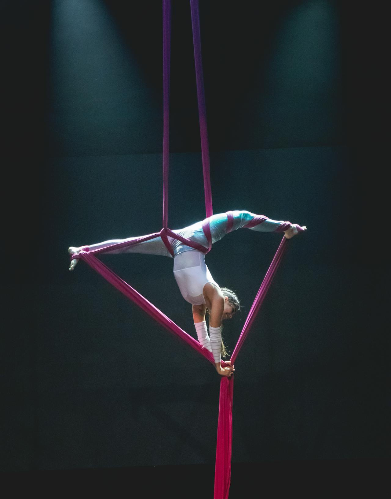

I'm venturing into Rust and it's both satisfying and mind-boggling at the same time. So far I've been learning from [the book](https://doc.rust-lang.org/book/) and [Mara Bos' book](https://mara.nl/atomics/), but I got the itch to do some dissecting myself. My initial goal of these experiments was to compare Rust's approach to polymorphism with C++'s. Ultimately, however, as I've come to realize, it's a bit of a trap when trying to understand a new language through another one to try to draw 1:1 parallels. It might seem like it helps, but at the end of the day, we can't treat Rust as C++ with different syntax. If that were the case, there'd be nothing revolutionary about it.

That said, I believe there is merit in poking around and coming to understand the *why*. So, if you're like me and need to know *what exactly is happening in memory,* in order to feel like you truly understand the concepts, hopefully you'll find this post useful :)

By the way, the thumbnail image is a photo of the rust fungus, to which we owe Rust's name. 
Credit: <a href="https://commons.wikimedia.org/wiki/File:Rust_fungus_-_Flickr_-_gailhampshire.jpg">gailhampshire from Cradley, Malvern, U.K</a>, <a href="https://creativecommons.org/licenses/by/2.0">CC BY 2.0</a>, via Wikimedia Commons.

You can find all the code and experiments on [GitHub](https://github.com/sofiabelen/rust-vtables-for-cpp-programmers).

## Introduction: The Crux of the Matter

What we're trying to achieve is quite simple. Let's say we have a bunch of shapes: circles, squares, triangles, and we want to call `draw()` on each one.  

### C++ Approach #1: Virtual Functions

The first way to do this that comes to mind in C++ is through virtual functions, which makes use of runtime polymorphism. The vtable pointer lives inside the object, virtual dispatch happens automatically.

```cpp
std::vector<Shape*> shapes = { new Circle(), new Square() };
for (auto* s : shapes)
    s->draw();
```

Rust's equivalent would be `dyn Trait`, which is what we ultimately want to understand. But first, let's take a look at another way we could solve this in C++.

### C++ Approach #2: CRTP

One could also go the CRTP (Curiously Recurring Template Pattern) route, which is essentially compile time polymorphism. If you're interested, this awesome [talk](https://www.youtube.com/watch?v=pmdwAf6hCWg) by Klaus Iglberger was my first introduction to the topic, and the one I keep coming back to for reference.

```cpp
template<typename Derived>
struct Shape {
    void draw() {
        static_cast<Derived*>(this)->draw();
    }
};
```

Essentially, there are no vtables and it's resolved at compile time, sacrificing readability (it really is a mouthful).

Rust offers a much more straightforward and simple equivalent to CRTP, namely monomorphization. This is the approach we'll dig into first to start constructing our mental model of what Rust has to offer.

## Static Dispatch

<figure>

<caption>
Photo by <a href="https://unsplash.com/@jiaweizhao?utm_source=unsplash&utm_medium=referral&utm_content=creditCopyText">Jiawei Zhao</a> on <a href="https://unsplash.com/photos/tuxedo-cat-in-brown-cardboard-box-W-ypTC6R7_k?utm_source=unsplash&utm_medium=referral&utm_content=creditCopyText">Unsplash</a>
</caption>
</figure>

Static dispatch, also known as generics, achieves a similar result to CRTP: the compiler generates a separate copy of the function for each type it's called with. There is zero runtime cost, but the types must be known at compile time.

```rust
trait Draw {
    fn draw(&self) -> &str;
}

struct Circle;
struct Square;

impl Draw for Circle {
    fn draw(&self) -> &str {
        "Drawing a circle"
    }
}

impl Draw for Square {
    fn draw(&self) -> &str {
        "Drawing a square"
    }
}

fn draw_shape<T: Draw>(shape: T) {
    println!("{}", shape.draw());
}

fn main() {
    let circle = Circle;
    let square = Square;
    draw_shape(circle);
    draw_shape(square);
}
```

Under the hood, the compiler generates two separate functions: `draw_shape::<Circle>` and `draw_shape::<Square>`.

### How does this compare to C++'s templates?

The difference here is the philosophy. C++ makes the constraints implicit, a
template accepts any type `T` that happens to have a `.draw()` method. While,
in Rust, you are typing out the contract explicitly: you "implement the Draw
trait for Square."

My question is, when is this not enough? Before tackling this question, let's indulge a bit in a side quest.

### Side Quest: Rust's Zero-Sized Types

I tried to look at the size of `Circle` and `Square` because I wanted to make
the comparison to wide pointers, which we'll see in a bit, but it led me to
discover something unexpected. In C++, the standard mandates that every object
has a size of at least 1 byte, even if empty. This
is so that two distinct objects always have distinct address, meaning `&obj1`
must be different from `&obj2`. This is one of those things that is ingrained in my mind as a fact of
nature, so seeing that rust returns `0` totally surprised me. These are the little moments that bring me so much joy as I'm
exploring Rust because it deconstructs my mental model and helps me appreciate the different philosophy.

```rust
println!("{}", std::mem::size_of::<Circle>()); // 0 WHAT???
println!("{}", std::mem::size_of::<Square>()); // 0
```

This is how I discovered that Rust handles the unique address guarantee differently. Zero-sized types (ZST) are structs that don't contain any fields, therefore there's no need to allocate any memory. Rust tracks identity through ownership, not addresses. Every value has exactly one owner at a time, this is enforced at compile time by our friend, the borrow-checker.

In C++, we might do this to check if two pointers refer to the same object:

```cpp
if (&a == &b) { // same object }
```

In Rust, that question is answered by the borrow-checker at compile time:

```rust
// the borrow checker already knows these are different bindings
// you don't need to compare addresses to tell them apart
let a = Circle;
let b = Circle;
```

The compiler tracks `a` and `b` as distinct names with distinct owners.

After learning about this, my question was, what happens then if we take the address of a zst? Let's try it.

```rust
let a = Circle;
let b = Circle;

println!("{:p}", &a as *const Circle);
println!("{:p}", &b as *const Circle);
```

The output:

```
0x7ffdda99aece
0x7ffdda99aecf
```

Strange... so they are getting distinct stack addresses 1 byte apart (`ce` and `cf` in hex). It might look like the compiler allocated a byte for each, just as C++ would, but this is simply a debug-mode behavior. The compiler assigns local ZST variables a dummy stack slot purely so debuggers can track and inspect them by reference.

If we try this in release mode, however, we get different behavior:

```
cargo run --release --bin 01_static_dispatch
```

The addresses do indeed collapse for me:

```
0x7ffdf74afa6f
0x7ffdf74afa6f
```

My take away from this is that the compiler makes no guarantees about ZST addresses, and identity is tracked by the borrow checker through ownership, not memory addresses.

## Dynamic Dispatch

<figure>

<caption>
Photo by <a href="https://unsplash.com/@aldrinrachmanpradana?utm_source=unsplash&utm_medium=referral&utm_content=creditCopyText">Aldrin Rachman Pradana</a> on <a href="https://unsplash.com/photos/a-cat-sitting-on-the-back-of-a-motorcycle-rrzPbEZR1I4?utm_source=unsplash&utm_medium=referral&utm_content=creditCopyText">Unsplash</a>
</caption>
</figure>

To continue on our main quest, let's see what dynamic dispatch would look like for our previous example:

```rust
fn draw_shape(shape: &dyn Draw) {
    println!("{}", shape.draw());
}

fn main() {
    let circle = Circle;
    let square = Square;
    draw_shape(&circle);
    draw_shape(&square);
}
```

It looks almost identical to the static dispatch version, the only difference is `&dyn Draw` instead of `<T: Draw>`. But something fundamentally different is happening underneath. Let's see what happens to the size:

```rust
println!("&Circle size:   {}", std::mem::size_of::<&Circle>());   // 8
println!("&dyn Draw size: {}", std::mem::size_of::<&dyn Draw>()); // 16
```

`&dyn Draw` is twice the size of a regular pointer. This is called a **wide pointer**: it's actually two pointers, one points to the data, the other to a vtable. That vtable is what tells Rust which `draw()` to call at runtime.

We can inspect what those pointers look like:

```rust
fn inspect(shape: &dyn Draw) {
    let (data_ptr, vtable_ptr) = unsafe {
        std::mem::transmute::<&dyn Draw, (usize, usize)>(shape)
    };
    println!("data ptr:      {:#x}", data_ptr);
    println!("vtable ptr:    {:#x}", vtable_ptr);
}
```

`std::mem::transmute` does a bit-for-bit copy from the source type (`&dyn Draw`) to the destination type (`(usize, usize)`). This requires `unsafe` because the compiler cannot guarantee that arbitrary bit patterns form valid values for the target type.

We see that objects of the same type share a vtable and the data pointer changes per instance:

<pre><code>
=== circle ===
data ptr:      0x7ffdcae73286
<mark>vtable ptr:    0x55f23cbe5338   <-- circle's vtable</mark>

=== circle2 ===
data ptr:      0x7ffdcae732ec
<mark>vtable ptr:    0x55f23cbe5338   <-- same vtable as circle!!</mark>

=== square ===
data ptr:      0x7ffdcae73287
vtable ptr:    0x55f23cbe5358
</pre></code>

## Why the Need for Dynamic Dispatch

Getting back to our question, when is static dispatch not enough, and why do we need dynamic dispatch at all? Let's explore a scenario where static dispatch is not enough. If we wanted to create a `Vec<T>` containing a mix of both `Square`s and `Circle`s, we hit a wall with generics alone. 

```rust
// does not compile!!
let shapes = vec![Circle, Square];
```

A `Vec<T>` requires every element to be the exact same **type** and **size**. `Circle` and `Square` are completely unrelated and could have different sizes. There's no "base class" like in C++, where you'd write:

```cpp
std::vector<Shape*> shapes = { new Circle(), new Square() };
```

This is where we need dynamic dispatch, aka `dyn Trait`. `Box<T>` is Rust's way of allocating a value on the heap and owning it through a pointer.

```rust
    let shapes : Vec<Box<dyn Draw>> = vec![ // Box -> [ data ptr | vtable ptr ]
        Box::new(Circle),
        Box::new(Square),
    ];
```

`Box<dyn Draw>` solves the size problem. A `Box` is always the same size, since it's just a wide pointer.

```
Vec<Box<dyn Draw>> in memory:
[ 16 bytes | 16 bytes ]
     ↓            ↓
[data|vtable] [data|vtable]
     ↓              ↓
   Circle         Square
```

A key distinction from C++ philosophy is that in C++, the choice between dynamic and static dispatch is made at the class level. If you mark a method `virtual`, that class will always use dynamic dispatch. In the case of `vector<Shape*>`, it works because the vtable pointer is part of the object.

In Rust, the choice is made at the *call site.* `Circle` is just `Circle`, it knows nothing about dispatch. You decide whether to use static or dynamic dispatch depending on how you refer to it: `&Circle` for static, `&dyn Draw` for dynamic.

<figure>

  <figcaption>
Photo by <a href="https://www.pexels.com/photo/aerial-silk-performer-in-dramatic-pose-on-stage-30131184/">Anderson Portella</a>.
  </figcaption>
</figure>

I honestly had to take a moment to let all of this sink in, since I'm so used to how C++ does things, it twists my brain (in a good way) to reason about Rust's philosophy. I've recently started doing aerial silks, and there's an odd resemblance: when you're inverted in the air, you have to consciously rewire your entire sense of how your body works. Rust does the same thing to your mental model.

## One Vtable per (Type, Trait) Pair

Let's see what happens when we combine different traits for a type. We want our `Duck` to both `Fly` and `Swim`.

```rust
trait Fly {
    fn fly(&self) -> &str;
}

trait Swim {
    fn swim(&self) -> &str;
}

struct Duck;

impl Fly for Duck {
    fn fly(&self) -> &str {
        "Duck flies!"
    }
}

impl Swim for Duck {
    fn swim(&self) -> &str {
        "Duck swims!"
    }
}
```

What does this look like in memory:
```rust
    let fly_obj: &dyn Fly = &duck;
    let swim_obj: &dyn Swim = &duck;
    
    let (data_fly, vtable_fly) = unsafe {
        std::mem::transmute::<&dyn Fly, (usize, usize)>(fly_obj)
    };
    let (data_swim, vtable_swim) = unsafe {
        std::mem::transmute::<&dyn Swim, (usize, usize)>(swim_obj)
    };

    println!("fly_obj  -> data: {:#x}  vtable: {:#x}", data_fly,  vtable_fly);
    println!("swim_obj -> data: {:#x}  vtable: {:#x}", data_swim, vtable_swim);
    println!("size of duck: {}", std::mem::size_of_val(&duck));
```

<pre><code>
fly_obj  -> data: <mark>0x7ffe769558df</mark>  vtable: <mark>0x5573a247ea48</mark>
swim_obj -> data: <mark>0x7ffe769558df</mark>  vtable: <mark>0x5573a247ea68</mark>
size of duck: 0
</pre></code>

We can marvel again at how the size of `Duck` is `0` because it's a ZST. We also see that the `fly_obj` and the `swim_obj` both share the same **data pointer**, which makes sense because they are both dynamic traits of the same underlying duck object. The interesting part here, however, is how the **vtable pointers** differ. 

<figure style="display: flex; flex-direction: column; align-items: center; text-align: center; margin: 0 auto;">
  
  <figcaption style="margin-top: 8px;">
    A duck is just a duck.<br>
    Photo by <a href="https://unsplash.com/@ross_sokolovski?utm_source=unsplash&utm_medium=referral&utm_content=creditCopyText">Ross Sokolovski</a> on <a href="https://unsplash.com/photos/brown-and-white-duck-on-gray-concrete-floor-kCZSzqvIei4?utm_source=unsplash&utm_medium=referral&utm_content=creditCopyText">Unsplash</a>
  </figcaption>
</figure>

This reinforces our core idea: the vtable is not embedded in the object (like C++), it's external static data that gets paired with the object when you ask for dynamic dispatch. A `Duck` stays a `Duck` no matter if it swims or flies, or how many traits it implements.

## Object Safety: Why Not Every Trait Can Be Dyn

If you're like me, you're probably thinking that is all very nice. And it is, but it's important to also understand the limitations. One of these limitations is something that in C++ we didn't have to worry about, and another one is also present in C++. To clear up the mystery, not every trait in Rust can be used as `dyn Trait`. A trait must follow so-called **object safety** rules to be used as a trait object:

- methods can't return `Self`
- methods can't have generic parameters

### Methods Can't Return Self

`Clone` is the classic example because it has `fn clone(&self) -> Self`.

`Self` is essentially just a placeholder for the type that is currently implementing the trait.

```rust
trait Clone {
    fn clone(&self) -> Self;
}
```

So, for `Circle` implementing the `Clone` trait, `Self` resolves to `Circle`.

Since it returns `Self`, it means that the caller needs to know the concrete type to know how much memory to allocate for the return value. Through a vtable, the caller doesn't know the concrete type, so the compiler rejects it.

C++ doesn't have this problem at all, since virtual dispatch always goes through pointers and return types are always pointers too. Rust works with values directly, so when you return `Self` by value, you need to know the size.

### Methods Can't Have Generic Parameters

```
trait Serialize {
    fn serialize<T>(&self, output: &mut T);
}
```

In this case, the compiler would need a separate vtable entry for every possible `T`:
```
serialize::<File> 
serialize::<String>
serialize::<Vec<u8>>
...
```
It would essentially need to be infinite.

Therefore, this won't compile:
```rust
let s: Box<dyn Serialize> = ...; // COMPILE ERROR
```

What about C++? It hits the same wall essentially, since you can't have a template virtual method for the same reason:

```cpp
class Serialize {
public:
    template<typename T>
    virtual void serialize(T& output); // COMPILE ERROR!!
};
```

I googled this, and technically, with enough C++20 black magic you *could* work around this by building the vtable manually, but it only works within a single source file and is not something you'd do in production code. This is out of the scope of my post, but I'll leave a link to [Christian Daley's article](https://dev.to/christiandaley/virtual-function-templates-with-stateful-metapogramming-in-c-20-33l2) if you'd like to go down this rabbit hole.

## Recap

We started with a simple question: how do you call `draw()` on a collection of shapes in Rust, without inheritance?

- Monomorphization (static dispatch) in Rust and CRTP in C++ both are compile-time polymorphism. They have no runtime cost, with the downside being the code size. Essentially, monomorphization is a native language feature for what CRTP achieves as a sort of workaround.

- `dyn Trait` and virtual functions in C++ both use a vtable to achieve dynamic dispatch. The difference is that in C++, the vtable pointer lives inside the object, adding overhead to every instance whether you use polymorphism or not. In Rust, the vtable pointer only appears when you explicitly use `&dyn Trait` or `Box<dyn Trait>`.

- Zero-sized types (ZSTs): In C++ every object must occupy at least 1 byte because it tracks the identity through memory addresses at runtime. In Rust, identity is tracked through ownership at compile time, which is why it can have zero-sized types.

If you made it this far, thank you! This one took a while to get it out there.
I started writing it in March 2026. It just needed some final touches, but I
hadn't gotten around to publishing it. I kept second guessing myself if it'd
actually be useful content, but I figured, if this approach was helpful for me,
maybe it'd also be useful for someone else. Much has happened between then and now, both
in my personal life and in my Rust journey. Some good, some bad. I'm
in Spain now, and a life update post is coming soon. On the Rust side, I'm
diving into concurrency and lock-free programming,
with the goal of eventually contributing to open source. And I plan to document
that journey here too :)
