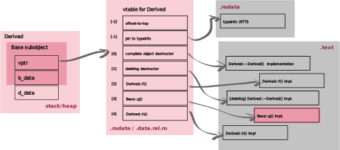

I've struggled to understand the exact memory layout of C++ objects. Each time I thought I grasped it, I later came back to realize I didn't. So, I decided to make a series of experiments to make sure that this time I really got it. Hopefully this post will be useful to you if you're like me, someone who loves lots of diagrams and experiments to visualize concepts.

You can find all the code and experiments on [GitHub](https://github.com/sofiabelen/visualizing-the-cpp-object-memory-layout/tree/main).

---

## Series Parts
1. Part 1 — Single Inheritance *(current post)*
2. Part 2 — Multiple Non-Virtual Inheritance (Diamond Without Virtual) *(coming soon)*
3. Part 3 — Virtual Inheritance (Diamond With Virtual Base) *(coming soon)*

---

Before going further, it’s worth mentioning one important assumption:
all the experiments in this series use the Itanium C++ ABI, which is what GCC and Clang follow on most platforms.

The ABI (Application Binary Interface) defines things the C++ standard doesn’t, like how vtables are laid out, where the vptr lives, how virtual calls are dispatched, and how RTTI (runtime type information) works.

Different compilers and platforms can follow different ABIs. For example, MSVC on Windows uses its own. So, the exact memory layouts we’ll see here apply specifically to the Itanium C++ ABI.

## Simple Single Inheritance

We'll start with single inheritance, so we can then build on top of this intuition.

```cpp
struct Base {
  Base(int b = 0) : b_data(b) {}

  virtual void f() {};
  int b_data;
};

struct Derived : Base {
  Derived(int b = 0, int d = 0)
    : Base(b), d_data(d) {}

  int d_data;
};
```

Let’s create a couple of objects from the classes we just defined:
```cpp
Base base {1};
Derived derived {2, 3};
```

We initialize these data members so that we can later see them in memory.

## Memory Layout of Derived

Because Base has a virtual function, each Base or Derived object includes a hidden pointer to the vtable (vptr), typically the first word in the object layout.

Every polymorphic object (a class with at least one virtual function) contains a hidden pointer called the vptr. This pointer points to a vtable, a table of function pointers corresponding to the virtual functions of that object's dynamic type. When you call a virtual function, the program doesn’t call a fixed memory address. Instead, it looks up the correct function via the vptr. This mechanism is what allows dynamic dispatch: the program chooses the right function at runtime depending on the actual type of the object. We'll see this in action in a bit and manually trigger dynamic dispatch.

So, memory for objects of type `Base` and `Derived` roughly looks like:

<figure>

  <figcaption>
Figure 1: Memory layout of a Base object and a Derived object. The Derived layout includes the virtual function table pointer (vptr) inherited from Base, followed by the Base's `b_data`, and then Derived's `d_data`. This shows how Derived extends Base while maintaining the base subobject’s memory layout.

  </figcaption>
</figure>

Let's do an experiment to visualize this.

We'll review a few modern features that will come in handy. This is meant to serve a cheat-sheet as we build our experiment, not a comprehensive explanation.

| Concept | Intuitive Explanation |
|:--|:--|
| [**`std::uintptr_t`**](https://en.cppreference.com/w/cpp/types/integer) | A number type that can safely hold a pointer’s value. |
| [**`std::byte`**](https://en.cppreference.com/w/cpp/types/byte) | A special type that represents a single byte of raw memory. |
| [**`std::span`**](https://en.cppreference.com/w/cpp/container/span) | A non-owning “view” of an array or vector (like a safe pointer + size). |
| [**`reinterpret_cast`**](https://en.cppreference.com/w/cpp/language/reinterpret_cast) | Reinterprets raw bits as another type (used for low-level memory manipulation). |
| [**`std::as_bytes`**](http://en.cppreference.com/w/cpp/container/span/as_bytes.html) | Obtains a view to the object representation of the elements of a span. |


## Dissecting C++ Object Memory: Offsets, Bytes, and the Hidden vptr

**Goal:** visualize how an object is laid out in memory.

For each data member, we want to see three things:
- its offset from the start of the object,
- its size, and
- the actual bytes it occupies in memory.

### Pointer Arithmetic Using std::uintptr_t
In standard C++, you can only do pointer arithmetic within the same **array object**.
That’s why something like:

```cpp
&derived.b_data - &derived
```

is undefined behavior because `derived` and `derived.b_data` are not elements of the same array. They’re separate subobjects inside a class.

Even if you cast to `char*`:

```cpp
reinterpret_cast<char*>(&derived.b_data) - reinterpret_cast<char*>(&derived)
```

This usually works in practice (and is what people often do), but technically it's only guaranteed to be valid if the two pointers point into the same object or one past it.

To stay fully defined, we can cast pointers to integers (`std::uintptr_t`) and do arithmetic there instead. We are basically doing integer math.

So, to get the offset of a member:

```cpp
Derived derived;
std::uintptr_t derivedPtr { reinterpret_cast<std::uintptr_t>(&derived)};
offset = reinterpret_cast<std::uintptr_t>(&derived.b_data) - derivedPtr
```

### Displaying Offset, Size and Raw Bytes
We’ll group the information we want into a simple structure:
```cpp
struct Field {
  std::size_t offset;
  std::size_t size;
  std::string_view name;
};
```

Then fill it in. The `vptr` (the virtual table pointer) isn’t visible directly, so we cheat a little and assume it starts at offset 0x00. Don't worry, we’ll verify that this is the case by calling the functions through the vtable.

```cpp
  Field fields [] = {
    {0x00, sizeof(void*), "vptr"},
    {reinterpret_cast<std::uintptr_t>(&derived.b_data) - derivedPtr, sizeof(derived.b_data), "b_data"},
    {reinterpret_cast<std::uintptr_t>(&derived.d_data) - derivedPtr, sizeof(derived.d_data), "d_data"}
  };
```

To inspect the object’s raw bytes, we can use `std::span` and `std::as_bytes`:
```cpp
auto dataBytes { std::as_bytes(std::span{&derived, 1}) };
```
`std::as_bytes` gives us a safe view of the object’s binary representation as `std::bytes`.

Finally, we can display everything nicely:
```cpp
void dumpLabeled(std::span<const std::byte> dataBytes,
    std::span<const Field> fields) {

  std::println("Offset  Size  Field     Bytes");
  std::println("------  ----  -----     ------");

  for (const auto& field: fields) {
    std::print("0x{:02X}      {}    {:<8} ", field.offset, field.size, field.name);

    for (std::size_t i {}; i < field.size && (field.offset + i) < dataBytes.size(); i++) {
      auto b { dataBytes[field.offset + i] };
      std::print("{:02x} ", std::to_integer<unsigned>(b));
    }
    std::println();
  }
}
```
This function simply walks over the object’s bytes and prints each field’s offset, size, and raw memory contents. The formatting inside `std::print` is for readability, don't worry too much about that part.

Before dumping the object’s bytes, I decided to also print a few details such as the object’s address, its base pointer, and the sizes of the involved types, just to give some context.
(Full source is on GitHub.)

<pre><code>
sizeof(Base):    16
sizeof(Derived): 16

&derived (Derived*):          0x7fff31b5d5e0
&base (Base*):                0x7fff31b5d5d0

Base obj bytes (annotated):
Offset  Size  Field     Bytes
------  ----  -----     ------
<mark>0x00      8    vptr     d0 0b 3b 40 ad 55 00 00 </mark>
<mark>0x08      4    b_data   01 00 00 00 </mark>

Derived obj bytes (annotated):
Offset  Size  Field     Bytes
------  ----  -----     ------
<mark>0x00      8    vptr     b8 0b 3b 40 ad 55 00 00 </mark>
<mark>0x08      4    b_data   02 00 00 00 </mark>
<mark>0x0C      4    d_data   03 00 00 00 </mark>

Offset of Base within Derived: 0 bytes
</pre></code>

We can now see the object layout clearly:

- the first 8 bytes are the `vptr`,
- followed by the base class field `b_data`,
- and then the derived class field `d_data`.

For `base`, we see that the `b_data` is indeed `1`, as we had initialized it. For `derived`, `b_data` is `2`, while `d_data` is equal to `3`. All looks good.

The `Derived` object takes up 16 bytes in memory. It's what we’d expect: 8 bytes for the vptr and 4 bytes each for the two `int` members.
But wait... shouldn’t `Base` be smaller, since it only has one `int`?

The reason for this is padding: extra bytes the compiler inserts to keep everything properly aligned in memory.

### Padding

<figure>

  <figcaption>
You can imagine memory alignment like organizing items on shelves: each variable has its own shelf size, and it needs to start exactly at the edge of that shelf so the CPU can find and access it properly.
  </figcaption>
</figure>

The CPU access memory most efficiently when data is aligned to certain boundaries (for some architectures this is actually a requirement). For example, a 4-byte integer is typically fastest to read or write when it starts at an address that’s a multiple of 4. If a field would otherwise start at an unaligned address, the compiler adds some unused bytes (padding) to move it to the next properly aligned position.

With a bit (no pun intended) more pointer arithmetic, we can actually peek at those padding bytes.

<pre><code>
Base obj bytes (annotated with padding):
Offset  Size  Field     Bytes
------  ----  -----     ------
0x00      8    vptr     d0 0b 3b 40 ad 55 00 00 
0x08      4    b_data   01 00 00 00 
<mark>0x0C      4    padding  31 7f 00 00 </mark>
</pre></code>

Here you can see that after the 4-byte `b_data` field, there are 4 more bytes that don’t correspond to any real variable, they’re just there to ensure the next part of the object starts at the correct alignment boundary.

Those bytes (`31 7f 00 00`) are effectively garbage data. They might contain leftover memory values, but they’re ignored by the program.

## Invoking Functions Directly via Vptr

Now for the fun part. I promised we would use the `vptr`, located at the start of each object, to access the virtual function and call them directly.

Let's start out by making our functions print something so that we can recognize which function has been called. We don't care about the data members for this part, so we can just get rid of them.

```cpp
struct Base {
  virtual void f() {
    std::print("Base::f()");
  }
  virtual void g() {
    std::print("Base::g()");
  }
};

struct Derived : Base {
  virtual void f() override {
    std::print("Derived::f()");
  }
  virtual void h() {
    std::print("Derived::h()");
  }
};
```

### Function Pointer Type For Member Functions

A vtable entry has the type roughly: (more on [function pointers](https://www.geeksforgeeks.org/cpp/function-pointer-in-cpp/) bellow)

```cpp
using FnPtr = void(*)(void*);  // takes "this" pointer manually
```

Each virtual function is compiled to something like:

```cpp
void Derived_f(Derived* this);
void Base_g(Base* this);
```

Here we can see that these functions take the `this` pointer manually. This is done automatically by the compiler, so we don't have to worry about it when calling member functions.

So, if we reinterpret a vtable entry as a `FnPtr`, and pass it the address of our object, we can call it directly.

### Accessing the Hidden Vptr

1. We first get the address of the `derived` object. It's type is `Derived*`.
```cpp
&derived
```

2. We cast this pointer to `void**` so we can treat the **first word of the object as a pointer**.
```cpp
reinterpret_cast<void**>&derived
```

3. Next, we dereference that pointer to read the value stored at the start of the object:
```cpp
*reinterpret_cast<void**>(&derived)
```

4. Finally, we store that value, the **vtable address**, into a `void*` variable:
```cpp
void* vptr = *reinterpret_cast<void**>(&derived);
```

### Reinterpreting the vptr as a Vtable Pointer
Right now, `vptr` is just a `void*`. That's a pointer to "something," but the compiler doesn't know it points to an array of (function) pointers. By doing:
```cpp
auto vtable = reinterpret_cast<void**>(vptr);
```
we now have a pointer to an array of `void*` (our vtable entries).

### Function Pointer
Let's review the syntax for a [function pointer](https://www.geeksforgeeks.org/cpp/function-pointer-in-cpp/):
```cpp
return_type (*FuncPtr) (parameter_type, ...);
```

So, we can define our own function pointer type:

```cpp
using FnPtr = void(*)(void*);
```

- `void` -> The function returns nothing.
- `(void*)` -> The function takes a single argument, which is a `void*`.
- `(*)` -> This is the syntax for declaring a pointer to a function rather than a regular function.

### Inspecting a Vtable and Manually Triggering Virtual Dispatch

We are finally ready to iterate over the vtable entries and invoke each of the virtual functions:
<pre><code class="language-cpp">
for (size_t i {}; i < 3; i++) {
  std::print("[{}] {:p}  ", i, vtable[i]);

  if (vtable[i] != nullptr) {
    <mark>auto fn = reinterpret_cast<FnPtr>(vtable[i]);</mark>
    <mark>fn(obj);</mark>
  }
  std::println();
}
</pre></code>

The output, where we can see our beautiful functions being called.
<pre><code class="language-cpp">
vtable pointer (vptr): 0x55b010347bb8

 i     vtable[i]     calling funtion
---  -------------  ----------------
[0] 0x55b010323370  <mark>Derived::f()</mark>
[1] 0x55b010323318  <mark>Base::g()</mark>
[2] 0x55b0103233c8  <mark>Derived::h()</mark>
</pre></code>

Let’s pause and recap what we’ve done so far. We accessed the first member of our polymorphic object, the `vptr` which points to the vtable. Using a few careful casts, we were able to reach the vtable itself. From there, we iterated over its entries and even called the functions directly, seeing virtual dispatch in action and proving that the first member of the object is in fact the `vptr`.

### Difference Between Deleting and Complete Object Destructors
The next logical thing to try is to add a virtual destructor:
```cpp
struct Base {
  virtual ~Base() {
    std::print(" Base::~Base()");
  }
  virtual void f() {
    std::print("Base::f()");
  }
  virtual void g() {
    std::print("Base::g()");
  }
};

struct Derived : Base {
  ~Derived() {
    std::print(" Derived::~Derived()");
  }
  virtual void f() override {
    std::print("Derived::f()");
  }
  virtual void h() {
    std::print("Derived::h()");
  }
};
```

Let's print out the first vtable element:
<pre><code>
vtable pointer (vptr): 0x55e2d423db78

 i     vtable[i]     calling funtion
---- -------------  ----------------
<mark>[ 0] 0x55e2d421849c  Derived::~Derived() Base::~Base()</mark>

Derived::~Derived() Base::~Base()
</pre></code>

Now that we’ve confirmed the first entry is the destructor, we can safely skip it and start iterating from index 1. This is the tricky part. I'd assumed the first element of the vtable would be the destructor, and it is. However, the second element is also a destructor!

This is what happens when we try calling that second element on vtable:

<pre><code>
vtable pointer (vptr): 0x56489b9b3b78

 i     vtable[i]     calling funtion
---- -------------  ----------------
<mark>free(): invalid pointer</mark>
zsh: IOT instruction (core dumped)  ./a.out
</pre></code>

So, I did some digging and I'm happy to share my findings.

Destructors are **split into two variants:**

| **Vtable Entry** | **Destructor**           | **When used**                                  | **What it does**                                                   |
|-------------------------------|------------------------------------------------|--------------------------------------------------------------------|------------------------|
| `[0]` | **Complete object destructor** | When the object is destroyed but **not freed** (e.g. stack object, or called internally by `delete`) | Destroys the full object (calls base destructors, releases resources). |
| `[1]` | **Deleting destructor**        | When deleting through a **base pointer** (e.g. `delete basePtr;`) | Calls the complete destructor, then invokes `operator delete`.     |

Basically what we did earlier was to call the deleting destructor, which will **free the memory** of the object. However, our object is **stack-allocated**. That's why this results in `free(): invalid pointer`.

### Visualizing The Deleting and Complete Object Destructors

This whole thing about two different destructors got me intrigued. I've always seen in diagrams of the vtable only one entry for the destructor, never two. Or at least I don't remember hearing anything about two destructors, maybe I just missed it. What I'm trying to say is that this came as a surprise for me, so naturally I wanted to *see* these two destructors.

Let's disassemble the binary:

```bash
objdump -dC a.out | grep -A20 "Derived::~Derived"
```

We can see that the compiler emits two destructor symbols:


<pre><code class="language-asm">
<mark>00000000000064f4 &lt;Derived::~Derived()&gt;:</mark>
# this destructor destroys the object but does NOT free memory
# only prints the message and updates the vptr (ABI housekeeping)
    <span style="filter: blur(2px)">64f4:       55                      push   %rbp</span>
    <span style="filter: blur(2px)">64f5:       48 89 e5                mov    %rsp,%rbp</span>
    <span style="filter: blur(2px)">64f8:       48 83 ec 30             sub    $0x30,%rsp</span>
    <span style="filter: blur(2px)">64fc:       48 89 7d d8             mov    %rdi,-0x28(%rbp)</span>
    <span style="filter: blur(2px)">6500:       64 48 8b 04 25 28 00    mov    %fs:0x28,%rax</span>
    <span style="filter: blur(2px)">6507:       00 00 </span>
    <span style="filter: blur(2px)">6509:       48 89 45 f8             mov    %rax,-0x8(%rbp)</span>
    <span style="filter: blur(2px)">650d:       31 c0                   xor    %eax,%eax</span>
# computes address of vtable
    650f:       48 8d 15 62 56 02 00    lea    0x25662(%rip),%rdx        # 2bb78 &lt;vtable for Derived+0x10&gt;
# loads object pointer
    6516:       48 8b 45 d8             mov    -0x28(%rbp),%rax
# writes vtable pointer into object (vptr)
    651a:       48 89 10                mov    %rdx,(%rax)
    <span style="filter: blur(2px)">651d:       48 c7 45 e0 13 00 00    movq   $0x13,-0x20(%rbp)</span>
    <span style="filter: blur(2px)">6524:       00 </span>
    <span style="filter: blur(2px)">6525:       48 8d 05 73 8d 01 00    lea    0x18d73(%rip),%rax        # 1f29f &lt;std::ranges::_Cpo::data+0x297&gt;</span>
    <span style="filter: blur(2px)">652c:       48 89 45 e8             mov    %rax,-0x18(%rbp)</span>
    <span style="filter: blur(2px)">6530:       48 8b 55 e0             mov    -0x20(%rbp),%rdx</span>
    <span style="filter: blur(2px)">6534:       48 8b 45 e8             mov    -0x18(%rbp),%rax</span>
    <span style="filter: blur(2px)">6538:       48 89 d7                mov    %rdx,%rdi</span>
    <span style="filter: blur(2px)">653b:       48 89 c6                mov    %rax,%rsi</span>
# calls our print function
    653e:       e8 ce 33 00 00          call   9911 &lt;void std::print&lt;&gt;(std::basic_format_string&lt;char&gt;)&gt;
<span style="filter: blur(2px)">--</span>
    <span style="filter: blur(2px)">655d:       74 05                   je     6564 &lt;Derived::~Derived()+0x70&gt;</span>
    <span style="filter: blur(2px)">655f:       e8 0c dd ff ff          call   4270 &lt;__stack_chk_fail@plt&gt;</span>
    <span style="filter: blur(2px)">6564:       c9                      leave</span>
    <span style="filter: blur(2px)">6565:       c3                      ret</span>


<mark>0000000000006566 &lt;Derived::~Derived()&gt;:</mark>
# this destructor calls the complete destructor and then frees memory
    <span style="filter: blur(2px)">6566:       55                      push   %rbp</span>
    <span style="filter: blur(2px)">6567:       48 89 e5                mov    %rsp,%rbp</span>
    <span style="filter: blur(2px)">656a:       48 83 ec 10             sub    $0x10,%rsp</span>
    <span style="filter: blur(2px)">656e:       48 89 7d f8             mov    %rdi,-0x8(%rbp)</span>
    <span style="filter: blur(2px)">6572:       48 8b 45 f8             mov    -0x8(%rbp),%rax</span>
    <span style="filter: blur(2px)">6576:       48 89 c7                mov    %rax,%rdi</span>
# calls the complete destructor
<mark>    6579:       e8 76 ff ff ff          call   64f4 &lt;Derived::~Derived()&gt;</mark>
    <span style="filter: blur(2px)">657e:       48 8b 45 f8             mov    -0x8(%rbp),%rax</span>
    <span style="filter: blur(2px)">6582:       be 08 00 00 00          mov    $0x8,%esi</span>
    <span style="filter: blur(2px)">6587:       48 89 c7                mov    %rax,%rdi</span>
# calls the delete operator
<mark>    658a:       e8 a1 dc ff ff          call   4230 &lt;operator delete(void*, unsigned long)@plt&gt;</mark>
    <span style="filter: blur(2px)">658f:       c9                      leave</span>
    <span style="filter: blur(2px)">6590:       c3                      ret</span>
    <span style="filter: blur(2px)">6591:       90                      nop</span>
</code></pre>

The reason why it's not talked about much is because the C++ language only defines one virtual destructor per class.
The fact that compilers (like GCC/Clang) emit two actual function symbols is an implementation detail of the Itanium C++ ABI. For understanding polymorphic calls, it's enough to think of the first element as the destructor, without worrying about the internal distinction between "deleting" and "complete object" destructors.

Now, let's try again, skipping the first two elements.

```
 i     vtable[i]         meaning
---- -------------  ----------------
[ 0] 0x55cf265075a2  complete object destructor
[ 1] 0x55cf26507614  deleting destructor

 i     vtable[i]     calling funtion
---- -------------  ----------------
[ 2] 0x55cf26507640  Derived::f()
[ 3] 0x55cf2650754a  Base::g()
[ 4] 0x55cf26507698  Derived::h()


Derived::~Derived() Base::~Base()
```

We get our beautiful vtable:

<figure>

  <figcaption>
  </figcaption>
</figure>

<mark>*Disclaimer:*</mark> *The destructors occupy positions `[0]` and `[1]` in the vtable in this case, but they will be listed in the order they are declared within the class, which may not match `[0]` and `[1]`. So, for example, they might be in positions `[1]` and `[2]` if a virtual function is put before the destructor.*

However, the story is not over yet. For those who like finding hidden treasure, there are two more to be found.

### Vtable Entries [-1] and [-2]

Another of the compiler's (not-so-)well-kept secrets is the `[-1]` and `[-2]` entries of the vtable.

| **Vtable Entry**           | **Meaning**                                  | **Purpose**                                                   | 
|-------------------------------|------------------------------------------------|--------------------------------------------------------------------|
| `[-2]` | offset-to-top | If a derived object is part of a multiple inheritance hierarchy, the offset-to-top tells the runtime how far the current subobject is from the start of the complete object. |
| `[-1]`        | points to the typeinfo object for the class | This is the RTTI (Run-Time Type Information) for `Derived`. It’s used by `dynamic_cast` and `typeid`. |

Our hard work pays off and we finally have our complete vtable:
```
 i     vtable[i]         meaning
---- -------------  ----------------
[-2] 0x0             offset-to-top
[-1] 0x55cf2652cd00  typeinfo (RTTI)
[ 0] 0x55cf265075a2  complete object destructor
[ 1] 0x55cf26507614  deleting destructor

 i     vtable[i]     calling funtion
---- -------------  ----------------
[ 2] 0x55cf26507640  Derived::f()
[ 3] 0x55cf2650754a  Base::g()
[ 4] 0x55cf26507698  Derived::h()

```

<figure>

  <figcaption>
  </figcaption>
</figure>

Here’s one final diagram (I did say there would be plenty!) that illustrates how `Derived` and `Base` coexist. It’s a bit complex, but personally, visualizing these relationships really helped me solidify the concepts.

<figure>

  <figcaption>
  </figcaption>
</figure>

Thanks for reading until the end and hope you enjoyed!

## Resources for Further Reading

- [What does C++ Object Layout Look Like?](https://nimrod.blog/posts/what-does-cpp-object-layout-look-like/): 
Nimrod's Coding Lab
    - Explains memory layouts of C++ objects with diagrams and examples.
- [Memory Layout of C++ Object](https://dev.to/visheshpatel/memory-layout-of-c-object-1p17): Vishal Chovatiya
    - Offers insights into how different members and inheritance affect object memory.
